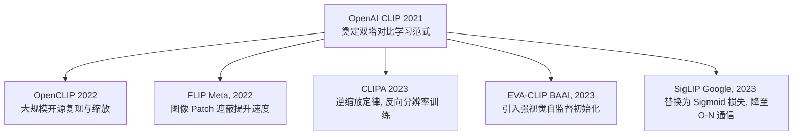
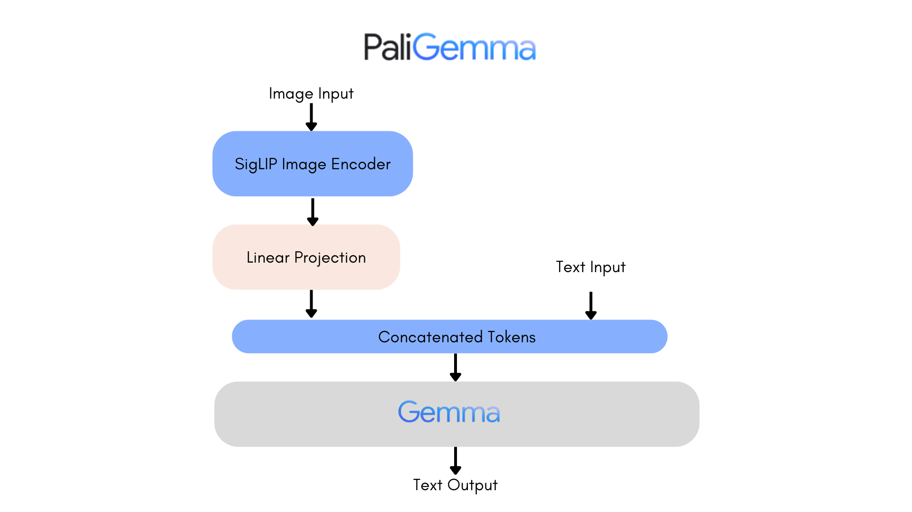

# CLIP (Contrastive Language-Image Pre-training) 技术演进与深度研究

本项目第一阶段聚焦于视觉语言模型（VLM）的开山之作 —— **CLIP**，以及其后续数代在**训练效率**、**损失函数优化**、**网络架构规模**等方向的重要迭代。

---

## 1. 经典基线：OpenAI CLIP (2021)

OpenAI 于 2021 年提出 CLIP（Learning Transferable Visual Models From Natural Language Supervision），首次确立了以**双塔对比学习（Dual-Encoder Contrastive Learning）**进行大规模图文匹配的范式。

### 1.1 核心架构
*   **图像编码器 (Image Encoder)**：可以是 ResNet-50 / ResNet-101，也可以是 Vision Transformer (ViT-B/32, ViT-B/16, ViT-L/14)。
*   **文本编码器 (Text Encoder)**：一个标准的 Transformer 编码器。
*   **投影矩阵 (Projection Layer)**：将图像编码器和文本编码器提取的特征分别映射到相同的 $D$ 维多模态共享嵌入空间，然后进行 **L2 归一化 (L2 Normalization)**。
*   **可学习温度参数 (Learnable Temperature, $\tau$)**：控制预测概率的缩放，通常初始化为 $\ln(1/0.07) \approx 2.659$，并设上限为 100（防止训练不稳定）。

### 1.2 损失函数：对称 InfoNCE 损失
CLIP 在一个大小为 $N$ 的 Batch 内，计算所有 $N$ 张图像与 $N$ 个文本之间的相似度矩阵 $S \in \mathbb{R}^{N \times N}$：

$$
s_{i,j} = \text{sim}(v_i, t_j) = \frac{v_i \cdot t_j}{\|v_i\|_2 \|t_j\|_2}
$$

损失函数对图像到文本、文本到图像分别计算交叉熵，并求均值：

$$
\mathcal{L}_{\text{InfoNCE}} = \frac{1}{2} \left( \mathcal{L}_{I \to T} + \mathcal{L}_{T \to I} \right)
$$

$$
\mathcal{L}_{I \to T} = -\frac{1}{N} \sum_{i=1}^{N} \log \frac{\exp(s_{i,i} \cdot e^\tau)}{\sum_{j=1}^{N} \exp(s_{i,j} \cdot e^\tau)}
$$

$$
\mathcal{L}_{T \to I} = -\frac{1}{N} \sum_{j=1}^{N} \log \frac{\exp(s_{j,j} \cdot e^\tau)}{\sum_{i=1}^{N} \exp(s_{i,j} \cdot e^\tau)}
$$

### 1.3 优缺点分析
*   **优点**：极强的 Zero-shot 迁移能力；强大的鲁棒性，克服了 ImageNet 分类器易受分布偏移影响的问题。
*   **缺点**：
    *   **计算资源极其昂贵**：需要极大的 Batch Size（OpenAI 使用了 32,768）以保证对比学习中负样本的多样性。
    *   **Softmax 全局归一化瓶颈**：在多卡分布式训练中，为了计算 Softmax 分母，需要进行 All-Gather 节点通信，内存占用为 $O(N^2)$，极大限制了 Batch Size 的进一步扩大。

---

## 2. 核心迭代与演进路径

为了克服 OpenAI CLIP 的限制，学术界与工业界从多个维度进行了演进：

### 2.1 OpenCLIP：开源中坚与大规模缩放 (2022)
由 LAION 发起，旨在复现并超越 OpenAI CLIP。
*   **核心贡献**：
    *   基于开源的 LAION-400M 和 LAION-2B 数据集进行训练。
    *   将模型规模从 ViT-L 扩大至 ViT-H, ViT-g, 甚至 ViT-bigG（拥有 2.5B 参数）。
    *   引入了更先进的优化技术（如 AdamW、混合精度训练、可变学习率调度）。
*   **迭代亮点**：证明了只要数据量和参数量足够，开源的复现模型同样能在性能上与闭源模型并驾齐驱，甚至在 Zero-shot 上取得更好的成绩。

### 2.2 FLIP：掩码图文对比学习 (Meta, 2022)
针对 CLIP **训练慢、计算代价高**的问题，Meta 提出了 FLIP (Fast Language-Image Pre-training)。
*   **核心机制**：
    *   在进入 ViT 编码器之前，随机遮蔽（Masking）大比例的图像 Patch（例如 50% ~ 75%）。
    *   文本端不做修改，图像端只编码未被遮蔽的 Patch。
*   **迭代亮点**：
    *   **2~3倍加速**：由于图像 Patch 大幅减少，计算复杂度和内存消耗急剧下降。
    *   **性能不降反升**：通过增加每步的 Batch Size，掩码带来的信息丢失得到了补偿，甚至因为“防过拟合”作用，在相同计算预算下取得了更好的表征能力。

### 2.3 CLIPA：逆向分辨率训练与高效学习 (2023)
CLIPA 提出了一个“逆向缩放定律”（An Inverse Scaling Law for CLIP Training），进一步挑战了 CLIP 的计算边界。
*   **核心机制**：
    *   **动态分辨率**：在训练的前期使用极低的分辨率（如 112x112），只有在最后的微调阶段（最后几个 Epoch）才切换到高分辨率（如 224x224）。
    *   **Token Packing**：在处理短文本时，合并文本 Token 以减少冗余计算。
*   **迭代亮点**：允许在极低的算力（例如几张消费级显卡）下训练出与经典大算力 CLIP 媲美的模型，大大降低了学术界入局 VLM 预训练的门槛。

### 2.4 EVA-CLIP：视觉预训练与超大规模对齐 (BAAI, 2023)
EVA-CLIP 将**视觉自监督学习（如 Masked Image Modeling）**与多模态对齐相结合。
*   **核心机制**：
    *   不直接从头（Scratch）训练图像编码器，而是使用 EVA（一种通过掩码图像建模预训练的 ViT）作为图像编码器的初始化。
    *   这种初始化提供了极强的视觉特征表征能力。
*   **迭代亮点**：
    *   **更平稳的训练**：解决了超大规模参数（如 5B）CLIP 训练容易崩溃（Instability）的问题。
    *   **卓越性能**：在 ImageNet Zero-shot 分类中取得当时的 SOTA（State-of-the-Art）。

### 2.5 SigLIP：从 Softmax 到 Sigmoid 损失的革命 (Google, 2023)
SigLIP (Sigmoid Loss for Language-Image Pre-training) 是目前 CLIP 演进中**最重要的损失函数优化**。

#### 2.5.1 痛点解决
在标准的 Softmax Contrastive Loss 中，计算分母需要全局归一化。这在分布式训练中导致两点硬伤：
1.  **高通信延迟**：多卡之间需要频繁传输各自的特征向量（All-Gather）。
2.  **不适用于小 Batch**：如果 Batch Size 较小，Softmax 容易过拟合到 Batch 内的干扰样本。

#### 2.5.2 Sigmoid 损失的数学原理
SigLIP 丢弃了 Softmax，将对比学习转化为了 $N \times N$ 个**独立的二分类问题（Binary Classification Task）**。
对于每一个图文对 $(i, j)$，模型预测它们是否匹配：
*   当 $i = j$ 时，目标标签 $y_{i,j} = 1$（正样本）。
*   当 $i \neq j$ 时，目标标签 $y_{i,j} = -1$（负样本）。

损失函数采用二进制交叉熵（Binary Cross Entropy, BCE）：

$$
\mathcal{L}_{\text{SigLIP}} = -\frac{1}{N} \sum_{i=1}^{N} \sum_{j=1}^{N} \log \sigma \left( y_{i,j} \left( \lambda \cdot s_{i,j} + \beta \right) \right)
$$

其中：
*   $\sigma(z) = \frac{1}{1 + e^{-z}}$ 是 Sigmoid 函数。
*   $\lambda$ 是可学习的缩放参数（对应于 CLIP 中的 $e^\tau$）。
*   $\beta$ 是可学习的偏置参数（Bias）。
*   $s_{i,j} = v_i \cdot t_j$ 是图像 $v_i$ 与文本 $t_j$ 的内积相似度。

#### 2.5.3 迭代亮点与突破
1.  **无通信瓶颈**：由于每个图文对的计算是独立的，不需要全局 Softmax 归一化。这使得显卡之间不需要 All-Gather 所有的特征，仅需简单的多卡并行计算，通信复杂度从 $O(N^2)$ 降为 $O(N)$（按流式分块处理即可）。
2.  **支持超大规模 Batch Size**：可扩展至数十万甚至数百万的 Batch Size，不受显卡显存和节点通信的制约。
3.  **在小 Batch 下更稳定**：相比 Softmax 在小 Batch 下的脆弱性，SigLIP 的二分类属性在较小 batch size 下也有极佳的表现。
4.  **架构简单**：是当前 Google PaliGemma 等最新 VLM 的核心视觉-语言对齐骨干。

---

## 3. 技术对比总结

| 模型 | 发布年份 | 核心优化维度 | 解决的痛点 | 优缺点 / 适用场景 |
| :--- | :--- | :--- | :--- | :--- |
| **CLIP (OpenAI)** | 2021 | 奠基作 | 传统监督分类的泛化瓶颈 | 经典基线，但分布式训练显存消耗大且多卡通信极高。 |
| **OpenCLIP** | 2022 | 大规模开源 | 闭源模型参数及数据不可及 | 开源社区主流，提供了 ViT-bigG 等超大权重。 |
| **FLIP (Meta)** | 2022 | 图像掩码 (Masking) | 训练计算成本高、图像特征冗余 | 极适合预算有限但数据量巨大的大规模预训练。 |
| **CLIPA** | 2023 | 动态分辨率与 Packing | 预训练成本太高 | 用极低分辨率起手，适合学术界快速迭代和验证。 |
| **EVA-CLIP** | 2023 | 视觉自监督预训练权重 | 超大模型预训练的不稳定性 | 表征性能天花板，适用于对 Zero-shot 性能有极致要求的场景。 |
| **SigLIP (Google)**| 2023 | **Sigmoid Loss 替代 Softmax** | 分布式多卡通信瓶颈及显存 $O(N^2)$ 爆炸 | 当前最前沿、效率最高的对齐方案，是现代端侧 VLM 的首选。 |

---

## 4. 本项目代码复现与应用

针对最新的 CLIP 迭代款 —— **SigLIP**，本项目提供了以下两份代码实现：

1.  **核心架构从零实现**：[siglip_scratch.py](file:///Users/zhongzhiyi/Vision-Foundation-Model/CLIP/siglip_scratch.py) 
    *   实现了带有 `MultiheadAttentionPooling` 的 Vision Transformer。
    *   实现了 SigLIP 特有的 `SigmoidLoss` 损失函数（含可学习的 $\lambda$ 与 $\beta$）。
2.  **实战推断 Demo**：[run_demo.py](file:///Users/zhongzhiyi/Vision-Foundation-Model/CLIP/run_demo.py)
    *   基于 Hugging Face `transformers` 库加载预训练的 `google/siglip-base-patch16-224` 模型。
    *   完成了**零样本图像分类（Zero-shot Classification）**与**图文相关性检索（Image-Text Retrieval）**两个任务。
