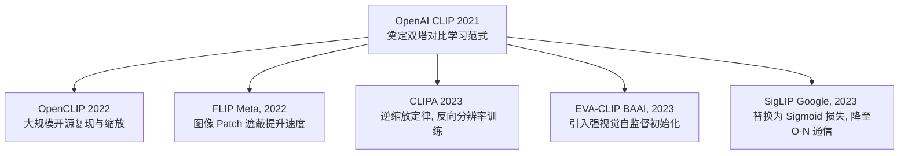

# CLIP (Contrastive Language-Image Pre-training) 技术演进与深度研究

本项目第一阶段聚焦于视觉语言模型（VLM）的开山之作 —— <strong>CLIP</strong>，以及其后续数代在 <strong>训练效率</strong>、<strong>损失函数优化</strong>、<strong>网络架构规模</strong> 等方向的重要迭代。

---

## 1. 经典基线：OpenAI CLIP (2021)

OpenAI 于 2021 年提出 CLIP（Learning Transferable Visual Models From Natural Language Supervision），首次确立了以 <strong>双塔对比学习（Dual-Encoder Contrastive Learning）</strong> 进行大规模图文匹配的范式。


### 1.1 核心架构
*   **图像编码器 (Image Encoder)**：可以是 ResNet-50 / ResNet-101，也可以是 Vision Transformer (ViT-B/32, ViT-B/16, ViT-L/14)。
*   **文本编码器 (Text Encoder)**：一个标准的 Transformer 编码器。
*   **投影矩阵 (Projection Layer)**：将图像编码器和文本编码器提取的特征分别映射到相同的 **D** 维多模态共享嵌入空间，然后进行 **L2 归一化 (L2 Normalization)**。
*   **可学习温度参数 (Learnable Temperature, τ)**：控制预测概率的缩放，通常初始化为 ln(1/0.07) ≈ 2.659，并设上限为 100（防止训练不稳定）。

### 1.2 损失函数：对称 InfoNCE 损失
CLIP 在一个大小为 **N** 的 Batch 内，计算所有 **N** 张图像与 **N** 个文本之间的相似度矩阵 **S** (其维度为 ℝ^(N×N))：

<p align="center"></p>

损失函数对图像到文本、文本到图像分别计算交叉熵，并求均值：

<p align="center"></p>

<p align="center"></p>

<p align="center"></p>


### 1.3 优缺点分析
*   **优点**：极强的 Zero-shot 迁移能力；强大的鲁棒性，克服了 ImageNet 分类器易受分布偏移影响的问题。
*   **缺点**：
    *   **计算资源极其昂贵**：需要极大的 Batch Size（OpenAI 使用了 32,768）以保证对比学习中负样本的多样性。
    *   **Softmax 全局归一化瓶颈**：在多卡分布式训练中，为了计算 Softmax 分母，需要进行 All-Gather 节点通信，内存占用为 O(N²)，极大限制了 Batch Size 的进一步扩大。

---

## 2. 核心迭代与演进路径

为了克服 OpenAI CLIP 的限制，学术界与工业界从多个维度进行了演进：



### 2.1 OpenCLIP：开源中坚与大规模缩放 (2022)
由 LAION 发起，旨在复现并超越 OpenAI CLIP。
*   **核心贡献**：
    *   基于开源的 LAION-400M 和 LAION-2B 数据集进行训练。
    *   将模型规模从 ViT-L 扩大至 ViT-H, ViT-g, 甚至 ViT-bigG（拥有 2.5B 参数）。
    *   引入了更先进的优化技术（如 AdamW、混合精度训练、可变学习率调度）。
*   **迭代亮点**：证明了只要数据量和参数量足够，开源的复现模型同样能在性能上与闭源模型并驾齐驱，甚至在 Zero-shot 上取得更好的成绩。

### 2.2 FLIP：掩码图文对比学习 (Meta, 2022)
针对 CLIP <strong>训练慢、计算代价高</strong> 的问题，Meta 提出了 FLIP (Fast Language-Image Pre-training)。
*   **核心机制**：
    *   在进入 ViT 编码器之前，随机遮蔽（Masking）大比例的图像 Patch（例如 50% ~ 75%）。
    *   文本端不做修改，图像端只编码未被遮蔽的 Patch。
*   **迭代亮点**：
    *   **2~3倍加速**：由于图像 Patch 大幅减少，计算复杂度和内存消耗急剧下降。
    *   **性能不降反升**：通过增加每步的 Batch Size，掩码带来的信息丢失得到了补偿，甚至因为“防过拟合”作用，在相同计算预算下取得了更好的表征能力。

### 2.3 CLIPA：逆向分辨率训练与高效学习 (2023)
CLIPA 提出了一个“逆向缩放定律”（An Inverse Scaling Law for CLIP Training），进一步挑战了 CLIP 的计算边界。
*   **核心机制**：
    *   **动态分辨率**：在训练的前期使用极低的分辨率（如 112x112），只有在最后的微调阶段（最后几个 Epoch）才切换到高分辨率（如 224x224）。
    *   **Token Packing**：在处理短文本时，合并文本 Token 以减少冗余计算。
*   **迭代亮点**：允许在极低的算力（例如几张消费级显卡）下训练出与经典大算力 CLIP 媲美的模型，大大降低了学术界入局 VLM 预训练的门槛。

### 2.4 EVA-CLIP：视觉预训练与超大规模对齐 (BAAI, 2023)
EVA-CLIP 将 <strong>视觉自监督学习（如 Masked Image Modeling）</strong> 与多模态对齐相结合。
*   **核心机制**：
    *   不直接从头（Scratch）训练图像编码器，而是使用 EVA（一种通过掩码图像建模预训练的 ViT）作为图像编码器的初始化。
    *   这种初始化提供了极强的视觉特征表征能力。
*   **迭代亮点**：
    *   **更平稳的训练**：解决了超大规模参数（如 5B）CLIP 训练容易崩溃（Instability）的问题。
    *   **卓越性能**：在 ImageNet Zero-shot 分类中取得当时的 SOTA（State-of-the-Art）。

### 2.5 SigLIP：从 Softmax 到 Sigmoid 损失的革命 (Google, 2023)
SigLIP (Sigmoid Loss for Language-Image Pre-training) 是目前 CLIP 演进中 <strong>最重要的损失函数优化</strong>。


#### 2.5.1 痛点解决
在标准的 Softmax Contrastive Loss 中，计算分母需要全局归一化。这在分布式训练中导致两点硬伤：
1.  **高通信延迟**：多卡之间需要频繁传输各自的特征向量（All-Gather）。
2.  **不适用于小 Batch**：如果 Batch Size 较小，Softmax 容易过拟合到 Batch 内的干扰样本。

#### 2.5.2 Sigmoid 损失的数学原理
SigLIP 丢弃了 Softmax，将对比学习转化为了 **N × N** 个 <strong>独立的二分类问题（Binary Classification Task）</strong>。
对于每一个图文对 (i, j)，模型预测它们是否匹配：
*   当 i = j 时，目标标签 y<sub>i,j</sub> = 1（正样本）。
*   当 i ≠ j 时，目标标签 y<sub>i,j</sub> = -1（负样本）。

损失函数采用二进制交叉熵（Binary Cross Entropy, BCE）：

<p align="center"></p>

其中：
*   σ(z) = 1 / (1 + e<sup>-z</sup>) 是 Sigmoid 函数。
*   λ 是可学习的缩放参数（对应于 CLIP 中的 e<sup>τ</sup>）。
*   β 是可学习的偏置参数（Bias）。
*   s<sub>i,j</sub> = v<sub>i</sub> · t<sub>j</sub> 是图像 v<sub>i</sub> 与文本 t<sub>j</sub> 的内积相似度。

#### 2.5.3 迭代亮点与突破
1.  **无通信瓶颈**：由于每个图文对的计算是独立的，不需要全局 Softmax 归一化。这使得显卡之间不需要 All-Gather 所有的特征，仅需简单的多卡并行计算，通信复杂度从 O(N<sup>2</sup>) 降为 O(N)（按流式分块处理即可）。
2.  **支持超大规模 Batch Size**：可扩展至数十万甚至数百万的 Batch Size，不受显卡显存和节点通信的制约。
3.  **在小 Batch 下更稳定**：相比 Softmax 在小 Batch 下的脆弱性，SigLIP 的二分类属性在较小 batch size 下也有极佳的表现。
4.  **架构简单**：是当前 Google PaliGemma 等最新 VLM 的核心视觉-语言对齐骨干。

---

## 3. 技术对比总结

| 模型 | 发布年份 | 核心优化维度 | 解决的痛点 | 优缺点 / 适用场景 |
| :--- | :--- | :--- | :--- | :--- |
| **CLIP (OpenAI)** | 2021 | 奠基作 | 传统监督分类的泛化瓶颈 | 经典基线，但分布式训练显存消耗大且多卡通信极高。 |
| **OpenCLIP** | 2022 | 大规模开源 | 闭源模型参数及数据不可及 | 开源社区主流，提供了 ViT-bigG 等超大权重。 |
| **FLIP (Meta)** | 2022 | 图像掩码 (Masking) | 训练计算成本高、图像特征冗余 | 极适合预算有限但数据量巨大的大规模预训练。 |
| **CLIPA** | 2023 | 动态分辨率与 Packing | 预训练成本太高 | 用极低分辨率起手，适合学术界快速迭代和验证。 |
| **EVA-CLIP** | 2023 | 视觉自监督预训练权重 | 超大模型预训练的不稳定性 | 表征性能天花板，适用于对 Zero-shot 性能有极致要求的场景。 |
| **SigLIP (Google)**| 2023 | <strong>Sigmoid Loss 替代 Softmax</strong> | 分布式多卡通信瓶颈及显存 O(N²) 爆炸 | 当前最前沿、效率最高的对齐方案，是现代端侧 VLM 的首选。 |

---

## 4. 本项目代码复现与应用

为了深入掌握 CLIP 及其后续关键迭代的架构变化，本项目在 `CLIP/` 目录下提供了完整的 **PyTorch 从零代码复现**。所有实现均以清晰、模块化的结构编写，并在内部测试通过。

### 4.1 代码复现列表

1.  **OpenAI CLIP 基线**：[clip_baseline.py](file:///Users/zhongzhiyi/Vision-Foundation-Model/CLIP/clip_baseline.py)
    *   **架构**：标准 ViT 图像编码器 + Transformer 文本编码器 + 映射层。
    *   **损失函数**：对称 InfoNCE 损失（Symmetric Softmax Loss）及可学习温度参数 $\tau$。
2.  **FLIP (掩码对比学习)**：[flip.py](file:///Users/zhongzhiyi/Vision-Foundation-Model/CLIP/flip.py)
    *   **架构**：带有 **随机 Patch 掩码 (Random Patch Masking)** 机制的 ViT 图像编码器。
    *   **加速逻辑**：训练时随机遮蔽（如 50%）的 Patch 仅不参与 Transformer 计算，将输入 Sequence 长度直接减半，节约大量 Self-Attention 计算。
3.  **CLIPA (逆向缩放/动态分辨率)**：[clipa.py](file:///Users/zhongzhiyi/Vision-Foundation-Model/CLIP/clipa.py)
    *   **架构**：支持 **动态分辨率位置插值 (Dynamic Resolution Positional Interpolation)** 的 ViT 图像编码器。
    *   **动态插值**：当前向传播输入不同分辨率（如 112x112 或 448x448）的图像时，模型会自动通过双线性插值（Bilinear Interpolation）缩放位置编码 `pos_embed` 以对齐网格。
4.  **EVA-CLIP (大模型训练稳定版)**：[eva_clip.py](file:///Users/zhongzhiyi/Vision-Foundation-Model/CLIP/eva_clip.py)
    *   **架构**：支持 **LayerScale** 和 **SwiGLU** 激活层的 ViT。
    *   **稳定机制**：LayerScale 对 Attention 和 MLP 的输出乘以一个极小的可学习对角阵（初始化为 1e-5）进行稳定；SwiGLU 替换传统 MLP 提高参数量巨大时的表征与训练稳定性。
5.  **SigLIP (最新的对齐范式)**：[siglip.py](file:///Users/zhongzhiyi/Vision-Foundation-Model/CLIP/siglip.py)
    *   **架构**：采用 **多头注意力汇聚 (Multihead Attention Pooling, MAP)** 替代 CLS Token 的 ViT 图像编码器。
    *   **损失函数**：使用特有的成对 **Sigmoid Loss** 替代 Softmax，训练时将匹配任务转化为 $N \times N$ 个独立的二分类任务。

---

### 4.2 各模型调用与实例化方式

您可以在不下载权重或跑完整 Demo 的情况下，直接通过以下方式在您的代码中实例化模型、损失函数并完成 Forward 前向计算：

#### ① OpenAI CLIP 基线调用
```python
from clip_baseline import OpenAI_CLIP, InfoNCELoss
import torch

# 1. 实例化模型与损失函数
model = OpenAI_CLIP(vocab_size=49408, embed_dim=512)
loss_fn = InfoNCELoss()

# 2. 模拟输入 (Batch Size = 2)
images = torch.randn(2, 3, 224, 224)
text = torch.randint(0, 49408, (2, 77))        # token IDs
eot_indices = torch.tensor([12, 15])           # 句子结束 Token (EOT) 的索引

# 3. 前向传播与损失计算
image_embeds, text_embeds = model(images, text, eot_indices)
loss = loss_fn(image_embeds, text_embeds)
print(f"CLIP Baseline InfoNCE Loss: {loss.item()}")
```

#### ② FLIP 调用 (含掩码对比学习)
```python
from flip import FLIP, InfoNCELoss
import torch

# 1. 实例化模型 (设置掩码比例为 50%)
model = FLIP(vocab_size=49408, embed_dim=512, mask_ratio=0.5)
loss_fn = InfoNCELoss()

# 2. 模拟输入 (必须在 model.train() 状态下才会触发掩码加速)
model.train()
images = torch.randn(2, 3, 224, 224)
text = torch.randint(0, 49408, (2, 77))
eot_indices = torch.tensor([8, 20])

# 3. 前向计算
image_embeds, text_embeds = model(images, text, eot_indices)
loss = loss_fn(image_embeds, text_embeds)
print(f"FLIP Loss: {loss.item()}")
```

#### ③ CLIPA 调用 (动态输入分辨率)
```python
from clipa import CLIPA
import torch

# 1. 实例化模型
model = CLIPA(vocab_size=49408, embed_dim=512)

# 2. 模拟输入 (支持任意分辨率输入，位置编码会自动双线性插值对齐)
low_res_images = torch.randn(1, 3, 112, 112)   # 低分辨率 (CLIPA 训练前期)
high_res_images = torch.randn(1, 3, 448, 448)  # 高分辨率 (CLIPA 训练后期)
text = torch.randint(0, 49408, (1, 77))
eot_indices = torch.tensor([10])

# 3. 前向计算 (位置编码自适应)
low_res_embeds, _ = model(low_res_images, text, eot_indices)
high_res_embeds, _ = model(high_res_images, text, eot_indices)
print(f"Low-res embeds shape: {low_res_embeds.shape}")
print(f"High-res embeds shape: {high_res_embeds.shape}")
```

#### ④ EVA-CLIP 调用 (含 LayerScale & SwiGLU)
```python
from eva_clip import EVA_CLIP
import torch

# 1. 实例化模型 (大型 ViT，采用 SwiGLU MLP 与 LayerScale)
model = EVA_CLIP(vocab_size=49408, embed_dim=768)

# 2. 模拟输入
images = torch.randn(1, 3, 224, 224)
text = torch.randint(0, 49408, (1, 77))
eot_indices = torch.tensor([14])

# 3. 前向计算
image_embeds, text_embeds = model(images, text, eot_indices)
print(f"EVA-CLIP Image shape: {image_embeds.shape}")
print(f"EVA-CLIP Text shape: {text_embeds.shape}")
```

#### ⑤ SigLIP 调用 (含 MAP 汇聚 & Sigmoid Loss)
```python
from siglip import SigLIP, SigLIPLoss
import torch

# 1. 实例化模型与 Sigmoid 损失函数
model = SigLIP(vocab_size=32000, embed_dim=512)
loss_fn = SigLIPLoss()

# 2. 模拟输入
images = torch.randn(2, 3, 224, 224)
text = torch.randint(0, 32000, (2, 64))
eot_indices = torch.tensor([10, 15])

# 3. 前向计算与成对 Sigmoid 损失计算
image_embeds, text_embeds = model(images, text, eot_indices)
loss = loss_fn(image_embeds, text_embeds)
print(f"SigLIP Loss: {loss.item()}")
```

