# DINO 视觉自监督与 Grounding DINO 目标检测演进及研究

本项目第二阶段聚焦于计算机视觉中两支极为重要的 <strong>DINO</strong> 命名流派：
1. **自监督特征表征学习（Self-Supervised Learning）流派**：由 Meta AI (FAIR) 提出的 <strong>DINO v1</strong>、<strong>DINOv2</strong> 和最新推出的 <strong>DINOv3</strong>。
2. **目标检测与开集接地定位（Object Detection & Open-Set Grounding）流派**：由 IDEA-Research 提出的 <strong>DINO-DETR</strong> 以及融合了文本引导的 <strong>Grounding DINO</strong>。

---

## 1. 概念与演进路径概览

在计算机视觉研究中，存在两个在学术界和工业界都极具声望的 “DINO” 家族。为避免概念混淆，本项目将它们的演进路线梳理如下：

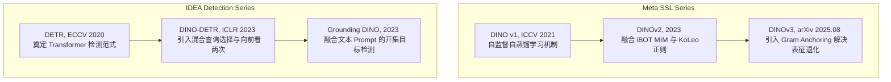

---

## 2. Meta 自监督学习系列 (DINO v1 / v2 / v3)

### 2.1 DINO v1：自监督 ViT 自蒸馏机制 (2021)


DINO（Self-distillation with no labels）的核心思想是在 <strong>没有标签</strong> 的情况下，使用 <strong>教师-学生（Teacher-Student）</strong> 架构进行知识蒸馏。

#### 2.1.1 核心机制与防崩塌策略
自监督学习的核心痛点是防止模型发生 **表征坍塌（Representation Collapse）**（即所有输入映射为相同的常数输出）。DINO v1 摒弃了对比学习中对负样本（Negative Samples）的依赖，通过以下手段避免坍塌：
1.  **中心化（Centering）**：将教师网络输出的均值向量进行累积，并在前向传播时减去该均值（或加入偏差 c）。这会把输出分布拉向均匀分布，防止单维度表征统治。
    中心向量更新公式为：
    $$
    c \leftarrow m c + (1 - m) \frac{1}{B} \sum_{i=1}^{B} g_t(x_i)
    $$
2.  **锐化（Sharpening）**：使用较低的温度参数 τ<sub>t</sub> 来对教师网络的 Softmax 进行缩放，使输出分布更加“尖锐/确信”，防止分布滑向完全均匀。
    教师端 Softmax 输出概率计算公式：
    $$
    P_t(x)^{(i)} = \frac{\exp(g_t(x)^{(i)} / \tau_t)}{\sum_{k=1}^{K} \exp(g_t(x)^{(k)} / \tau_t)}
    $$
3.  **多尺度剪裁（Multi-crop）**：学生网络接收全局和局部剪裁图像（Global & Local Crops），而教师网络只接收大分辨率的全局剪裁（Global Crops），强迫网络学习“局部到全局”的几何特征对齐。

DINO v1 使用交叉熵损失，优化目标为最小化学生概率 P<sub>s</sub> 与教师概率 P<sub>t</sub> 之间的散度：
$$
\mathcal{L} = - \sum P_t(x) \cdot \log P_s(x)
$$

---

### 2.2 DINOv2：鲁棒的通用视觉表征 (2023)

DINOv2 模型能够学习到极其稳健且具有强泛化能力的视觉特征。以下为 DINOv2 的整体模型与任务架构图：

<p align="center">
  
</p>

DINOv2 模型生成的高性能视觉特征可以直接配合简单的分类器或线性层应用在各种密集预测任务中，其语义提取效果非常优异。以下是其 patch 特征主成分分析（PCA）可视化的视频展示（使用 HTML video 标签）：

<p align="center">
  <video src="images/dinov2_demo.mp4" width="80%" autoplay loop muted controls></video>
</p>

DINOv2 构建了高效率、大参数规模的通用视觉骨干网络，相比 v1 做了多项重要改进：
1.  **iBOT 掩码图像建模（Masked Image Modeling, MIM）**：在图像 patch 级别上引入了自监督掩码损失。学生网络处理被随机遮蔽部分 patch 的图像，教师网络处理完整图像，在 patch 级别上对齐相似度，极大地增强了网络对于 <strong>语义分割、深度估计等密集预测（Dense Prediction）</strong> 任务的理解力。
2.  **KoLeo 正则化（Kozachenko-Leonenko Entropic Regularizer）**：为了促使特征表征更均匀地分布在超球面上，防止特征过于聚拢或发生维度崩溃。
    KoLeo 正则化损失计算公式：
    $$
    \mathcal{L}_{\text{KoLeo}} = -\frac{1}{n} \sum_{i=1}^{n} \ln(d_i)
    $$
    其中 d<sub>i</sub> 为特征向量 x<sub>i</sub> 与其在 Batch 内的最近邻（Nearest Neighbor）之间的欧氏距离。
3.  **网络稳定性优化**：全面采用了 <strong>LayerScale</strong> 和 <strong>SwiGLU FFN</strong>，在超大模型（例如 ViT-g）训练时提供了极佳的稳定度。

---

### 2.3 DINOv3：抑制特征退化的格拉姆锚定 (2025.08)

Meta FAIR 于 2025 年 8 月推出 DINOv3，旨在克服大规模模型长周期自监督训练时出现的 <strong>密集特征图退化（Dense Feature Degradation）</strong> 现象（即虽然分类性能提升，但局部 patch 表征的结构连贯性降低）。

#### 2.3.1 特征退化与 PCA 可视化对比
在缺乏空间几何约束的长周期训练下，自监督特征会在局部细节上产生噪点或破裂。下图展示了引入 DINOv3 格拉姆锚定前后，图像 patch 特征 PCA 可视化的清晰度对比：

<p align="center">
  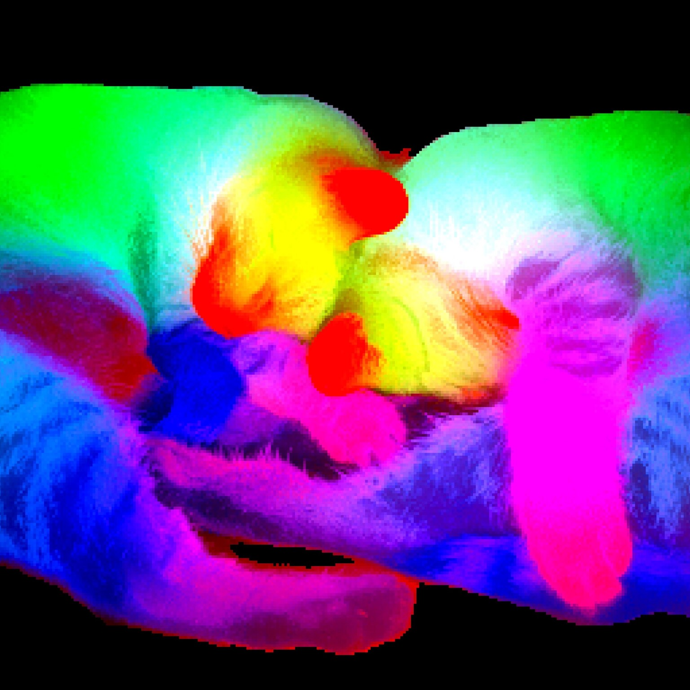
  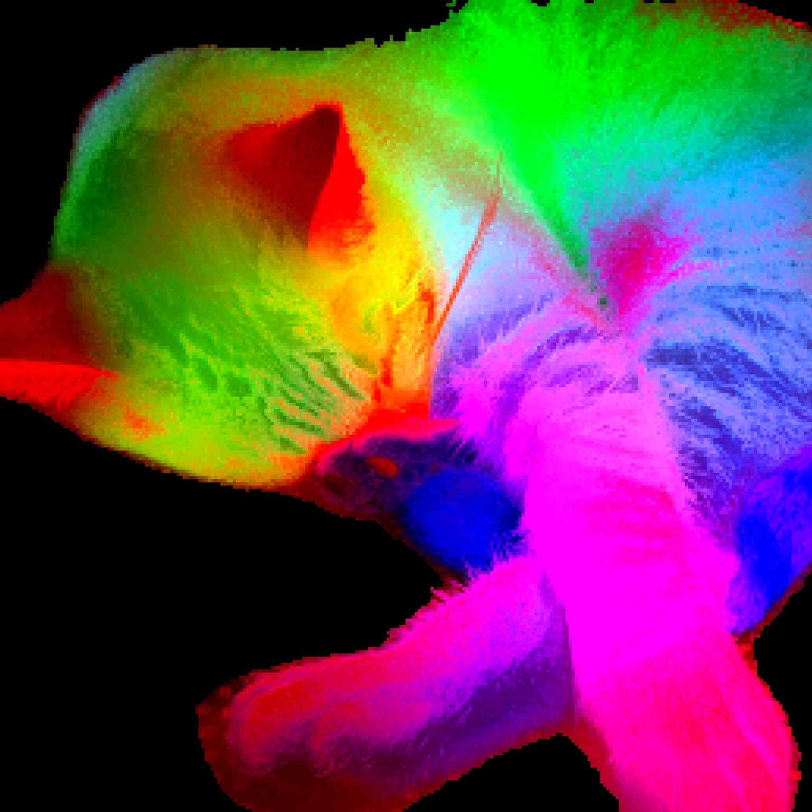
</p>
<p align="center">
  <em>图：左侧为普通长周期自监督训练下的特征图退化现象；右侧为 DINOv3 借助格拉姆锚定维持的稳定局部语义特征结构。</em>
</p>

#### 2.3.2 格拉姆锚定（Gram Anchoring）
DINOv3 引入了 <strong>Gram Anchoring</strong>，用以约束学生网络的空间结构，使其与一个缓慢更新或冻结的稳定“Gram 教师”保持一致。
*   对于包含 P 个 patch、特征维度为 d 的特征图 X (ℝ^(P × d))，通过 L2 归一化通道维度，计算其格拉姆矩阵（Gram Matrix）以代表 patch 之间的相似度图谱：
    $$
    G = X X^T
    $$
    其中 G (ℝ^(P × P))。
*   通过最小化学生与 Gram 教师之间的均方误差，保证空间结构的几何一致性，从而允许模型在 7B 参数、17亿张图片上长周期训练而依然维持顶级的局域定位精度：
    $$
    \mathcal{L}_{\text{Gram}} = \Vert G_{\text{student}} - G_{\text{teacher}} \Vert_F^2
    $$

#### 2.3.3 密集预测下游应用（如卫星遥感森林冠高估计）
DINOv3 卓越的空间结构特征使其非常适用于地理信息学等下游密集预测任务。下图对比了 DINOv2 与 DINOv3 在卫星遥感图像上预测森林冠层高度（Canopy Height Estimation）的实际表现：

<p align="center">
  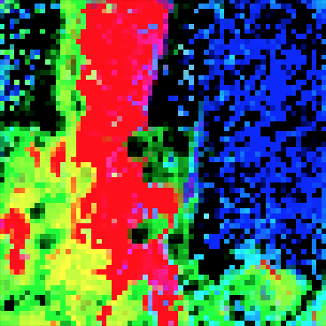
  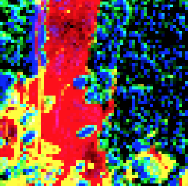
</p>
<p align="center">
  <em>图：使用 DINOv3 预测出的林冠高度图谱空间连续性更强，显著克服了 DINOv2 在局部特征上的高频噪点问题。</em>
</p>

---

## 3. 目标检测与开集接地定位系列 (DINO-DETR / Grounding DINO)

### 3.1 DINO-DETR：高效收敛的 Transformer 检测器 (2023)

<p align="center">
  
</p>

DINO-DETR 是由 IDEA 团队开发的一种基于 Transformer 架构的高性能目标检测模型。它克服了 DETR 收敛缓慢的问题，整体网络架构与训练流程如下图所示：

<p align="center">
  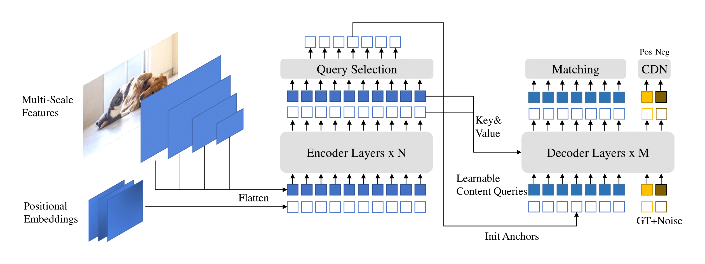
</p>

其三大核心创新点与运行机制如下：
*   <strong>混合查询选择（Mixed Query Selection）</strong>：之前的方法要么使用静态可学习查询，要么采用 Deformable DETR 的双重查询。DINO-DETR 选择将 Encoder 输出特征中的 Top-K 强特征用作初始锚框（即 positional queries，带有极强的图像自适应空间先验），而 content queries 保持为零或可学习偏移参数，实现了“混合选择”。
*   <strong>对比去噪训练（Contrastive Denoising Training, CDN）</strong>：在传统的去噪训练（DN-DETR）中只添加了正向噪点框。DINO 引入了“对比”概念，设置正负两类噪点。低噪声框被贴上正样本标签，要求重建；高噪声框被赋予负样本标签（背景），使模型学会对相似但带有偏差的定位进行抑制，从而避免检测框的重叠。
*   <strong>向前看两次（Look Forward Twice）</strong>：在 DETR 的多层解码中，通常在前向传播计算坐标更新后，会将坐标的梯度回传阻断（detach）。DINO 通过改进此公式，使第 i-1 层的参数能从第 i 层的最终坐标预测损失中直接回传梯度，通过多层深度监督大大加速了框的精细化微调。

---

### 3.2 Grounding DINO：开集目标检测的范式结合 (2023)

<p align="center">
  
</p>

Grounding DINO 巧妙地将 <strong>DINO-DETR 的检测能力</strong> 与 <strong>文本接地定位（Text Grounding）</strong> 相结合，是零样本（Zero-Shot）开集物体检测的核心基石。

#### 3.2.1 架构设计

以下为 Grounding DINO 的模型架构图与开集检测示例图：

<p align="center">
  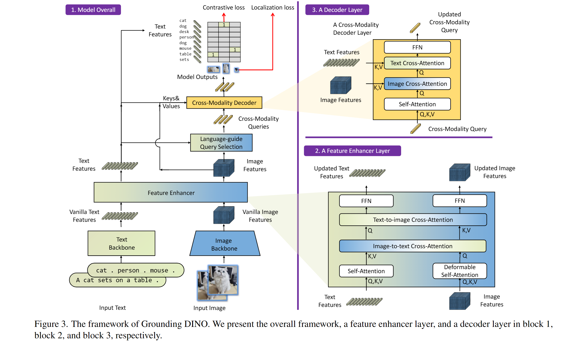
</p>

<p align="center">
  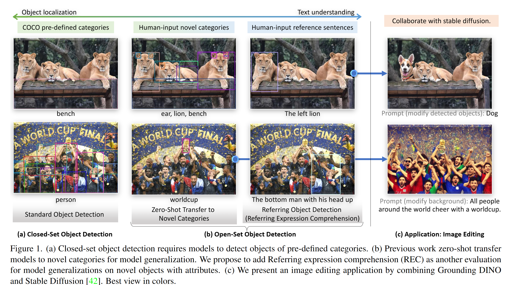
</p>

<p align="center">
  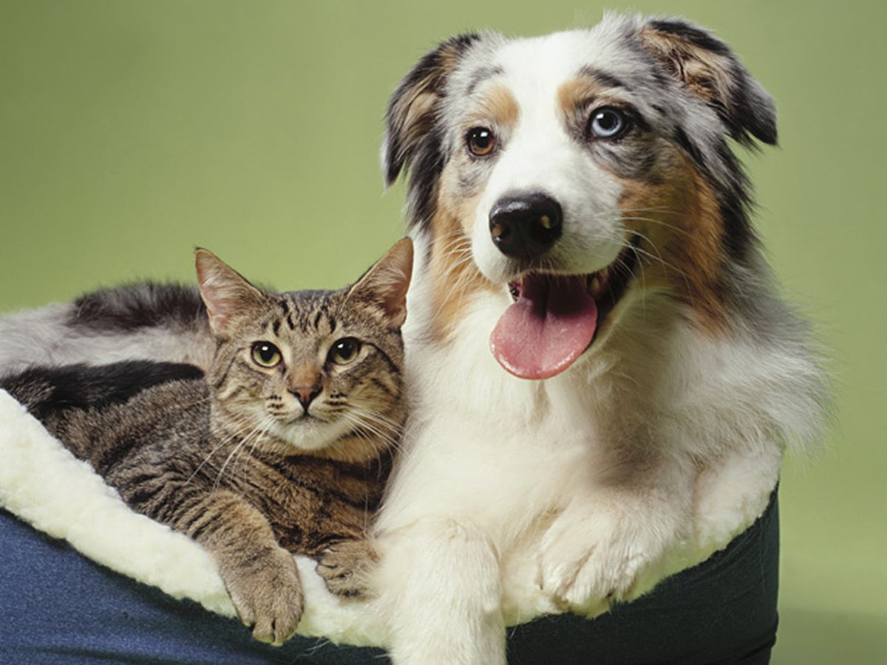
</p>

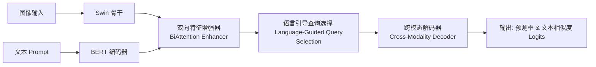

*   **双向特征增强器 (BiAttention Enhancer)**：包含多个层，每层执行四个关注：图像自注意力、文本自注意力、图像对文本的交叉注意力、文本对图像的交叉注意力。从而将图文特征空间进行彻底对齐与交互。
*   **语言引导查询选择 (Language-Guided Query Selection)**：计算融合后图像 patch 和文本 token 之间的相似度，挑选与文本最相关的图像特征来初始化解码查询（Query）。
*   **跨模态解码器 (Cross-Modality Decoder)**：查询在解码时同时结合图像与文本表征进行自适应调整，最终通过查询与文本特征的内积相似度来决定检测框所属的文本词。

---

## 4. 本项目代码复现与应用

本项目在 `DINO/` 目录下提供了全部 5 种核心模型架构的 **PyTorch 从零代码实现**。代码去除了冗余库的依赖，专注于模型前向流和损失函数的计算，极大地方便了学术研究与架构理解。

### 4.1 代码文件列表

1.  **DINO v1**：[dino_v1.py](file:///Users/zhongzhiyi/Vision-Foundation-Model/DINO/dino_v1.py)
    *   **架构**：ViT 图像骨干 + DINO 投影头（包含 bottleneck 结构与 L2 归一化）。
    *   **损失**：对称自蒸馏交叉熵损失，支持对教师输出的 <strong>中心化（Centering）</strong> 和 <strong>锐化（Sharpening）</strong>，包含 EMA 教师权重更新。
2.  **DINOv2**：[dino_v2.py](file:///Users/zhongzhiyi/Vision-Foundation-Model/DINO/dino_v2.py)
    *   **架构**：支持 <strong>LayerScale</strong> 和 <strong>SwiGLU 激活</strong> 的 ViT 骨干。
    *   **损失**：集成全局蒸馏损失、iBOT <strong>局部掩码 patch 对齐损失</strong> 和 <strong>KoLeo 正则化熵损失</strong>，有效防止高维特征折叠。
3.  **DINOv3**：[dino_v3.py](file:///Users/zhongzhiyi/Vision-Foundation-Model/DINO/dino_v3.py)
    *   **架构**：在 DINOv2 基础上引申。
    *   **损失**：加入了最新的 <strong>格拉姆锚定（Gram Anchoring）</strong> 损失计算，使用稳定阶段的 Gram 教师保持 patch 级别的几何相似结构。
4.  **DINO-DETR**：[dino_detr.py](file:///Users/zhongzhiyi/Vision-Foundation-Model/DINO/dino_detr.py)
    *   **架构**：多尺度特征提取 + Mixed Query Selection 查询初始化。
    *   **机制**：支持对比去噪（CDN）标签噪点生成，以及基于计算图连通的 **Look Forward Twice** 迭代坐标修正。
5.  **Grounding DINO**：[grounding_dino.py](file:///Users/zhongzhiyi/Vision-Foundation-Model/DINO/grounding_dino.py)
    *   **架构**：文本 Encoder + Swin-like 图像骨干 + 跨模态特征增强层（BiAttention block）。
    *   **损失**：文本引导的查询选择，并输出查询对于各文本词的对齐 Logits，从而能够通过 Prompt 定位任意开集类别。
6.  **全模型测试 Demo**：[run_demo.py](file:///Users/zhongzhiyi/Vision-Foundation-Model/DINO/run_demo.py)
    *   **执行方式**：直接通过 python 脚本一次性对五种架构进行模拟前向传播、EMA 更新与损失验证。

---

### 4.2 各模型调用与实例化方式

您可以通过运行测试 Demo 或在自己的训练流中直接调用以下实例化与前向测试代码：

#### ① DINO v1 模拟调用
```python
from DINO.dino_v1 import DINOv1, DINOLoss
import torch

# 1. 初始化模型与 DINO 损失函数
model = DINOv1(embed_dim=384, out_dim=2048)
loss_fn = DINOLoss(out_dim=2048)

# 2. 模拟 Multi-crop 输入 (2 个 224x224 全局图 + 2 个 96x96 局部图)
B = 2
crops = [
    torch.randn(B, 3, 224, 224), # Global 1
    torch.randn(B, 3, 224, 224), # Global 2
    torch.randn(B, 3, 96, 96),   # Local 1
    torch.randn(B, 3, 96, 96)    # Local 2
]

# 3. 前向计算与损失
student_projs, teacher_projs = model(crops)
loss = loss_fn(student_projs, teacher_projs)
print(f"DINOv1 Loss: {loss.item()}")

# 4. 更新教师网络权重
model.update_teacher()
```

#### ② DINOv2 模拟调用 (含 iBOT 掩码与 KoLeo)
```python
from DINO.dino_v2 import DINOv2, DINOv2Loss
import torch

model = DINOv2(embed_dim=384, out_dim=2048, patch_out_dim=512)
loss_fn = DINOv2Loss(out_dim=2048, patch_out_dim=512)

B = 2
crops = [torch.randn(B, 3, 224, 224), torch.randn(B, 3, 224, 224)]
num_patches = (224 // 14) ** 2  # 256 patches

# 模拟学生端的随机 Patch 掩码 (50% 比例)
masks = [torch.rand(B, num_patches) < 0.5, torch.rand(B, num_patches) < 0.5]
concat_masks = torch.cat(masks, dim=0)

student_cls, student_patches, teacher_cls, teacher_patches, koleo_feats = model(crops, masks)
total_loss, g_loss, p_loss, k_loss = loss_fn(
    student_cls=student_cls,
    student_patches=student_patches,
    teacher_cls=teacher_cls,
    teacher_patches=teacher_patches,
    mask=concat_masks,
    koleo_features=koleo_feats
)
print(f"DINOv2 Loss: {total_loss.item()}")
```

#### ③ DINOv3 模拟调用 (含 Gram 空间锚定)
```python
from DINO.dino_v3 import DINOv3, DINOv3Loss
import torch

model = DINOv3(embed_dim=384, out_dim=2048, patch_out_dim=512)
loss_fn = DINOv3Loss(out_dim=2048, patch_out_dim=512, gram_weight=2.0)

B = 2
crops = [torch.randn(B, 3, 224, 224), torch.randn(B, 3, 224, 224)]
num_patches = (224 // 14) ** 2
masks = [torch.rand(B, num_patches) < 0.5, torch.rand(B, num_patches) < 0.5]
concat_masks = torch.cat(masks, dim=0)

# 前向传播得到 Gram 空间 raw features
(student_cls, student_patches_proj, teacher_cls, teacher_patches_proj, koleo_feats,
 student_raw_patches, teacher_raw_patches) = model(crops, masks)

total_loss, g_loss, p_loss, k_loss, gram_loss = loss_fn(
    student_cls=student_cls,
    student_patches_proj=student_patches_proj,
    teacher_cls=teacher_cls,
    teacher_patches_proj=teacher_patches_proj,
    mask=concat_masks,
    koleo_features=koleo_feats,
    student_raw_patches=student_raw_patches,
    teacher_raw_patches=teacher_raw_patches
)
print(f"DINOv3 Total Loss: {total_loss.item()} (Gram Loss: {gram_loss.item()})")
```

#### ④ DINO-DETR 模拟调用 (去噪训练与 Look Forward Twice)
```python
from DINO.dino_detr import DinoDETR
import torch

model = DinoDETR(num_classes=80, num_queries=20, decoder_layers=6)
model.train()  # 激活训练模式下的 CDN 噪点生成

images = torch.randn(2, 3, 256, 256)
# 模拟标注框与类别
gt_boxes = torch.tensor([[[0.2, 0.3, 0.4, 0.5]], [[0.1, 0.1, 0.3, 0.3]]])
gt_labels = torch.tensor([[1], [12]])

outputs = model(images, gt_boxes, gt_labels)
print("Detected Box Outputs shape (last layer):", outputs["pred_boxes"].shape)
```

#### ⑤ Grounding DINO 模拟调用 (跨模态开集检测)
```python
from DINO.grounding_dino import GroundingDINO
import torch

# 实例化模型
model = GroundingDINO(vocab_size=30522, num_queries=25, decoder_layers=6)

images = torch.randn(2, 3, 256, 256)
input_ids = torch.randint(0, 30522, (2, 15))  # 文本 Prompt (分词后包含 15 个 tokens)

outputs = model(images, input_ids)
# 预测框对于每一个文本 token 处的对齐分类对数相似度
print("Query to Text alignment shape:", outputs["pred_logits"].shape) # [2, 25, 15]
print("Box coordinate output shape:", outputs["pred_boxes"].shape)   # [2, 25, 4]
```

---

## 5. DINOv3 空间关系与格拉姆锚定可视化 Demo

为了直观地展示 DINOv3 的 <strong>格拉姆锚定（Gram Anchoring）</strong> 如何捕获图像的密集空间表征和局部特征相关性，本项目在 [visualize_dino_v3.py](file:///Users/zhongzhiyi/Vision-Foundation-Model/DINO/visualize_dino_v3.py) 中实现了一个交互式可视化 Demo。

### 5.1 运行方式
直接在终端中运行以下命令：
```bash
/Users/zhongzhiyi/Vision-Foundation-Model/.venv/bin/python DINO/visualize_dino_v3.py
```

### 5.2 运行效果与物理解释
运行后，脚本将生成一张对比可视化图，并保存在 [dino_v3_similarity_demo.png](file:///Users/zhongzhiyi/Vision-Foundation-Model/DINO/demo_images/dino_v3_similarity_demo.png) 中，如下图所示：

<p align="center">
  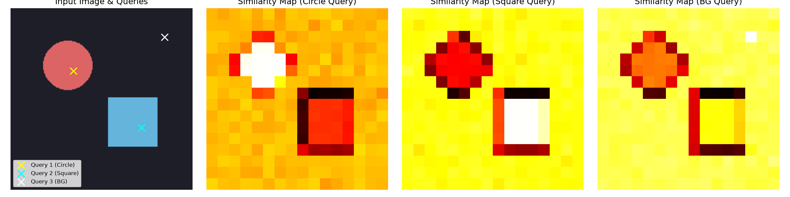
</p>

该图展示了以下核心物理解释：
1.  **合成输入图像**：包含一个红色圆形和一个蓝色矩形，分别代表不同的空间目标。同时，在圆形内部（Query 1）、矩形内部（Query 2）和背景区域（Query 3）各设置了一个查询像素点（以红色、蓝色、绿色的 "X" 标记）。
2.  **相似度热力图（Similarity Maps）**：对于每个查询点，基于 DINOv3 导出的 `16 × 16` 个 patch 特征，计算其与所有其他 patch 的 cosine 相似度（即 Gram 矩阵对应行），并重塑回二维热力图显示。
    *   **圆形查询点热力图**：展示圆形区域内的 patch 与其他区域的关联度。在经过充分自监督训练的 DINO 骨干中，此处会显示出清晰的圆形轮廓，表明模型在无监督下自动学会了物体的边界分割（Emerging Segmenter Property）。
    *   **矩形查询点热力图**：同样展示出矩形区域高度关联。
    *   **背景查询点热力图**：背景区域 patch 表现出高关联性，表明模型能区分前景物体与背景环境。
3.  **格拉姆锚定作用**：DINOv3 在长周期预训练中，通过 L2 损失约束学生与 Gram 教师的格拉姆矩阵（相似度图谱）一致，强制让这些相似度热力图的空间布局保持稳定，不会因为模型参数的进一步缩放而发生局域信息退化或表征坍塌。

