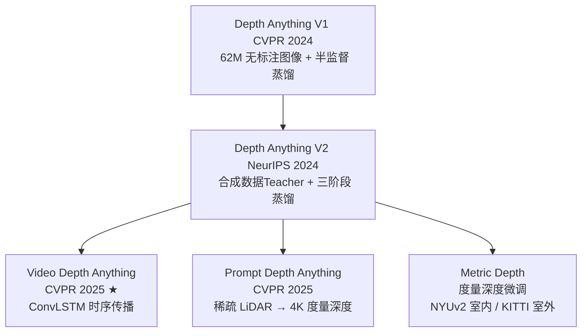
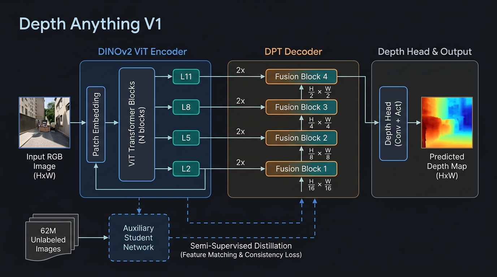
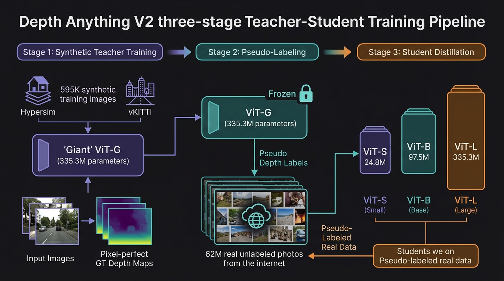
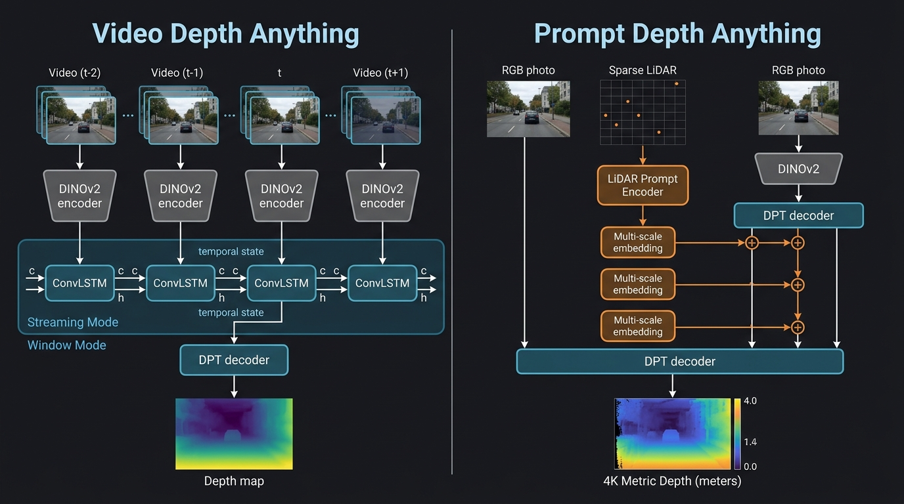

# Depth Anything 家族：单目深度估计基础模型全系演进与研究

本项目第四阶段聚焦于单目深度估计（Monocular Depth Estimation, MDE）领域的里程碑系列 —— <strong>Depth Anything 家族</strong>。我们在此实现了由 HKU、TikTok/ByteDance 等机构提出的四种核心深度估计架构的 <strong>纯 PyTorch 从零实现</strong>，专注于最核心的架构设计、训练范式与时序/度量扩展机制。

---

## 1. 概念与演进路径概览

Depth Anything 家族的演进围绕三条核心技术轨迹展开：<strong>数据质量提升</strong>、<strong>时序一致性</strong>与<strong>度量深度扩展</strong>：



> ★ CVPR 2025 Highlight（被接收论文中前 13.5%）

---

## 2. 核心架构与模型详解

### 2.1 Depth Anything V1：大规模无标注数据释放基础能力（CVPR 2024）

<p align="center">
  
</p>

**论文**：[Depth Anything: Unleashing the Power of Large-Scale Unlabeled Data](https://arxiv.org/abs/2401.10891)  
**团队**：Lihe Yang et al. (HKU + TikTok)  
**GitHub**：https://github.com/LiheYoung/Depth-Anything

#### 架构设计

Depth Anything V1 采用 **DINOv2 ViT Encoder + DPT 多尺度解码器 + 深度预测头** 三段式结构：

*   <strong>DINOv2 ViT 编码器</strong>：使用 14×14 patch 大小（比标准 ViT 的 16×16 更精细），输入 518×518 分辨率图像后产生 37×37 的 token 网格。提取第 2、5、8、11 层的中间 token 序列作为多尺度特征。模型提供 S/B/L 三种规模：

    | 规模 | 参数量 | embed dim | 深度 | 注意力头数 |
    |:-:|:-:|:-:|:-:|:-:|
    | ViT-S | 24.8M | 384 | 12 | 6 |
    | ViT-B | 97.5M | 768 | 12 | 12 |
    | ViT-L | 335.3M | 1024 | 24 | 16 |

*   <strong>DPT（Dense Prediction Transformer）解码器</strong>：将 4 个中间层 token 序列转换为空间特征图，自底向上（深 → 浅）逐步 2× 上采样并融合 skip connection，最终输出分辨率约为 16×Hp × 16×Wp 的稠密特征。

*   <strong>深度预测头</strong>：Conv → ReLU → Conv → Sigmoid，输出归一化到 [0,1] 的<strong>仿射不变相对视差图</strong>（值越大 = 越近）。

#### 训练策略：半监督蒸馏解锁 62M 无标注图像

*   <strong>有标注阶段</strong>：在 MIX-6 混合数据集（1.5M 有标注图像）上用 L<sub>ssi</sub> + L<sub>gm</sub> 联合损失训练基础模型。
*   <strong>无标注蒸馏阶段</strong>：引入辅助学生网络（auxiliary student）。教师模型对 62M 互联网无标注图像生成软伪标签，学生网络学习对齐教师特征空间，从而将大量无标注数据中的视觉先验注入模型。

#### 损失函数

*   <strong>仿射不变损失（L<sub>ssi</sub>）</strong>：处理来自不同数据集的深度图尺度/偏移差异。对预测和 GT 分别中位数 + 均值绝对偏差归一化后计算 L2：

<p align="center"></p>

其中 t(d) 为中位数，s(d) 为均值绝对偏差。

*   <strong>梯度匹配损失（L<sub>gm</sub>）</strong>：在多个图像尺度上计算深度梯度差异，强化边界处的预测精度：

<p align="center"></p>

*   <strong>总损失</strong>：L<sub>total</sub> = L<sub>ssi</sub> + λ · L<sub>gm</sub>（λ = 0.5）

#### 性能（零样本迁移，与 MiDaS 对比）

| 方法 | 参数量 | KITTI AbsRel↓ | KITTI δ₁↑ | NYUv2 AbsRel↓ | NYUv2 δ₁↑ |
|:-:|:-:|:-:|:-:|:-:|:-:|
| MiDaS v3.1 BEiT<sub>L</sub> | 345M | 0.127 | 0.850 | 0.048 | 0.980 |
| **DA-S** | 24.8M | 0.080 | 0.936 | 0.053 | 0.972 |
| **DA-B** | 97.5M | 0.080 | 0.939 | 0.046 | 0.979 |
| **DA-L** | 335.3M | **0.076** | **0.947** | **0.043** | **0.981** |

---

### 2.2 Depth Anything V2：合成数据 Teacher 驱动的精度飞跃（NeurIPS 2024）

<p align="center">
  
</p>

**论文**：[Depth Anything V2](https://arxiv.org/abs/2406.09414)  
**团队**：Lihe Yang et al. (HKU + TikTok)  
**GitHub**：https://github.com/DepthAnything/Depth-Anything-V2

#### V2 vs V1 核心改进

| 维度 | V1 | V2 |
|:-|:-|:-|
| 教师训练数据 | 有标注真实图（含噪声标注） | 595K 高质量合成图（像素完美 GT） |
| 中间层选择 | 最后 4 层（存在 Bug） | 显式指定中间层（正确的 DPT 设计） |
| 伪标签质量 | 受真实噪声影响，结构性错误较多 | 合成 GT 训练的 Teacher，结构精确 |
| 细粒度表现 | 薄结构、透明物体预测较差 | 细节预测能力显著提升 |
| 最大规模 | ViT-L (335M) | ViT-G (1.3B) |

#### 三阶段教师-学生蒸馏流水线

*   <strong>阶段 1 — 合成数据 Teacher 训练</strong>：使用最大规模 ViT-G 教师模型，在 595K 张合成图像（Hypersim、vKITTI、SceneFlow 等 8 个合成数据集）上以像素完美 GT 深度训练，避免了真实数据标注噪声。

*   <strong>阶段 2 — 伪标签生成</strong>：冻结教师权重，对 62M 张真实无标注图像生成密集深度伪标签。由于教师在合成数据上训练，伪标签结构精度远高于 V1 的基于真实数据教师。

*   <strong>阶段 3 — 学生蒸馏</strong>：S/B/L 规模的学生模型在伪标签真实图像上训练，弥合合成到真实的域间差距。

#### 度量深度扩展（Metric Depth）

在相对深度训练完成后，通过相机 FoV（视场角）条件化的度量深度头进行微调：
*   <strong>室内（NYUv2）</strong>：度量范围 [0, 10] 米
*   <strong>室外（KITTI）</strong>：度量范围 [0, 80] 米

FoV 编码原理：宽角相机（如鱼眼镜头）拍摄同一距离物体时显示更小，窄角相机则相反。FoV 作为正弦位置编码注入度量头，使模型能够根据相机特性正确推断绝对尺度。

#### DA-2K 新基准

V2 引入了 <strong>DA-2K 评估基准</strong>（2000 张真实图像），采用<strong>相对深度排序对</strong>（Relative Ordering Pairs）作为评估指标：给定一张图中的两个像素点，判断哪个距摄像机更近。这直接评估了模型对深度结构的理解，不依赖绝对尺度对齐。

---

### 2.3 Video Depth Anything：时序一致性突破（CVPR 2025 Highlight）

<p align="center">
  
</p>

**论文**：[Video Depth Anything](https://arxiv.org/abs/2501.12375)  
**团队**：Sili Chen, Hengkai Guo et al. (ByteDance)  
**GitHub**：https://github.com/DepthAnything/Video-Depth-Anything  
**荣誉**：CVPR 2025 Highlight（全体接收论文前 13.5%）

#### 核心问题：帧间深度抖动

对视频每帧独立运行单图深度估计会导致严重的<strong>时序不一致性</strong>（Temporal Flickering）：
*   静止场景中同一点的深度值在帧间随机波动
*   没有跨帧信息传递，每帧独立预测缺乏"记忆"

#### ConvLSTM 时序传播机制

Video Depth Anything 在 DINOv2 编码器（无状态，逐帧独立）后引入 <strong>ConvLSTM（卷积长短期记忆网络）</strong>进行时序状态传播：

*   <strong>空间保留</strong>：与全连接 LSTM 不同，ConvLSTM 用 2D 卷积替代全连接层，保留特征图的空间结构（不压缩为向量），使得每个空间位置都有独立的时序历史。

*   <strong>四门控机制</strong>：标准 LSTM 的输入门 i、遗忘门 f、单元门 g、输出门 o 全部用卷积实现：
    *   更新方程：c<sub>t</sub> = f ⊙ c<sub>t-1</sub> + i ⊙ tanh(g)
    *   隐状态：h<sub>t</sub> = o ⊙ tanh(c<sub>t</sub>)

*   <strong>流式推理</strong>（Streaming Mode，2025年新增）：每次只处理一帧，ConvLSTM 状态在帧间持续传递，VRAM 用量恒定，支持数分钟乃至数小时的超长视频在线推理。

#### 时序一致性损失（L<sub>tc</sub>）

利用光流估计（或光度代理）识别静态区域，对这些区域的相邻帧深度差施加惩罚：

<p align="center"></p>

其中 <strong>M<sub>t</sub></strong> 为静态区域掩码，d̃<sub>t</sub> 为尺度对齐后的 t 帧深度。

---

### 2.4 Prompt Depth Anything：稀疏 LiDAR 引导的 4K 度量深度（CVPR 2025）

**论文**：[Prompt Depth Anything](https://arxiv.org/abs/2412.14015)  
**团队**：ByteDance + HKU  
**项目页**：https://promptda.github.io/

#### 核心动机：尺度模糊的终结

单目深度模型的本质局限：从单张 2D 图像无法确定绝对尺度（1 只桌子近处和 1 座山远处看起来可能一样大）。传统解决方案要么需要昂贵的全分辨率 LiDAR，要么仅在特定数据集（NYUv2/KITTI）微调后才有度量能力。

PromptDA 的核心思想：<strong>低成本稀疏 LiDAR 作为"度量锚点提示"</strong>。iPhone ARKit 的 LiDAR 分辨率仅 32×24（768 个点），但这些稀疏的绝对深度值足以"锚定"高分辨率 RGB 模型的预测尺度，产生 4K 像素级别的精确度量深度图。

#### 多尺度 LiDAR 提示融合架构

*   <strong>LiDAR 提示编码器</strong>：输入 [深度值, 有效性掩码]（2 通道），通过浅层 ConvNet 提取特征后，在 4 个不同空间分辨率下分别生成提示嵌入。

*   <strong>多尺度加法融合</strong>：在 DPT 解码器的每个 Fusion Block 处，将对应尺度的 LiDAR 提示嵌入<strong>加性融合</strong>（Additive Fusion）到特征图中：

<p align="center"></p>

其中 α<sub>s</sub> 为每个尺度的可学习缩放因子（Sigmoid 激活），使提示从小扰动开始逐渐学习合适的融合强度。

*   <strong>有效性掩码处理</strong>：LiDAR 零值（无效返回）通过显式掩码排除，防止缺失数据污染有效测量。

#### 训练数据解决方案：合成 LiDAR 模拟

由于（RGB, 稀疏 LiDAR, 稠密 GT 深度）三元组数据极为稀缺，PromptDA 采用合成方案：
*   从合成/伪标签 GT 深度图中随机采样 N 个点（均匀采样/波束模拟/iPhone ARKit 模式）
*   添加高斯噪声（σ ≈ 2cm）模拟真实 LiDAR 测量误差
*   由此可从任意有标注深度数据集生成无限量（RGB, 模拟 LiDAR, GT）三元组

---

## 3. 本项目代码结构与使用

所有 PyTorch 代码均存放于 `Depth-Anything/` 目录下：

1.  <strong>Depth Anything V1 基线</strong>：[depth_anything_v1.py](file:///Users/zhongzhiyi/Vision-Foundation-Model/Depth-Anything/depth_anything_v1.py) — DINOv2 ViT 编码器、DPT 多尺度解码器、L<sub>ssi</sub>+L<sub>gm</sub> 损失、辅助学生半监督蒸馏接口。

2.  <strong>Depth Anything V2</strong>：[depth_anything_v2.py](file:///Users/zhongzhiyi/Vision-Foundation-Model/Depth-Anything/depth_anything_v2.py) — V2 修正版 DPT 解码器（正确中间层选择）、FoV 条件化度量深度头、三阶段教师-学生训练流水线、DA-2K 相对排序评估器。

3.  <strong>Video Depth Anything</strong>：[video_depth_anything.py](file:///Users/zhongzhiyi/Vision-Foundation-Model/Depth-Anything/video_depth_anything.py) — ConvLSTM 时序传播模块、流式推理接口（逐帧恒定 VRAM）、窗口模式批量推理、时序一致性损失。

4.  <strong>Prompt Depth Anything</strong>：[prompt_depth_anything.py](file:///Users/zhongzhiyi/Vision-Foundation-Model/Depth-Anything/prompt_depth_anything.py) — LiDAR 提示编码器、多尺度加法融合 DPT 解码器、度量深度损失（L<sub>ssi</sub>+L1+L<sub>gm</sub>）、合成 LiDAR 模拟器。

5.  <strong>统一演示脚本</strong>：[run_demo.py](file:///Users/zhongzhiyi/Vision-Foundation-Model/Depth-Anything/run_demo.py) — 一键验证 4 个模型的前向传播、损失计算与输出维度，包含详细打印。

### 3.1 运行 Demo 测试

```bash
# 从项目根目录运行
/Users/zhongzhiyi/Vision-Foundation-Model/.venv/bin/python Depth-Anything/run_demo.py
```

**实际运行输出（全部通过）：**

```
✓ Depth Anything V1 — All tests PASSED
  - 参数量: 27,759,041
  - 输出深度: (1, 1, 518, 518), range [0.49, 0.54]
  - L_total = 2.879 (L_ssi=2.662, L_gm=0.435)

✓ Depth Anything V2 — All tests PASSED
  - 相对深度: (1, 1, 518, 518)
  - 度量深度: [4.83, 5.31] 米 (max=10m, FoV=70°)
  - 三阶段训练流水线验证通过

✓ Video Depth Anything — All tests PASSED
  - 流式推理 6 帧, 帧间深度差异: 0.0006
  - ConvLSTM 状态自然平滑时序输出

✓ Prompt Depth Anything — All tests PASSED
  - LiDAR 有效点: 78/768 (10.2% 稀疏率)
  - 度量深度: [4.93, 5.48] 米
  - 合成 LiDAR 模拟器: 每图 ~200 有效点
```

---

## 4. 各模型前向传播调用代码框

### ① Depth Anything V1 (相对深度 + 半监督蒸馏)

```python
from depth_anything_v1 import DepthAnythingV1, DepthAnythingV1Loss, AuxiliaryStudent
import torch

# 1. 实例化模型 (S/B/L 三种规模)
model = DepthAnythingV1(scale='S')   # 24.8M 参数
model.eval()

# 2. 前向推理 — 输出仿射不变相对视差图
image = torch.randn(1, 3, 518, 518)
with torch.no_grad():
    depth = model(image)
print("Relative depth:", depth.shape)    # [1, 1, 518, 518], range [0, 1]
print("Depth range:", depth.min().item(), depth.max().item())

# 3. 损失计算 (训练时)
loss_fn = DepthAnythingV1Loss(lambda_gm=0.5)
pred   = torch.rand(2, 1, 256, 256)
target = torch.rand(2, 1, 256, 256)
total_loss, l_ssi, l_gm = loss_fn(pred, target)
print(f"L_total={total_loss:.4f} (L_ssi={l_ssi:.4f}, L_gm={l_gm:.4f})")

# 4. 半监督蒸馏步 (对无标注图像)
student = AuxiliaryStudent(scale='S')
optimizer = torch.optim.Adam(student.parameters(), lr=1e-4)
unlabeled_imgs = torch.randn(2, 3, 518, 518)
pseudo_labels  = model(unlabeled_imgs)   # 教师模型生成伪标签
distill_loss = student.distillation_step(unlabeled_imgs, pseudo_labels, optimizer)
```

### ② Depth Anything V2 (相对/度量深度 + 三阶段 Teacher-Student)

```python
from depth_anything_v2 import DepthAnythingV2, TeacherStudentPipeline
import torch

# --- 相对深度模式 ---
model_rel = DepthAnythingV2(scale='L', metric=False)
model_rel.eval()
depth_rel = model_rel(torch.randn(1, 3, 518, 518))
print("Relative depth:", depth_rel.shape)   # [1, 1, 518, 518]

# --- 度量深度模式 (室内 NYUv2, max=10m) ---
model_metric = DepthAnythingV2(scale='S', metric=True, max_depth=10.0)
model_metric.eval()
fov_rad = torch.tensor([1.22])   # 70° 水平视角 (弧度)
depth_metric = model_metric(torch.randn(1, 3, 518, 518), fov_rad=fov_rad)
print("Metric depth (m):", depth_metric.shape)    # [1, 1, 518, 518]
print("Depth range:", depth_metric.min().item(), "~", depth_metric.max().item(), "meters")

# --- 三阶段教师-学生流水线 ---
pipeline = TeacherStudentPipeline(teacher_scale='G', student_scale='S')
# Stage 1: 教师在合成数据上训练
opt_teacher = torch.optim.Adam(pipeline.teacher.parameters(), lr=1e-4)
pipeline.teacher_step(torch.randn(2, 3, 518, 518), torch.rand(2, 1, 518, 518), opt_teacher)
# Stage 2: 生成伪标签
pseudo = pipeline.generate_pseudo_labels(torch.randn(4, 3, 518, 518))
# Stage 3: 学生在伪标签数据上训练
opt_student = torch.optim.Adam(pipeline.student.parameters(), lr=1e-4)
loss, l_ssi, l_gm = pipeline.student_step(torch.randn(4, 3, 518, 518), opt_student)
print(f"Student loss: {loss:.4f}")
```

### ③ Video Depth Anything (时序一致视频深度)

```python
from video_depth_anything import VideoDepthAnything
import torch

model = VideoDepthAnything(scale='S')
model.eval()

# --- 流式推理模式 (逐帧处理, 恒定 VRAM) ---
model.reset_temporal_state()
for i in range(100):    # 支持任意长度视频
    frame = torch.randn(1, 3, 1080, 1920)   # 单帧 1080p
    with torch.no_grad():
        depth = model.forward_streaming(frame)
    print(f"Frame {i}: depth {depth.shape}")  # [1, 1, 1080, 1920]

# --- 窗口模式 (批量处理一段视频) ---
model.reset_temporal_state()
frames = torch.randn(8, 1, 3, 256, 256)   # [T=8, B=1, C, H, W]
with torch.no_grad():
    depth_seq = model.forward_window(frames, reset=True)   # [T, B, 1, H, W]
print("Video depth sequence:", depth_seq.shape)
print("Temporal diff:", (depth_seq[1] - depth_seq[0]).abs().mean().item())
```

### ④ Prompt Depth Anything (4K 度量深度 + 稀疏 LiDAR 引导)

```python
from prompt_depth_anything import PromptDepthAnything, SyntheticLiDARSimulator
import torch

model = PromptDepthAnything(scale='S', max_depth=10.0)
model.eval()

# --- 输入: 高分辨率 RGB + 低分辨率稀疏 LiDAR ---
rgb   = torch.randn(1, 3, 2160, 3840)   # 4K RGB
lidar = torch.rand(1, 1, 24, 32) * 8.0  # 24×32 稀疏 LiDAR, [0-8m]
# 模拟 90% 缺失率 (iPhone ARKit 典型稀疏程度)
lidar_mask = torch.rand(1, 1, 24, 32) > 0.9
lidar = lidar * lidar_mask.float()

with torch.no_grad():
    metric_depth = model(rgb, lidar)

print("Input RGB:", rgb.shape)                    # [1, 3, 2160, 3840]
print("Input LiDAR:", lidar.shape, "(sparse)")    # [1, 1, 24, 32]
print("Output depth:", metric_depth.shape)         # [1, 1, 2160, 3840] — 4K 度量深度!
print("Depth range:", metric_depth.min().item(), "~", metric_depth.max().item(), "m")

# --- 合成 LiDAR 模拟 (训练数据增强) ---
simulator = SyntheticLiDARSimulator(num_points=500, noise_std=0.02)
dense_gt_depth = torch.rand(4, 1, 256, 256) * 8.0
simulated_lidar = simulator.simulate(dense_gt_depth)
print("Simulated LiDAR valid points:", (simulated_lidar > 0).sum().item() // 4, "per image")
```

---

## 5. 模型性能横向对比

| 模型 | 发表会议 | 输出类型 | 最大规模 | 关键技术贡献 |
|:-|:-:|:-:|:-:|:-|
| Depth Anything V1 | CVPR 2024 | 相对视差 | ViT-L (335M) | 62M 无标注图像半监督蒸馏 |
| Depth Anything V2 | NeurIPS 2024 | 相对/度量 | ViT-G (1.3B) | 合成数据 Teacher，伪标签质量飞跃 |
| Video Depth Anything | CVPR 2025 ★ | 相对视差（时序一致） | ViT-L | ConvLSTM 时序状态，流式推理 |
| Prompt Depth Anything | CVPR 2025 | 4K 度量深度 | ViT-L | 稀疏 LiDAR 多尺度提示融合 |

> ★ CVPR 2025 Highlight

---

## 6. 相关链接与参考资料

*   **Depth Anything V1**：[Paper](https://arxiv.org/abs/2401.10891) | [GitHub](https://github.com/LiheYoung/Depth-Anything) | [HuggingFace](https://huggingface.co/spaces/LiheYoung/Depth-Anything)
*   **Depth Anything V2**：[Paper](https://arxiv.org/abs/2406.09414) | [GitHub](https://github.com/DepthAnything/Depth-Anything-V2) | [DA-2K Benchmark](https://huggingface.co/datasets/depth-anything/DA-2K)
*   **Video Depth Anything**：[Paper](https://arxiv.org/abs/2501.12375) | [GitHub](https://github.com/DepthAnything/Video-Depth-Anything) | [项目页](https://videodepthanything.github.io)
*   **Prompt Depth Anything**：[Paper](https://arxiv.org/abs/2412.14015) | [项目页](https://promptda.github.io/)
*   **DINOv2**（基础编码器）：[GitHub](https://github.com/facebookresearch/dinov2)
*   **DPT**（Dense Prediction Transformer，解码器范式）：[Paper](https://arxiv.org/abs/2103.13413)
