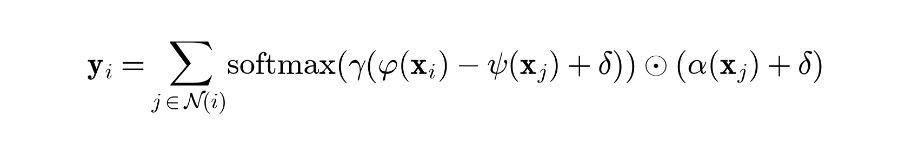
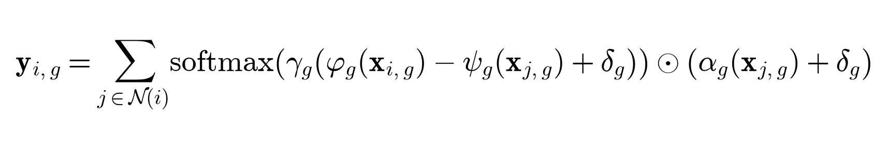
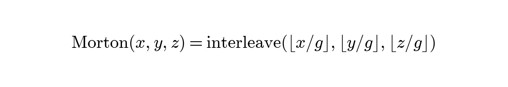
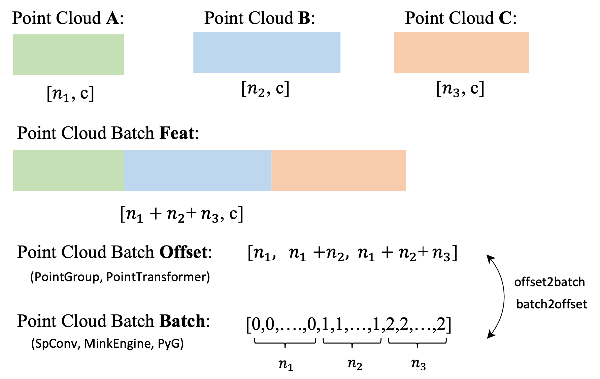
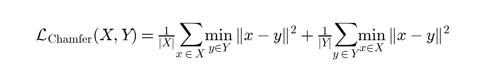
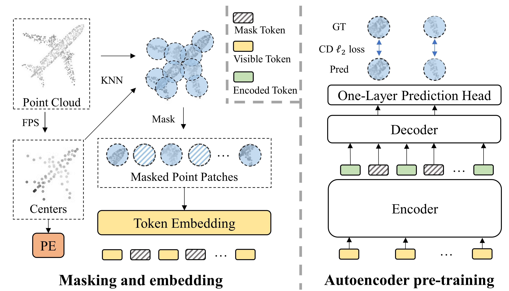
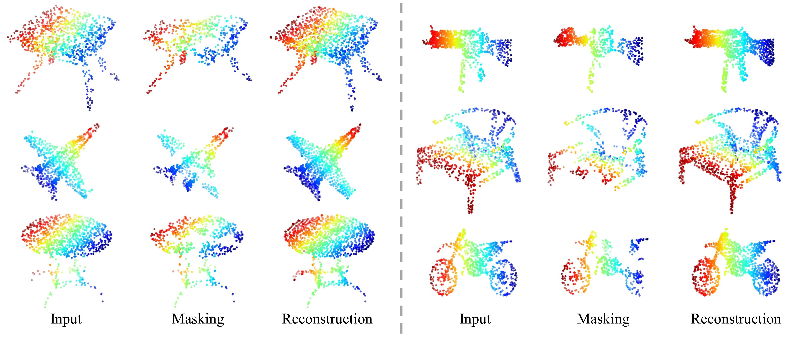

# Point Transformer Family & Point-MAE (3D Point Cloud Representation)

本目录包含了基于 PyTorch 从零实现的 <strong>Point Transformer (PTv1)</strong>、<strong>Point Transformer V2 (PTv2)</strong>、<strong>Point Transformer V3 (PTv3)</strong> 以及 <strong>Point-MAE</strong> 自监督学习架构的核心实现与前向传播逻辑。这些模型代表了 3D 点云表征学习（3D Point Cloud Representation Learning）从“高成本邻域搜索”走向“大规模 Morton 曲线序列化”与“自监督遮蔽重构”的技术演进路线。

---

## 目录
1. [模型家族概览](#模型家族概览)
2. [核心模型实现与解析](#核心模型实现与解析)
    - [Point Transformer V1 (ICCV 2021)](#1-point-transformer-v1-iccv-2021)
    - [Point Transformer V2 (NeurIPS 2022)](#2-point-transformer-v2-neurips-2022)
    - [Point Transformer V3 (CVPR 2024)](#3-point-transformer-v3-cvpr-2024)
    - [Point-MAE (ECCV 2022)](#4-point-mae-eccv-2022)
3. [快速开始与 Demo 运行](#快速开始与-demo-运行)
4. [公式与图示说明](#公式与图示说明)

---

## 模型家族概览

3D 点云（Point Cloud）具有无序性、稀疏性和几何不规则性。传统的 3D CNN 会带来巨大的计算负担，而 Transformer 架构在处理无序集时表现出了得天独厚的优势。
*   <strong>Point Transformer V1</strong> 首次将自注意力机制应用到点云局部 k-nearest neighbors（KNN）中，提出了基于位置编码和向量自注意力（Vector Attention）的局部表征算子。
*   <strong>Point Transformer V2</strong> 针对 V1 的计算开销进行优化，引入了分组向量自注意力（Grouped Vector Attention）和更具泛化性的位置编码乘子（Position Encoding Multiplier），并使用体素划分池化（Partition-Based Pooling）替代 FPS，显著降低了计算与内存开销。
*   <strong>Point Transformer V3</strong> 引入了点云 Morton 曲线序列化（Z-order space-filling curve serialization）的颠覆性范式，将 3D 点云映射为 1D 规则序列，在 1D 局部窗口（Patch Grouping）内计算 Dense Self-Attention，从而可以直接应用 FlashAttention 算法，运行效率和模型规模相比 PTv2 实现了数量级的提升。
*   <strong>Point-MAE</strong> 则将 Masked Autoencoder 自监督学习带入了 3D 领域。将点云分割为多个不规则点块（Patches），遮蔽掉 60%--80% 的块，由浅层 Encoder 编码可见块，再由 Decoder 重构出遮蔽块的局部 3D 几何（Chamfer Distance 监督）。

---

## 核心模型实现与解析

### 1. Point Transformer V1 (ICCV 2021)
*   <strong>代码实现</strong>: [point_transformer_v1.py](file:///Users/zhongzhiyi/Vision-Foundation-Model/PointTransformer/point_transformer_v1.py)
*   <strong>核心机制</strong>:
    1.  <strong>局部邻域搜索（KNN Lookup）</strong>: 寻找每个点局部 k 个最近邻居建立注意力图。
    2.  <strong>位置编码（Positional Encoding）</strong>: 通过 MLP 将三维相对坐标变换为与特征通道相同的向量 PE。
    3.  <strong>向量注意力（Vector Self-Attention）</strong>: 区别于常规 Scaled Dot-Product 注意力（输出标量权重），向量自注意力对每个通道独立计算注意力权重，更好地适应几何坐标突变。计算公式：
        <p align="center"></p>
    4.  <strong>层次化结构</strong>: 提供 Transition Down（基于 KNN 极大值池化下采样）与 Transition Up（基于 3-NN 距离加权插值上采样）的 Encoder-Decoder 结构。

#### 代码调用示例
```python
import torch
from point_transformer_v1 import PointTransformerV1

model = PointTransformerV1(in_channels=6, num_classes=10, k=16)
model.eval()

# 模拟输入: Batch=2, N=128 个点, 特征维度为 6 (XYZ坐标 + 3通道常规特征如法线)
xyz = torch.randn(2, 128, 3)
features = torch.randn(2, 128, 6)

logits = model(xyz, features)
print("Output logits shape:", logits.shape)  # torch.Size([2, 128, 10])
```

---

### 2. Point Transformer V2 (NeurIPS 2022)
*   <strong>代码实现</strong>: [point_transformer_v2.py](file:///Users/zhongzhiyi/Vision-Foundation-Model/PointTransformer/point_transformer_v2.py)
*   <strong>核心机制</strong>:
    1.  <strong>分组向量注意力（Grouped Vector Attention）</strong>: 为防止高维注意力图带来的过度冗余与计算消耗，将通道分割为 G 个组，各组内计算共享的向量注意力权重，保留向量注意力的表达力并减少参数量。计算公式：
        <p align="center"></p>
    2.  <strong>位置编码乘子（Position Encoding Multiplier）</strong>: 生成基于查询特征的乘数因子，动态调节 PE 大小。
    3.  <strong>体素划分池化（Partition-Based Pooling）</strong>: 摒弃了计算密集的最远点采样（FPS），将 3D 点云划分至体素网格（Voxel Grid），保留每个体素内的中心点和 max feature，极大加速了下采样。

#### 代码调用示例
```python
from point_transformer_v2 import PointTransformerV2
import torch

model = PointTransformerV2(in_channels=6, num_classes=10, groups=4, k=16)
model.eval()

xyz = torch.randn(2, 128, 3)
features = torch.randn(2, 128, 6)

logits = model(xyz, features)
print("Output classified logits shape:", logits.shape)  # torch.Size([2, 10])
```

---

### 3. Point Transformer V3 (CVPR 2024)
*   <strong>代码实现</strong>: [point_transformer_v3.py](file:///Users/zhongzhiyi/Vision-Foundation-Model/PointTransformer/point_transformer_v3.py)
*   <strong>核心机制</strong>:
    1.  <strong>Morton Z 曲线序列化</strong>: 通过将 3D 实数坐标转换为 Z-order Morton 二进制位交织码，在 1D 数组上进行排序。公式如下：
        <p align="center"></p>
    2.  <strong>分块窗口自注意力（Patch Grouping）</strong>: 排序后的 1D 序列中相邻点物理上也彼此接近。直接对 1D 序列切分为固定大小为 L 的连续 Patch，在 Patch 内部计算密集注意力，消除高昂的 KNN 搜索开销，并可无缝对接 FlashAttention 内核。
    3.  <strong>Offset 矩阵批处理（Offset Grid Batching）</strong>: 如图示说明，为了在同一 Tensor 中合并不同大小的点云序列，使用点云前缀和偏移量（Offset）来区分 Batch，保持 GPU 高并发计算效率。

<p align="center">
  
</p>

#### 代码调用示例
```python
from point_transformer_v3 import PointTransformerV3
import torch

model = PointTransformerV3(in_channels=6, num_classes=10, channels=64, patch_size=32, num_heads=4)
model.eval()

xyz = torch.randn(2, 128, 3)
features = torch.randn(2, 128, 6)

logits = model(xyz, features)
print("Morton sorted classification shape:", logits.shape)  # torch.Size([2, 10])
```

---

### 4. Point-MAE (ECCV 2022)
*   <strong>代码实现</strong>: [point_mae.py](file:///Users/zhongzhiyi/Vision-Foundation-Model/PointTransformer/point_mae.py)
*   <strong>核心机制</strong>:
    1.  <strong>点块嵌入（Patch Embedding）</strong>: 结合 FPS 与 KNN，将 3D 点云切分为不规则的点块（Patches），利用 Mini-PointNet 投影为一维特征 Token。
    2.  <strong>自监督遮蔽（Random Masking）</strong>: 对 Patch 按照高比例（如 60%--80%）实施掩码屏蔽。
    3.  <strong>非对称 Encoder-Decoder</strong>:
        -   <strong>Encoder</strong> 仅处理 unmasked 标记，进行特征交互。
        -   <strong>Decoder</strong> 联合 unmasked 编码特征以及用于填充的 learnable mask tokens 进行重构。
    4.  <strong>Chamfer 距离几何重建 Loss</strong>: 对被遮蔽块的 3D 坐标实施 Chamfer 距离拟合，定义如下：
        <p align="center"></p>

<p align="center">
  
</p>
<p align="center">
  
</p>

#### 代码调用示例
```python
from point_mae import PointMAE
import torch

model = PointMAE(embed_dim=128, depth_enc=3, depth_dec=1, mask_ratio=0.6, k=16)
model.eval()

xyz = torch.randn(2, 256, 3)
reconstructed_patches, gt_masked_patches, masked_indices = model(xyz, target_num_patches=64)

# 计算 Chamfer Loss 误差
loss = model.compute_loss(reconstructed_patches, gt_masked_patches)
print("Chamfer Reconstruction Loss:", loss.item())
```

---

## 快速开始与 Demo 运行

项目提供了一个完整的单元测试与前向推理验证脚本 [run_demo.py](file:///Users/zhongzhiyi/Vision-Foundation-Model/PointTransformer/run_demo.py)。它将使用代表性的随机张量执行以上所有姿态估计流水线，并在终端输出输入与预测输出张量的详细尺寸信息。

运行 demo 命令：
```bash
python PointTransformer/run_demo.py
```

---

## 公式与图示说明

*   <strong>静态公式</strong>: 所有的 Block Math 公式已经全部在本地使用 `matplotlib` 渲染为白底的高 DPI 图片并存放在 `images/` 中，以保证在暗色模式和不同的移动端浏览器上能瞬间且高保真地渲染显示。
*   <strong>论文图示</strong>: 已通过自动化脚本从官方开源库中获取：
    -   `pointcept_offset.png` 解释了为了加速稀疏点云在统一 Cuda 显存中运算，Pointcept 提出的全局前缀和偏移划分方式。
    -   `pointmae_net.jpg` 与 `pointmae_vvv.jpg` 说明了 Point-MAE 仅编码少量可见块，并在解码端完美重构出 3D 几何表面的流程与实际重构质量。
