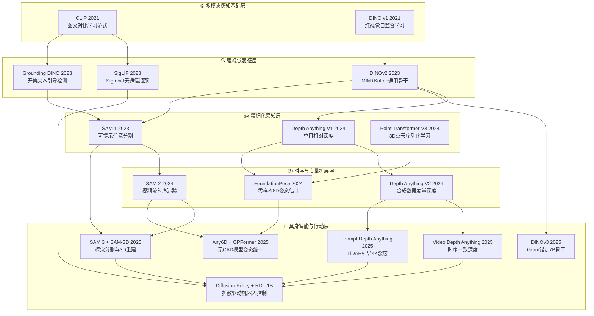
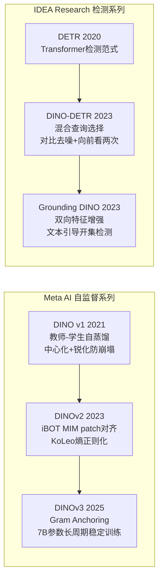
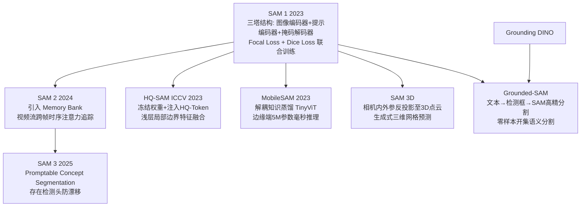
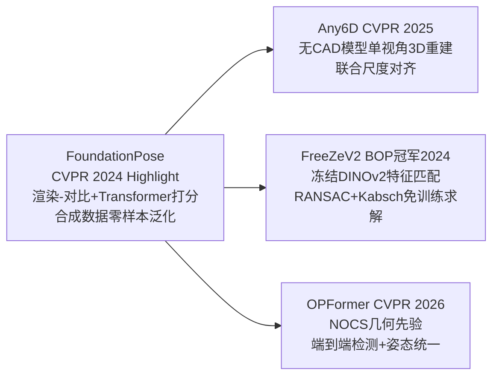
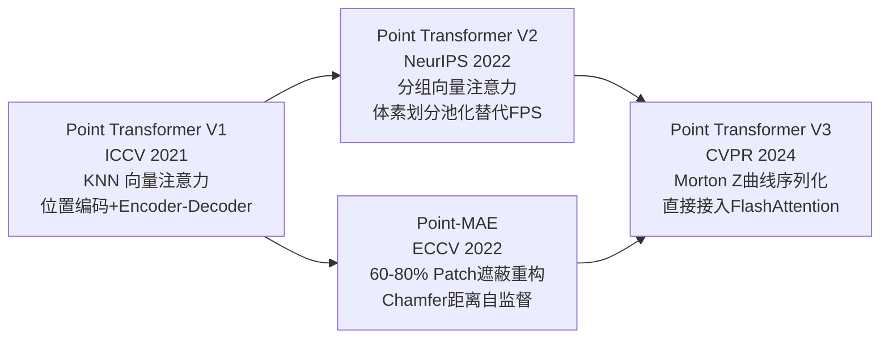

# Vision Foundation Models — 视觉基础模型系统化学习仓库

> 本仓库以 **从零纯 PyTorch 实现** 为核心，系统性地复现并研究计算机视觉领域最重要的视觉基础模型（Vision Foundation Models, VFMs）与视觉语言模型（Vision-Language Models, VLMs）。每个子目录均包含完整的模型实现、损失函数、调用示例与技术详解 README。

---

## 目录

1. [总体技术发展路线图](#一总体技术发展路线图)
2. [各阶段模型总览](#二各阶段模型总览)
   - [Stage 1 · 视觉-语言对比学习 (CLIP 家族)](#stage-1--视觉-语言对比学习-clip-家族)
   - [Stage 2 · 视觉自监督与开集检测 (DINO 家族)](#stage-2--视觉自监督与开集检测-dino-家族)
   - [Stage 3 · 可提示分割与时序追踪 (SAM 家族)](#stage-3--可提示分割与时序追踪-sam-家族)
   - [Stage 4 · 单目深度估计 (Depth Anything 家族)](#stage-4--单目深度估计-depth-anything-家族)
   - [Stage 5 · 生成式基座与具身控制 (Stable Diffusion 家族)](#stage-5--生成式基座与具身控制-stable-diffusion-家族)
   - [Stage 6 · 6D 物体姿态估计 (FoundationPose 家族)](#stage-6--6d-物体姿态估计-foundationpose-家族)
   - [Stage 7 · 3D 点云表征学习 (Point Transformer 家族)](#stage-7--3d-点云表征学习-point-transformer-家族)
3. [关键技术主线与交叉影响](#三关键技术主线与交叉影响)
4. [环境配置与运行说明](#四环境配置与运行说明)

---

## 一、总体技术发展路线图

计算机视觉基础模型的演进，可以沿着 **"从感知到理解再到行动"** 的主轴梳理出一条清晰的发展脉络。从早期的图文匹配对比学习，到无监督特征表征，再到精细化分割、深度感知、3D 理解，最终走向具身智能与机器人控制——每个阶段的突破都为下一个阶段的出现奠定了基础。

```mermaid
%%{init: {'theme': 'base', 'themeVariables': {'primaryColor': '#1e293b', 'primaryTextColor': '#f1f5f9', 'primaryBorderColor': '#334155', 'lineColor': '#64748b', 'secondaryColor': '#0f172a', 'tertiaryColor': '#1e293b'}}}%%
timeline
    title Vision Foundation Models 技术发展主轴 (2020–2025)
    section 2020–2021
        DETR : Transformer 首次引入目标检测
        DINO v1 : 无标签自蒸馏自监督学习
        CLIP OpenAI : 双塔图文对比学习范式奠基
    section 2022
        OpenCLIP : 大规模开源复现与缩放
        FLIP Meta : 掩码加速图文对比预训练
        Point Transformer V2 : 分组向量注意力与体素池化
    section 2023
        CLIPA EVA-CLIP SigLIP : 效率优化与Sigmoid损失革命
        DINOv2 : 融合MIM与KoLeo的通用视觉骨干
        DINO-DETR Grounding DINO : 开集文本引导检测
        SAM 1 : 可提示分割基础架构
        HQ-SAM MobileSAM : 边界精化与轻量化
        Depth Anything V1 : 62M无标注图像释放深度基础能力
    section 2024
        SAM 2 : Memory Bank视频流跟踪
        Depth Anything V2 : 合成数据Teacher驱动精度飞跃
        FoundationPose : 零样本6D物体姿态泛化
        Point Transformer V3 : Morton曲线序列化革命
        FreeZeV2 : 训练无关DINOv2姿态估计夺冠BOP
    section 2025
        DINOv3 : Gram Anchoring抑制特征退化 7B参数
        SAM 3 SAM-3D : 概念提示分割与3D空间提升
        Video Depth Anything : ConvLSTM时序一致深度 CVPR Highlight
        Prompt Depth Anything : 稀疏LiDAR引导4K度量深度
        Any6D OPFormer : 无CAD模型姿态与端到端Transformer统一
        RDT-1B : 1.2B参数机器人具身扩散大模型
```



### 核心演进主线拆解



---

## 二、各阶段模型总览

### Stage 1 · 视觉-语言对比学习 (CLIP 家族)

> 📁 [`CLIP/`](CLIP/README.md) — 5 种模型实现

**核心贡献**：确立了以大规模图文对比学习训练通用视觉编码器的基础范式，赋予模型零样本（Zero-shot）迁移能力。

| 模型 | 年份 | 核心创新 | 解决的痛点 |
|:---|:---:|:---|:---|
| **OpenAI CLIP** | 2021 | 双塔 InfoNCE 对比学习 + 可学习温度 τ | 传统监督分类泛化瓶颈 |
| **OpenCLIP** | 2022 | LAION-2B 开源数据 + ViT-bigG 超大模型 | 闭源模型数据与权重不可及 |
| **FLIP** (Meta) | 2022 | 随机遮蔽 50–75% 图像 Patch 加速训练 | 训练计算代价极高 |
| **CLIPA** | 2023 | 动态低→高分辨率渐进训练 + Token Packing | 学术界入局门槛过高 |
| **EVA-CLIP** (BAAI) | 2023 | MIM 预训练权重初始化 + LayerScale + SwiGLU | 超大模型训练不稳定 |
| **SigLIP** (Google) | 2023 | **Sigmoid 损失**替代 Softmax，O(N)→O(N) 通信 | 分布式多卡 All-Gather 通信瓶颈 |

**技术演进关键节点**：SigLIP 将对比学习从 N×N Softmax 归一化转变为 N×N 独立二分类，彻底消除跨卡通信依赖，成为 Google PaliGemma 等现代 VLM 的核心对齐骨干。

---

### Stage 2 · 视觉自监督与开集检测 (DINO 家族)

> 📁 [`DINO/`](DINO/README.md) — 5 种模型实现

**核心贡献**：证明了无标签自监督训练可以产生媲美乃至超越有监督预训练的通用视觉表征，同时将 Transformer 检测器与文本引导相结合实现开集目标定位。

**两大技术分支**：



| 模型 | 核心机制 | 技术亮点 |
|:---|:---|:---|
| **DINO v1** | 教师-学生自蒸馏，EMA 权重更新 | 首次无标签 ViT 自监督，Emerging Segmenter 现象 |
| **DINOv2** | iBOT MIM + KoLeo 正则化 | 单骨干适配分割/深度/分类等所有下游任务 |
| **DINOv3** | Gram Anchoring 格拉姆锚定 | 7B 参数、17亿图片下局部特征不退化 |
| **DINO-DETR** | 混合查询选择 + CDN 对比去噪 + Look Forward Twice | 1×训练期收敛速度 DETR 的 10× |
| **Grounding DINO** | BiAttention 图文双向增强器 + 跨模态解码 | 任意文本 Prompt 零样本定位任意物体 |

---

### Stage 3 · 可提示分割与时序追踪 (SAM 家族)

> 📁 [`SAM/`](SAM/README.md) — 7 种模型实现

**核心贡献**：确立了"提示驱动（Prompt-Driven）"分割的范式，将分割任务从封闭类别集合扩展到任意交互目标，并进一步拓展至视频追踪、3D 空间重建与开集语义理解。



**关键技术演进**：从单帧点/框提示（SAM 1）→ 视频记忆追踪（SAM 2）→ 语言/视觉示例概念提示（SAM 3）→ 2D 掩码三维空间提升（SAM 3D），完整覆盖空间-时间-语义三个维度的扩展。

---

### Stage 4 · 单目深度估计 (Depth Anything 家族)

> 📁 [`Depth-Anything/`](Depth-Anything/README.md) — 4 种模型实现

**核心贡献**：将 DINOv2 强视觉骨干与 DPT 多尺度解码器结合，以大规模数据蒸馏策略训练出能够泛化到任意场景的单目深度基础模型，并逐步扩展至时序一致性与度量精度。

| 模型 | 发表 | 关键能力 | 技术突破 |
|:---|:---:|:---|:---|
| **Depth Anything V1** | CVPR 2024 | 相对视差，零样本迁移 | 62M 无标注图像半监督蒸馏 |
| **Depth Anything V2** | NeurIPS 2024 | 相对/度量深度，ViT-G 1.3B | 合成数据 Teacher，伪标签质量飞跃 |
| **Video Depth Anything** | CVPR 2025 ★ | 时序一致视频深度，流式推理 | ConvLSTM 跨帧状态传播 |
| **Prompt Depth Anything** | CVPR 2025 | 4K 度量深度 + 稀疏 LiDAR | 低成本 LiDAR 点作为度量锚点提示 |

> ★ CVPR 2025 Highlight（接收论文前 13.5%）

**技术演进关键节点**：V1→V2 的核心跨越是将教师从"真实数据训练"换为"合成数据训练"，从根本上消除了标注噪声对伪标签质量的污染。Video DA 将单帧预测升维为时序连续预测，PromptDA 则彻底解决了单目深度的"尺度模糊"根本性局限。

---

### Stage 5 · 生成式基座与具身控制 (Stable Diffusion 家族)

> 📁 [`StableDiffusion/`](StableDiffusion/README.md) — 6 种模型实现

**核心贡献**：将扩散生成模型从图像合成扩展至视频物理世界建模与机器人动作轨迹决策，构建了从感知到行动的完整具身智能技术栈。

**两条技术路线**：

<table>
<tr><th>技术路线</th><th>模型</th><th>核心贡献</th></tr>
<tr>
<td rowspan="4"><strong>生成式媒体合成</strong></td>
<td>Stable Diffusion (LDM)</td>
<td>VAE 潜在空间压缩 + UNet 去噪 + DDPM/DDIM 采样</td>
</tr>
<tr>
<td>DiT</td>
<td>用 Transformer 替代 UNet，AdaLN 条件调制注入</td>
</tr>
<tr>
<td>Video DiT</td>
<td>空间-时间因子化，Sora 核心：时序层交织+门控融合</td>
</tr>
<tr>
<td>Classifier-Free Guidance</td>
<td>无分类器条件引导，控制多样性与保真度的平衡</td>
</tr>
<tr>
<td rowspan="2"><strong>具身控制决策</strong></td>
<td>Diffusion Policy</td>
<td>扩散模型驱动机器人多模态轨迹生成，解决 BC mode averaging</td>
</tr>
<tr>
<td>Flow Matching Policy + RDT-1B</td>
<td>直线概率流替代随机去噪，100Hz 极速闭环控制；128 维统一异构机器人动作空间</td>
</tr>
</table>

**技术演进关键节点**：Video DiT 证明了"视频生成即物理世界建模"的可行性；Diffusion Policy 将去噪范式迁移至机器人控制，Flow Matching 将其推理速度提升 20×；RDT-1B 首次实现异构双臂机器人的统一大模型控制。

---

### Stage 6 · 6D 物体姿态估计 (FoundationPose 家族)

> 📁 [`FoundationPose/`](FoundationPose/README.md) — 4 种模型实现

**核心贡献**：将 6D 物体姿态估计从"特定物体监督微调"推向"零样本泛化"，乃至"完全免训练"的方向演进，最终实现端到端 Transformer 统一框架。



| 模型 | 核心技术 | 里程碑意义 |
|:---|:---|:---|
| **FoundationPose** | 渲染-对比网络 + 6D 连续旋转表示 + Transformer 打分 | 首个真正零样本泛化到任意未见物体的姿态估计器 |
| **Any6D** | InstantMesh 单视角 3D 重建 + 度量尺度对齐 | 无需 CAD 模型，一张锚图即可完成绝对尺度姿态估计 |
| **FreeZeV2** | 冻结 DINOv2 描述子 + RANSAC-Kabsch SVD 闭式解 | 彻底无需训练，直接迁移视觉基础模型完成姿态估计 |
| **OPFormer** | 多模板编码器 + NOCS 几何先验 + 交叉注意力对应解码 | 端到端统一检测与姿态，效率与鲁棒性最优 |

---

### Stage 7 · 3D 点云表征学习 (Point Transformer 家族)

> 📁 [`PointTransformer/`](PointTransformer/README.md) — 4 种模型实现

**核心贡献**：将 Transformer 自注意力机制引入三维点云处理，从局部 KNN 向量注意力逐步进化到 Morton 曲线序列化的一维高效计算，并通过自监督掩码重构学习强泛化的三维几何表征。



| 模型 | 核心创新 | 计算效率 |
|:---|:---|:---|
| **Point Transformer V1** | 局部 KNN 向量自注意力，每通道独立权重 | O(N·K) KNN 搜索开销 |
| **Point Transformer V2** | 分组向量注意力 + 体素划分池化 | 显著降低内存与采样开销 |
| **Point Transformer V3** | **Morton Z 曲线一维序列化** + 局部窗口 Patch 注意力 | 可直接调用 FlashAttention，数量级效率提升 |
| **Point-MAE** | 60–80% Patch 遮蔽 + Chamfer 距离几何重建监督 | 自监督，无需标注，强泛化三维几何表征 |

**技术演进关键节点**：PTv3 的 Morton 曲线序列化是三维点云处理领域的范式革命——将不规则 3D 点云转化为可被标准 Transformer 高效处理的有序序列，彻底消除了 KNN 搜索瓶颈。

---

## 三、关键技术主线与交叉影响

以下梳理了贯穿整个仓库的四条核心技术发展主线：

### 主线 1：自监督表征学习 → 通用视觉骨干

```
DINO v1 (2021) 教师-学生自蒸馏
    │
    ▼
DINOv2 (2023) iBOT MIM + KoLeo  ——→  Depth Anything V1/V2 (DINOv2 作为深度编码器骨干)
    │                               ——→  FoundationPose FreeZeV2 (冻结 DINOv2 作为描述子提取)
    ▼
DINOv3 (2025) Gram Anchoring 7B  ——→  下一代视觉基础模型通用骨干
```

**技术洞察**：DINOv2 是目前最重要的"赋能型骨干"——它同时被 Depth Anything、FreeZeV2 等完全不同任务的模型直接复用，证明了强自监督表征的跨任务泛化能力。

### 主线 2：对比学习效率革命 → 多模态对齐

```
CLIP Softmax InfoNCE O(N²) 通信
    │
    ├─→ FLIP 图像 Patch 遮蔽 → 2-3× 速度提升
    ├─→ CLIPA 动态分辨率 → 极低算力入场门槛
    ├─→ EVA-CLIP MIM 初始化 → 超大规模训练稳定
    │
    ▼
SigLIP Sigmoid Binary Loss O(N) 通信
    │
    ▼
现代 VLM 核心对齐骨干（PaliGemma、LLaVA 等）
    │
    ▼
Grounding DINO (文本引导开集检测)
    │
    ▼
Grounded-SAM (文本 → 检测框 → 像素级分割)
```

### 主线 3：分割感知深度化 → 三维空间理解

```
SAM 1 (2023) 2D 可提示分割
    │
    ├─→ SAM 2 视频时序追踪
    ├─→ HQ-SAM 高精度边界
    ├─→ SAM 3D 深度+相机参数反投影至 3D 点云
    │
    ▼
Depth Anything V1/V2 单目深度基础模型
    │
    ├─→ Video Depth Anything 时序一致深度
    ├─→ Prompt Depth Anything 稀疏LiDAR度量深度
    │
    ▼
FoundationPose RGB-D 6D 物体姿态估计
    │
    ▼
Any6D 无CAD模型绝对尺度姿态估计
```

### 主线 4：生成式建模 → 具身智能行动

```
Stable Diffusion LDM (2022) 潜在空间条件图像生成
    │
    ├─→ DiT Transformer 替代 UNet，AdaLN 条件调制
    ├─→ Video DiT 时空因子化，视频生成即物理世界建模
    │
    ▼
Diffusion Policy (2023) 扩散范式驱动机器人轨迹决策
    │
    ├─→ Flow Matching Policy 直线概率流 → 5步推理 100Hz 闭环
    │
    ▼
RDT-1B (2025) 1.2B 参数，128维统一动作空间，异构双臂机器人大模型
```

### 技术交汇全景图

下表展示了各模型之间的关键依赖与影响关系：

| 提供能力的模型 | 被依赖/复用于 | 复用的具体能力 |
|:---|:---|:---|
| **CLIP** | Stable Diffusion, Grounding DINO | 文本编码器，多模态特征空间 |
| **DINOv2** | Depth Anything V1/V2, FreeZeV2, FoundationPose | 通用视觉骨干，强泛化局部特征描述子 |
| **SigLIP** | 现代 VLM (PaliGemma 等), Diffusion Policy | 高效视觉-语言对齐损失，视觉条件编码 |
| **DINO-DETR** | Grounding DINO | 混合查询选择，对比去噪，Look Forward Twice |
| **Grounding DINO** | Grounded-SAM, SAM 3 | 文本引导的开集检测框生成 |
| **SAM 1** | Grounded-SAM, HQ-SAM, MobileSAM, SAM 2/3/3D | 三塔提示分割架构，掩码解码器 |
| **Stable Diffusion** | Diffusion Policy, Video DiT, RDT-1B | DDPM/DDIM 去噪范式，UNet/Transformer 去噪骨干 |
| **FoundationPose** | Any6D | 渲染-对比网络，Transformer 姿态打分 |

---

## 四、环境配置与运行说明

### 4.1 环境要求

本项目使用 `uv` 管理虚拟环境：

```bash
# 克隆仓库
git clone https://github.com/your-repo/Vision-Foundation-Model.git
cd Vision-Foundation-Model

# 使用 uv 安装依赖（首次使用需安装 uv）
pip install uv
uv sync
```

主要依赖：
- Python ≥ 3.10
- PyTorch ≥ 2.0（CUDA 可选）
- torchvision, einops, timm

### 4.2 各子目录 Demo 一键运行

每个子目录均提供了 `run_demo.py`，可直接验证所有模型的前向传播与输出维度：

```bash
# 激活虚拟环境
source .venv/bin/activate

# 运行各阶段 Demo
python CLIP/run_demo.py           # Stage 1: CLIP 系列
python DINO/run_demo.py           # Stage 2: DINO 系列
python SAM/run_demo.py            # Stage 3: SAM 系列
python Depth-Anything/run_demo.py # Stage 4: Depth Anything 系列
python StableDiffusion/run_demo.py# Stage 5: Stable Diffusion 系列
python FoundationPose/run_demo.py # Stage 6: FoundationPose 系列
python PointTransformer/run_demo.py # Stage 7: Point Transformer 系列
```

### 4.3 子目录详细文档

| 目录 | 阶段 | 详细 README |
|:---|:---|:---|
| [`CLIP/`](CLIP/README.md) | Stage 1 | CLIP → FLIP → CLIPA → EVA-CLIP → SigLIP |
| [`DINO/`](DINO/README.md) | Stage 2 | DINO v1 → DINOv2 → DINOv3 + DINO-DETR → Grounding DINO |
| [`SAM/`](SAM/README.md) | Stage 3 | SAM 1 → SAM 2 → SAM 3 + SAM-3D + HQ-SAM + MobileSAM + Grounded-SAM |
| [`Depth-Anything/`](Depth-Anything/README.md) | Stage 4 | DA V1 → DA V2 → Video DA → Prompt DA |
| [`StableDiffusion/`](StableDiffusion/README.md) | Stage 5 | LDM → DiT → Video DiT → Diffusion Policy → Flow Matching → RDT-1B |
| [`FoundationPose/`](FoundationPose/README.md) | Stage 6 | FoundationPose → Any6D → FreeZeV2 → OPFormer |
| [`PointTransformer/`](PointTransformer/README.md) | Stage 7 | PTv1 → PTv2 → PTv3 + Point-MAE |

---

<p align="center">
  <em>本仓库持续更新中 · 欢迎 Star & Fork · 如有问题请提 Issue</em>
</p>
