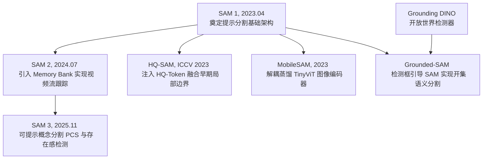

# SAM (Segment Anything Model) 提示分割与时序跟踪演进及研究

本项目第三阶段聚焦于视觉分割领域的里程碑系列 —— <strong>SAM (Segment Anything Model)</strong>。我们在此实现了由 Meta AI、BAAI 等机构提出的五种核心分割架构的 **纯 PyTorch 从零实现**，解耦了繁琐的库依赖，专注于最核心的模型前向流动、提示对齐与时序追踪机制。

---

## 1. 概念与演进路径概览

在 Segment Anything 生态中，演进路线主要沿着 <strong>时序追踪</strong>、<strong>边界质量提升</strong>、<strong>边缘端轻量化</strong> 以及 <strong>开集文本引导</strong> 四个维度展开。我们将整体演进关系梳理如下：



---

## 2. 核心架构与模型详解

### 2.1 SAM 1：可提示分割基线 (2023)
SAM 1 确立了三塔结构：图像编码器（Heavy ViT-H/L/B）、提示编码器（Sinusoidal 坐标点/框，BERT 文本，卷积掩码）与轻量双向交叉注意力掩码解码器。
*   **多尺度歧义解决**：SAM 在输出端同时预测 3 种不同粒度尺度的掩码（Whole, Part, Subpart）并评估其 IoU 分数，从根本上克服了单点交互时的结构模糊性。
*   **联合损失函数**：训练时采用 **Focal Loss** 与 **Dice Loss** 的线性加权组合以平衡像素类别不均与边界拟合：
    *   Focal Loss 公式：
        <p align="center"></p>
    *   Dice Loss 公式：
        <p align="center"></p>

### 2.2 SAM 2：视频与时序记忆跟踪 (2024)
SAM 2 引入了 <strong>Memory Bank（记忆库）</strong> 与 <strong>Memory Attention（记忆注意力）</strong>。
*   **流式处理**：在解码当前第 t 帧时，Memory Attention 模块使当前帧特征图（Query）对过去最近 N 帧及用户交互关键帧的特征和掩码（Keys & Values）进行时序注意力检索。
*   **交互修正**：用户可在视频追踪发生漂移的任意帧添加新 Prompt，SAM 2 会将这一帧作为新的“记忆节点”存入库中，并向前后双向重新扩散传播，刷新各帧掩码。

### 2.3 HQ-SAM：高精度边界修正 (2023)
HQ-SAM 为分割发丝、线缆等细微物体而生，特点是 **完全冻结 SAM 1 图像编码器和解码器原参数**，仅外挂不足 0.5% 参数量的结构：
*   **HQ-Token**：在 Transformer Decoder 中新增一个可学习的 HQ 标记向量。
*   **全局-局部融合 (Global-Local Fusion)**：将 Transformer 早期提取的高清低层特征（Low-level features，蕴含丰富几何边缘）与深层高层特征进行拼接，通过 HQ-Token 预测高精细边缘掩码。

### 2.4 MobileSAM：解耦知识蒸馏 (2023)
为了让 SAM 在边缘端侧设备上做到实时运行，MobileSAM 提出了 <strong>解耦知识蒸馏 (Decoupled Knowledge Distillation)</strong>。
*   由于图像特征提取最为耗费算力，MobileSAM 保持提示编码与掩码解码完全冻结，将 ViT-H 图像编码器输出的特征作为 Teacher，蒸馏训练一个仅有 500 万参数的 **TinyViT** 图像编码器作为 Student。
*   训练完成后，可将 TinyViT 编码器作为 drop-in 模块替换原 Heavy 编码器，实现 60x 速度提升（图像处理耗时 ~10ms）。

### 2.5 Grounded-SAM：开集文本引导分割流水线
Grounded-SAM 巧妙地将 <strong>Grounding DINO 的开放世界目标检测能力</strong> 与 <strong>SAM 的高精细像素分割能力</strong> 相结合。
*   用户输入自由文本 Prompt（如 *"the blue mug"*），首先通过 Grounding DINO 锁定目标位置并生成边界框（Bounding Box）。
*   边界框自动转换为 SAM 的 Box Prompt 作为空间几何约束，生成高精度的开集语义分割掩码。

---

## 3. 本项目代码结构与使用

本阶段所有 PyTorch 代码均存放于 `SAM/` 目录下：
1.  **SAM 1 基线**：[sam_v1.py](file:///Users/zhongzhiyi/Vision-Foundation-Model/SAM/sam_v1.py) (ViT 编码器、稀疏/密集提示编码、Mask 交叉注意力解码器及 Focal+Dice 损失)。
2.  **SAM 2 时序跟踪**：[sam_v2.py](file:///Users/zhongzhiyi/Vision-Foundation-Model/SAM/sam_v2.py) (记忆库单元队列、时序注意力融合层、视频流顺序追踪前向流)。
3.  **HQ-SAM 边缘细化**：[hq_sam.py](file:///Users/zhongzhiyi/Vision-Foundation-Model/SAM/hq_sam.py) (提取 ViT 多阶段中间层特征、HQ-Token 拼接及 Global-Local 融合卷积网络)。
4.  **MobileSAM 轻量化**：[mobile_sam.py](file:///Users/zhongzhiyi/Vision-Foundation-Model/SAM/mobile_sam.py) (TinyViT 卷积干线、轻量 Self-attention 编码器以及解耦蒸馏特征对齐训练接口)。
5.  **Grounded-SAM 串联**：[grounded_sam.py](file:///Users/zhongzhiyi/Vision-Foundation-Model/SAM/grounded_sam.py) (导入 Grounding DINO，处理 `[cx, cy, w, h]` 到 `[x1, y1, x2, y2]` 的坐标映射与过滤)。
6.  **架构仿真运行 Demo**：[run_demo.py](file:///Users/zhongzhiyi/Vision-Foundation-Model/SAM/run_demo.py) (一键跑通 5 种模型的模拟输入测试与 IoU 置信度计算)。

### 3.1 运行测试方式
直接在终端运行以下测试 Demo 脚本：
```bash
/Users/zhongzhiyi/Vision-Foundation-Model/.venv/bin/python SAM/run_demo.py
```

---

## 4. 各模型前向传播调用代码框

以下给出各个模型前向传播的正确实例化与调用接口：

### ① SAM 1 模拟调用 (点与框 Prompt)
```python
from SAM.sam_v1 import SAM1
import torch

# 1. 实例化模型
model = SAM1(in_channels=3, embed_dim=256)
model.eval()

# 2. 模拟输入 (Batch Size = 1)
images = torch.randn(1, 3, 256, 256)
points = torch.tensor([[[0.3, 0.4], [0.7, 0.8]]])  # [B, N_pts, 2]
labels = torch.tensor([[1, 0]])                     # [B, N_pts] (1=前景点, 0=背景点)
boxes = torch.tensor([[0.2, 0.2, 0.8, 0.8]])        # [B, 4] (两个角点 [x1, y1, x2, y2])

# 3. 前向计算点和框引导的分割掩码
masks, iou_scores = model(images, points=points, labels=labels, boxes=boxes)
print("SAM 1 Masks shape:", masks.shape)            # [1, 3, 64, 64]
print("SAM 1 IoU Scores:", iou_scores)              # [1, 3] (对应整/部件/子部件三个粒度)
```

### ② SAM 2 模拟调用 (视频流式记忆追踪)
```python
from SAM.sam_v2 import SAM2
import torch

# 1. 实例化模型并清空历史追踪记忆
model = SAM2(in_channels=3, embed_dim=256)
model.reset_video_memory()
model.eval()

# 2. 模拟第一帧: 用户在中心进行点击交互 (is_video_frame=True)
img0 = torch.randn(1, 3, 256, 256)
pts0 = torch.tensor([[[0.5, 0.5]]])
lbls0 = torch.tensor([[1]])

masks0, iou0 = model(img0, points=pts0, labels=lbls0, is_video_frame=True)
print("[Frame 0] Predicted masks:", masks0.shape)

# 3. 模拟第二帧: 自动时序追踪模式 (无 Prompt, is_video_frame=True)
img1 = torch.randn(1, 3, 256, 256)
masks1, iou1 = model(img1, is_video_frame=True)
print("[Frame 1] Tracked masks:", masks1.shape)
```

### ③ HQ-SAM 模拟调用 (高精度边缘特征提取)
```python
from SAM.hq_sam import HQSAM
import torch

# 1. 实例化模型
model = HQSAM(in_channels=3, embed_dim=256)
model.eval()

images = torch.randn(1, 3, 256, 256)
points = torch.tensor([[[0.5, 0.5]]])
labels = torch.tensor([[1]])

# 2. 前向计算 (包含原 SAM 的 3 个掩码与额外融合出来的 HQ 掩码)
masks, iou_scores = model(images, points=points, labels=labels)
print("HQ-SAM outputs masks shape:", masks.shape)   # [1, 4, 64, 64]
print("  Index 3 is the High-Quality mask:", masks[:, 3, :, :].shape)
```

### ④ MobileSAM 模拟调用 (TinyViT 轻量化加速)
```python
from SAM.mobile_sam import MobileSAM
import torch

# 1. 实例化模型 (使用高效的 5M 参数 TinyViT 作为骨干)
model = MobileSAM(in_channels=3, embed_dim=256)
model.eval()

images = torch.randn(1, 3, 256, 256)
boxes = torch.tensor([[0.1, 0.1, 0.9, 0.9]])

# 2. 快速实时分割
masks, iou_scores = model(images, boxes=boxes)
print("MobileSAM masks shape:", masks.shape)        # [1, 3, 64, 64]
```

### ⑤ Grounded-SAM 模拟双塔串联 (开放世界文本引导分割)
```python
from SAM.grounded_sam import GroundedSAM
import torch

# 1. 实例化端到端文本分割流水线
model = GroundedSAM(vocab_size=30522, num_queries=15, embed_dim=256)
model.eval()

# 2. 输入图像与文本分词 Token (L = 10)
images = torch.randn(1, 3, 256, 256)
input_ids = torch.randint(0, 30522, (1, 10))

# 3. 运行流水线: 自动通过 Grounding DINO 锁定边界框并转换输入 SAM
masks_batch, boxes_batch = model(images, input_ids, confidence_threshold=0.1)

# 4. 解析首张图像的检测分割结果
masks = masks_batch[0]
boxes = boxes_batch[0]
if masks is not None:
    print(f"Detected {boxes.shape[0]} matching items.")
    print("Boxes coordinates [x1, y1, x2, y2]:", boxes)
    print("SAM high-precision masks shape:", masks.shape) # [N_detected, 1, 64, 64]
```
