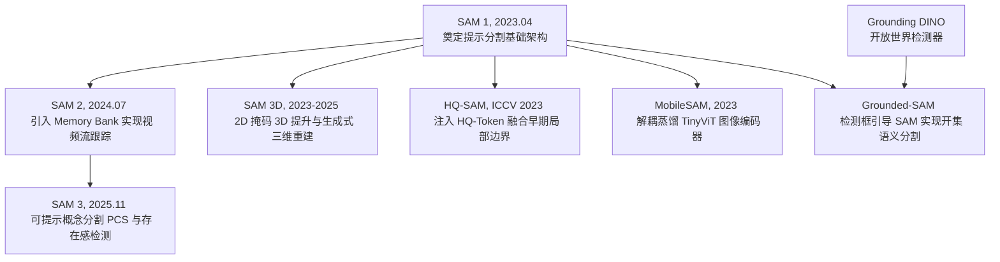
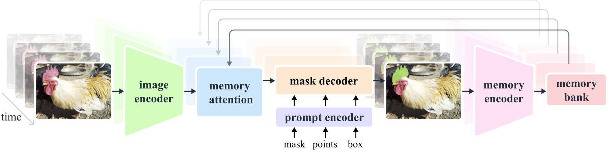
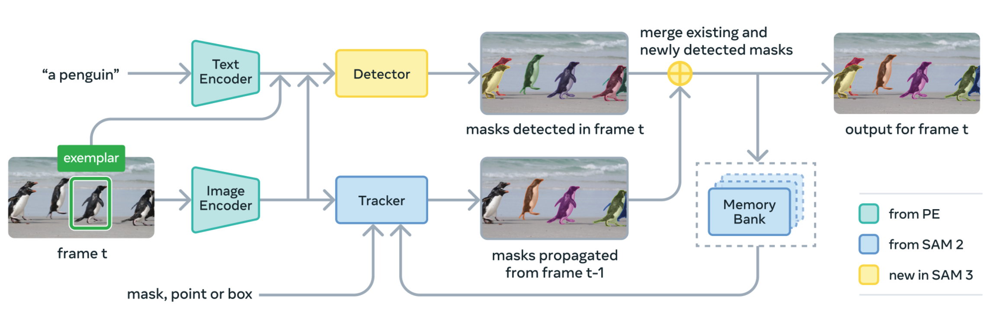
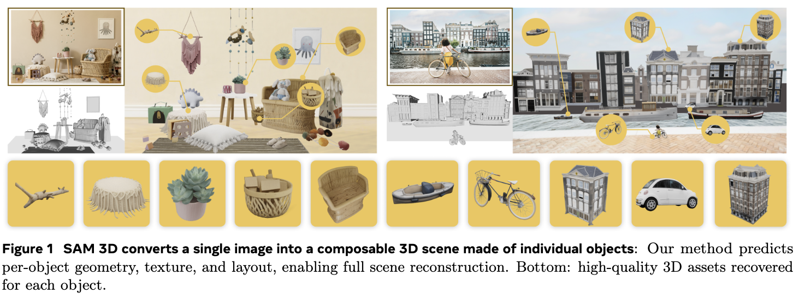
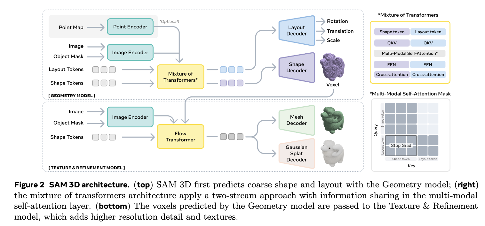
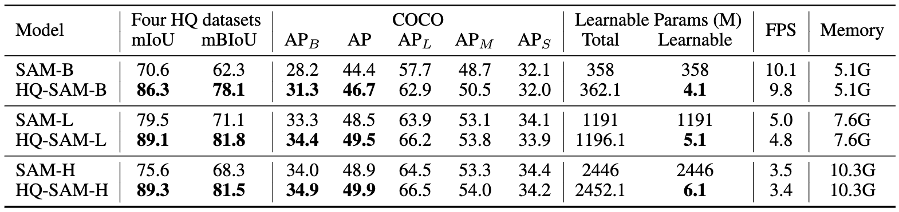
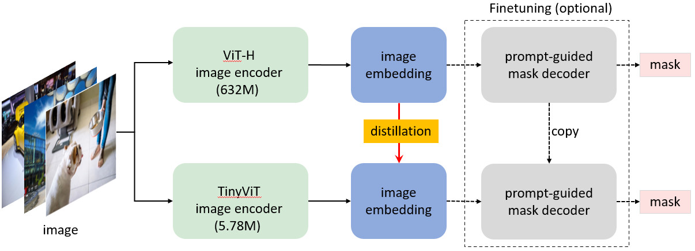

# SAM (Segment Anything Model) 提示分割、时序跟踪与 3D 重建演进及研究

本项目第三阶段聚焦于视觉分割领域的里程碑系列 —— <strong>SAM (Segment Anything Model)</strong>。我们在此实现了由 Meta AI、BAAI 等机构提出的七种核心分割架构的 <strong>纯 PyTorch 从零实现</strong>，解耦了繁琐的库依赖，专注于最核心的模型前向流动、提示对齐与时序追踪机制。

---

## 1. 概念与演进路径概览

在 Segment Anything 生态中，演进路线主要沿着 <strong>时序追踪</strong>、<strong>概念提示扩展</strong>、<strong>3D 空间提升</strong>、<strong>边界质量提升</strong>、<strong>边缘端轻量化</strong> 以及 <strong>开集文本引导</strong> 等维度展开。我们将整体演进关系梳理如下：



---

## 2. 核心架构与模型详解

### 2.1 SAM 1：可提示分割基线 (2023)

<p align="center">
  
</p>

SAM 1 确立了三塔结构：图像编码器（Heavy ViT-H/L/B）、提示编码器（Sinusoidal 坐标点/框，BERT 文本，卷积掩码）与轻量双向交叉注意力掩码解码器。
*   <strong>多尺度歧义解决</strong>：SAM 在输出端同时预测 3 种不同粒度尺度的掩码（Whole, Part, Subpart）并评估其 IoU 分数，从根本上克服了单点交互时的结构模糊性。
*   <strong>联合损失函数</strong>：训练时采用 <strong>Focal Loss</strong> 与 <strong>Dice Loss</strong> 的线性加权组合以平衡像素类别不均与边界拟合：
    *   Focal Loss 公式：
        $$
        \mathcal{L}_{\text{Focal}} = - \alpha (1-p)^\gamma y \log p - (1-\alpha) p^\gamma (1-y) \log(1-p)
        $$
    *   Dice Loss 公式：
        $$
        \mathcal{L}_{\text{Dice}} = 1 - \frac{2 \sum_i p_i y_i}{\sum_i p_i^2 + \sum_i y_i^2}
        $$

### 2.2 SAM 2：视频与时序记忆跟踪 (2024)

<p align="center">
  
</p>

SAM 2 引入了 <strong>Memory Bank（记忆库）</strong> 与 <strong>Memory Attention（记忆注意力）</strong>。
*   <strong>流式处理</strong>：在解码当前第 t 帧时，Memory Attention 模块使当前帧特征图（Query）对过去最近 N 帧及用户交互关键帧的特征和掩码（Keys & Values）进行时序注意力检索。
*   <strong>交互修正</strong>：用户可在视频追踪发生漂移的任意帧添加新 Prompt，SAM 2 会将这一帧作为新的“记忆节点”存入库中，并向前后双向重新扩散传播，刷新各帧掩码。

### 2.3 SAM 3：可提示概念分割与存在性检测 (2025.11)

<p align="center">
  
</p>

SAM 3 引入了 <strong>可提示概念分割 (Promptable Concept Segmentation, PCS)</strong> 以及用于跟踪鲁棒性的 <strong>存在检测头 (Presence Head)</strong>：
*   <strong>多模态概念提示 (Promptable Concept)</strong>：不仅支持传统的空间点/框提示，还支持利用多模态概念编码器（Concept Encoder）将自然语言名词（文本提示）或视觉示例剪裁（Exemplar Crops）映射为统一的提示表征 token。
*   <strong>解耦存在分类器 (Decoupled Presence Classifier)</strong>：在视频流式跟踪中，为了防止由于目标遮挡、出界引起的跟踪漂移，SAM 3 引入了独立的 Presence Head，用来输出当前帧中目标物体存在的对数概率（presence logits）。一旦检测到物体不存在，就会阻断当前的记忆写入，极大地增强了复杂多变场景下的时序追踪稳定性。

### 2.4 SAM 3D：2D 掩码 3D 提升与生成式三维网格重建

<p align="center">
  
  
</p>

SAM 3D (包括 SA3D 像素反投影与三维生成网格重建) 专注于将 2D 密集分割能力拓展到三维物理空间：
*   <strong>相机反投影提升模块 (Camera Lifting Module)</strong>：基于相机内参矩阵 K 和外参矩阵 <strong>[R | T]</strong>，将 2D 密集分割的掩码概率分布和估计的深度图（Depth Map）反投影到三维空间，计算得到带有分割得分的三维点云（3D Point Cloud）。
*   <strong>生成式三维网格预测 (Generative 3D Mesh Reconstruction)</strong>：基于 Meta 的 SAM 3D Objects 思想，将 2D 编码器提取的全局特征直接解码为三维边界框布局（3D layout bounding boxes，包含三维中心、尺寸和朝向）以及自适应变形的三维网格顶点偏移量（Vertex offsets from a base template mesh），实现基于单视角特征的零样本三维重建。

### 2.5 HQ-SAM：高精度边界修正 (2023)

<p align="center">
  
</p>

HQ-SAM 专门针对极细微、高复杂度的物体（如发丝、电线、网格等）设计，其核心理念是 <strong>完全冻结 SAM 1 的预训练权重</strong>，以此来避免对基础分割泛化能力的破坏：
*   <strong>高精度 Token (HQ-Token)</strong>：在 Mask Decoder 中加入了一组专属的可学习 HQ-Token。
*   <strong>多阶段特征融合 (Global-Local Feature Fusion)</strong>：将 ViT 图像编码器中浅层网络提取的高清几何边界信息（Low-level features）与深层语义信息进行交叉拼接，再由 HQ-Token 引导生成超高精细的物体轮廓。

### 2.6 MobileSAM：解耦知识蒸馏 (2023)

<p align="center">
  
</p>

MobileSAM 致力于解决 SAM 处理大分辨率图像时速度缓慢的问题，提出了 <strong>解耦知识蒸馏 (Decoupled Knowledge Distillation)</strong> 的训练策略：
*   <strong>瓶颈解耦</strong>：原 SAM 中 90% 以上的计算开销集中在 ViT-H 图像编码器上。MobileSAM 保持原有的提示编码器和掩码解码器完全冻结，只针对图像编码器做蒸馏。
*   <strong>极速替代</strong>：使用轻量的 <strong>TinyViT</strong> 模型作为学生网络来对齐 ViT-H 的图像特征空间。这不仅简化了知识传递的难度，而且在推理时只需使用 5M 参数的学生网络进行特征提取，在移动端和边缘端实现毫秒级快速分割。

### 2.7 Grounded-SAM：开集文本引导分割流水线

Grounded-SAM 巧妙地将 <strong>Grounding DINO 的开放世界目标检测能力</strong> 与 <strong>SAM 的高精细像素分割能力</strong> 相结合。
*   用户输入自由文本 Prompt（例如 *"the blue mug"*），首先通过 Grounding DINO 锁定目标位置并生成边界框（Bounding Box）。
*   边界框自动转换为 SAM 的 Box Prompt 作为空间几何约束，生成高精度的开集语义分割掩码。

---

## 3. 本项目代码结构与使用

本阶段所有 PyTorch 代码均存放于 `SAM/` 目录下：
1.  <strong>SAM 1 基线</strong>：[sam_v1.py](file:///Users/zhongzhiyi/Vision-Foundation-Model/SAM/sam_v1.py) (ViT 编码器、稀疏/密集提示编码、Mask 交叉注意力解码器及 Focal+Dice 损失)。
2.  <strong>SAM 2 时序跟踪</strong>：[sam_v2.py](file:///Users/zhongzhiyi/Vision-Foundation-Model/SAM/sam_v2.py) (记忆库单元队列、时序注意力融合层、视频流顺序追踪前向流)。
3.  <strong>HQ-SAM 边缘细化</strong>：[hq_sam.py](file:///Users/zhongzhiyi/Vision-Foundation-Model/SAM/hq_sam.py) (提取 ViT 多阶段中间层特征、HQ-Token 拼接及 Global-Local 融合卷积网络)。
4.  <strong>MobileSAM 轻量化</strong>：[mobile_sam.py](file:///Users/zhongzhiyi/Vision-Foundation-Model/SAM/mobile_sam.py) (TinyViT 卷积干线、轻量 Self-attention 编码器以及解耦蒸馏特征对齐训练接口)。
5.  <strong>Grounded-SAM 串联</strong>：[grounded_sam.py](file:///Users/zhongzhiyi/Vision-Foundation-Model/SAM/grounded_sam.py) (导入 Grounding DINO，处理 `[cx, cy, w, h]` 到 `[x1, y1, x2, y2]` 的坐标映射与过滤)。
6.  <strong>SAM 3 概念提示分割</strong>：[sam_v3.py](file:///Users/zhongzhiyi/Vision-Foundation-Model/SAM/sam_v3.py) (多模态概念编码器、少样本视觉示例编码器、Decoupled Presence 存在检测头以及联合分割+分类损失函数)。
7.  <strong>SAM 3D 反投影与重建</strong>：[sam_3d.py](file:///Users/zhongzhiyi/Vision-Foundation-Model/SAM/sam_3d.py) (通过内参 K 及外参 [R | T] 转换 2D 点深度至三维空间的 Camera Lifting 模块，以及基于全局特征的三维生成式 Mesh 预测头)。
8.  <strong>架构仿真运行 Demo</strong>：[run_demo.py](file:///Users/zhongzhiyi/Vision-Foundation-Model/SAM/run_demo.py) (一键跑通上述 7 种模型的模拟输入前向运行与输出维度检验)。

### 3.1 运行测试方式
直接在终端运行以下测试 Demo 脚本：
```bash
/Users/zhongzhiyi/Vision-Foundation-Model/.venv/bin/python SAM/run_demo.py
```

---

## 4. 各模型前向传播调用代码框

以下给出各个模型前向传播的正确实例化与调用接口：

### ① SAM 1 模拟调用 (点与框 Prompt)
```python
from SAM.sam_v1 import SAM1
import torch

# 1. 实例化模型
model = SAM1(in_channels=3, embed_dim=256)
model.eval()

# 2. 模拟输入 (Batch Size = 1)
images = torch.randn(1, 3, 256, 256)
points = torch.tensor([[[0.3, 0.4], [0.7, 0.8]]])  # [B, N_pts, 2]
labels = torch.tensor([[1, 0]])                     # [B, N_pts] (1=前景点, 0=背景点)
boxes = torch.tensor([[0.2, 0.2, 0.8, 0.8]])        # [B, 4] (两个角点 [x1, y1, x2, y2])

# 3. 前向计算点和框引导的分割掩码
masks, iou_scores = model(images, points=points, labels=labels, boxes=boxes)
print("SAM 1 Masks shape:", masks.shape)            # [1, 3, 64, 64]
print("SAM 1 IoU Scores:", iou_scores)              # [1, 3] (对应整/部件/子部件三个粒度)
```

### ② SAM 2 模拟调用 (视频流式记忆追踪)
```python
from SAM.sam_v2 import SAM2
import torch

# 1. 实例化模型并清空历史追踪记忆
model = SAM2(in_channels=3, embed_dim=256)
model.reset_video_memory()
model.eval()

# 2. 模拟第一帧: 用户在中心进行点击交互 (is_video_frame=True)
img0 = torch.randn(1, 3, 256, 256)
pts0 = torch.tensor([[[0.5, 0.5]]])
lbls0 = torch.tensor([[1]])

masks0, iou0 = model(img0, points=pts0, labels=lbls0, is_video_frame=True)
print("[Frame 0] Predicted masks:", masks0.shape)

# 3. 模拟第二帧: 自动时序追踪模式 (无 Prompt, is_video_frame=True)
img1 = torch.randn(1, 3, 256, 256)
masks1, iou1 = model(img1, is_video_frame=True)
print("[Frame 1] Tracked masks:", masks1.shape)
```

### ③ SAM 3 模拟调用 (PCS 与存在性检测)
```python
from SAM.sam_v3 import SAM3
import torch

# 1. 实例化模型
model = SAM3(in_channels=3, embed_dim=256)
model.eval()

# 2. 模拟输入 (Batch Size = 1)
images = torch.randn(1, 3, 256, 256)
# 文本提示: "yellow school bus" 对应的 Token ID
text_input_ids = torch.randint(0, 30522, (1, 5))
# 视觉示例 Prompt (图像裁剪区域)
exemplar_crops = torch.randn(1, 3, 64, 64)

# 3. 前向计算
masks, scores, presence_logits = model(
    images, text_input_ids=text_input_ids, exemplar_crops=exemplar_crops
)
print("SAM 3 Concept masks shape:", masks.shape)            # [1, 3, 64, 64]
print("SAM 3 Presence logits:", presence_logits)            # [1, 1]
```

### ④ SAM 3D 模拟调用 (2D特征及深度反投影与网格生成)
```python
from SAM.sam_3d import SAM3D
import torch

# 1. 实例化模型并定义顶点与面片拓扑数
model = SAM3D(embed_dim=256, num_vertices=100, num_faces=200)
model.eval()

# 2. 模拟输入: 2D 骨干网络提取的特征图 [B, D, H, W]
img_feats = torch.randn(1, 256, 16, 16)

# 3. 模拟 3D 反投影提升 (Lifting) 所需 of 2D 掩码、深度图与相机参数
mask_logits = torch.randn(1, 1, 32, 32)
depth_map = torch.randn(1, 1, 32, 32).abs() + 0.1  # 深度需为正值
intrinsics = torch.eye(3).unsqueeze(0)             # 内参矩阵 [1, 3, 3]
extrinsics = torch.cat([torch.eye(3), torch.zeros(3, 1)], dim=1).unsqueeze(0) # 外参矩阵 [1, 3, 4]

# 4. 前向计算: 同时获得三维重建网格与反投影 3D 点云
outputs = model(
    img_feats,
    mask_logits=mask_logits,
    depth_map=depth_map,
    intrinsics=intrinsics,
    extrinsics=extrinsics
)

print("Mesh vertices shape:", outputs["vertices"].shape)        # [1, 100, 3]
print("Mesh faces shape:", outputs["faces"].shape)              # [200, 3]
print("3D bounding box layout shape:", outputs["layout"].shape) # [1, 9]
print("Lifted 3D Point Cloud coordinates shape:", outputs["point_cloud"].shape) # [1, 1024, 3]
print("Lifted 3D Mask segmentation scores shape:", outputs["mask_scores_3d"].shape) # [1, 1024, 1]
```

### ⑤ HQ-SAM 模拟调用 (高精度边缘特征提取)
```python
from SAM.hq_sam import HQSAM
import torch

# 1. 实例化模型
model = HQSAM(in_channels=3, embed_dim=256)
model.eval()

images = torch.randn(1, 3, 256, 256)
points = torch.tensor([[[0.5, 0.5]]])
labels = torch.tensor([[1]])

# 2. 前向计算 (包含原 SAM 的 3 个掩码与额外融合出来的 HQ 掩码)
masks, iou_scores = model(images, points=points, labels=labels)
print("HQ-SAM outputs masks shape:", masks.shape)   # [1, 4, 64, 64]
print("  Index 3 is the High-Quality mask:", masks[:, 3, :, :].shape)
```

### ⑥ MobileSAM 模拟调用 (TinyViT 轻量化加速)
```python
from SAM.mobile_sam import MobileSAM
import torch

# 1. 实例化模型 (使用高效的 5M 参数 TinyViT 作为骨干)
model = MobileSAM(in_channels=3, embed_dim=256)
model.eval()

images = torch.randn(1, 3, 256, 256)
boxes = torch.tensor([[0.1, 0.1, 0.9, 0.9]])

# 2. 快速实时分割
masks, iou_scores = model(images, boxes=boxes)
print("MobileSAM masks shape:", masks.shape)        # [1, 3, 64, 64]
```

### ⑦ Grounded-SAM 模拟双塔串联 (开放世界文本引导分割)
```python
from SAM.grounded_sam import GroundedSAM
import torch

# 1. 实例化端到端文本分割流水线
model = GroundedSAM(vocab_size=30522, num_queries=15, embed_dim=256)
model.eval()

# 2. 输入图像与文本分词 Token (L = 10)
images = torch.randn(1, 3, 256, 256)
input_ids = torch.randint(0, 30522, (1, 10))

# 3. 运行流水线: 自动通过 Grounding DINO 锁定边界框并转换输入 SAM
masks_batch, boxes_batch = model(images, input_ids, confidence_threshold=0.1)

# 4. 解析首张图像的检测分割结果
masks = masks_batch[0]
boxes = boxes_batch[0]
if masks is not None:
    print(f"Detected {boxes.shape[0]} matching items.")
    print("Boxes coordinates [x1, y1, x2, y2]:", boxes)
    print("SAM high-precision masks shape:", masks.shape) # [N_detected, 1, 64, 64]
```
