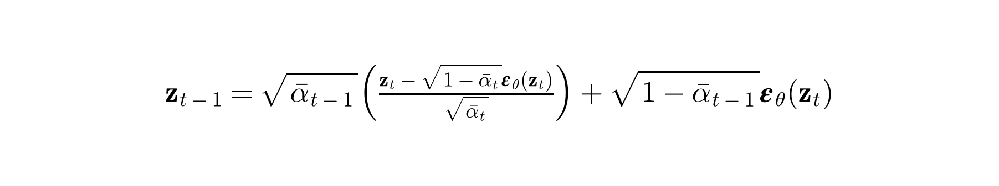
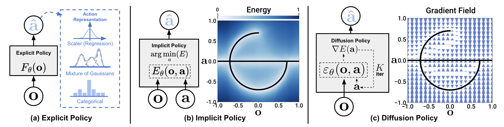
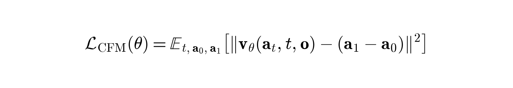

# Stable Diffusion, Diffusion Policy & World Models (生成式基座与时空物理模拟)

本目录包含了基于 PyTorch 从零实现的 <strong>Stable Diffusion (Latent Diffusion Models)</strong>、机器人控制决策中的 <strong>Diffusion Policy</strong>、<strong>Flow Matching Policy</strong>，以及现代生成式基座的核心架构 <strong>DiT (Diffusion Transformer)</strong> 与 <strong>Video DiT (时空视频扩散 Transformer)</strong> 的完整设计与前向/推理逻辑。这些模型共同构成了现代生成式 AI 从“高维多模态媒体合成”走向“机器人动作轨迹决策”与“物理世界模型模拟（World Models）”的理论基石。

---

## 目录
1. [世界模型（World Models）与视频物理模拟](#1-世界模型world-models与视频物理模拟)
2. [LDM 与 VAE：隐空间压缩原理](#2-ldm-与-vae隐空间压缩原理)
3. [DDPM 与 DDIM：从随机演化到确定性加速](#3-ddpm-与-ddim从随机演化到确定性加速)
4. [无分类器引导（Classifier-Free Guidance, CFG）原理](#4-无分类器引导classifier-free-guidance-cfg原理)
5. [DiT (Diffusion Transformer) 架构变革与 AdaLN 调制](#5-dit-diffusion-transformer架构变革与-adaln-调制)
6. [Video DiT：3D VAE、时空 Patch 与文本注入（Sora 核心）](#6-video-dit3d-vae时空-patch与文本注入sora核心)
7. [机器人具身控制：Diffusion Policy 与 Flow Matching Policy](#7-机器人具身控制diffusion-policy-与-flow-matching-policy)
8. [机器人大模型先驱：Robotics Diffusion Transformer (RDT-1B)](#8-机器人大模型先驱robotics-diffusion-transformer-rdt-1b)
9. [代码库接口与 Demo 验证](#9-代码库接口与-demo-验证)
10. [公式与图示对照速查](#10-公式与图示对照速查)

---

## 1. 世界模型（World Models）与视频物理模拟

在强化学习与自动驾驶领域，<strong>世界模型（World Models）</strong>是智能体在脑海中模拟真实物理世界运行机制的虚拟仿真器。它需要学习一个状态转移函数：
<p align="center"><strong>s<sub>t+1</sub> = T(s<sub>t</sub>, a<sub>t</sub>)</strong></p>
其中 s<sub>t</sub> 表示当前环境的状态，a<sub>t</sub> 表示智能体采取的控制动作，s<sub>t+1</sub> 表示物理世界受动作影响后的下一刻状态。
*   <strong>视频生成即物理模拟</strong>: 传统的物理引擎（如 Bullet, MuJoCo）需要人工编写复杂的运动方程，而以 OpenAI Sora 和 Google Genie 为代表的<strong>视频生成世界模型</strong>则直接将物理世界的演变建模为条件视频生成。
*   <strong>时空规律学习</strong>: 模型通过观察海量的视频数据，学习并理解重力、碰撞、惯性、流体力学以及刚体形变等物理规律。通过在时空特征上进行去噪，Video DiT 能够预测并合成极具真实感的未来视频序列，从而成为智能体进行无实物安全规控训练的“沙盒”。

---

## 2. LDM 与 VAE：隐空间压缩原理

直接在像素空间（Pixel Space）进行去噪（如在 512 × 512 的 RGB 图像上运行扩散过程）计算开销极其高昂，因为网络需要浪费大量参数去重构高频的细节冗余（如背景白噪、墙面纹理等），而这些冗余并不包含核心语义。
*   <strong>变分自编码器 (VAE)</strong>: <strong>Latent Diffusion Models (LDM)</strong> 提出通过一个预训练好的变分自编码器（VAE）将高维像素空间压缩到低维潜在特征空间（Latent Space）。VAE 的优化损失由重构误差和约束潜在变量分布的 KL 散度（Kullback-Leibler Divergence）共同构成：
    <p align="center"></p>
*   <strong>隐空间去噪</strong>: 隐特征 z<sub>0</sub> 的维度通常比原图降低 8 倍（如 512 × 512 × 3 图像被压缩为 64 × 64 × 4 隐变量），去除了大量感知冗余。扩散模型的加噪和去噪完全在这低维的 z 空间中运行，使得计算效率提升了数百倍。

---

## 3. DDPM 与 DDIM：从随机演化到确定性加速

*   <strong>DDPM (Denoising Diffusion Probabilistic Model)</strong>:
    -   <strong>正向过程（加噪）</strong>: 将高斯噪声逐步注入数据中。在任意时间步 t，加噪隐特征 z<sub>t</sub> 均可通过一步解析计算得出：
        <p align="center"></p>
        其中 α<sub>bar_t</sub> 是由预设噪声方差 β<sub>t</sub> 计算得出的累计衰减因子。
    -   <strong>反向过程（去噪）</strong>: 采用马尔可夫链（Markov Chain）退步逼近，预测每个时间步注入的噪声，目标函数（Noise Prediction Loss）定义为：
        <p align="center"></p>
        由于其随机性，采样去噪需要完整运行整个链条（如 1000 步），导致速度极慢。
*   <strong>DDIM (Denoising Diffusion Implicit Model)</strong>:
    -   <strong>确定性采样</strong>: DDIM 将正向过程推广至非马尔可夫链形式，构建了一条确定性的 ODE 去噪路径：
        <p align="center"></p>
    -   <strong>快速跳步</strong>: 因为去噪过程是确定性的，我们可以只在完整的 1000 步中均匀选取 20 步或 50 步进行迭代，在保持图像生成质量的同时大幅缩短推理时间。这对于需要高频输出动作轨迹的机器人系统至关重要。

---

## 4. 无分类器引导（Classifier-Free Guidance, CFG）原理

在文本生成图像或机器人基于视觉观测生成动作时，模型必须在样本多样性（Diversity）与条件贴合度（Fidelity）之间取得平衡。
*   <strong>训练方法</strong>: 在模型训练中，输入条件（如文本 Embedding c，或机器人观测 Embedding o）会以一定概率（通常为 10%--20%）被随机置为空值 ∅（即令其退化为无条件训练）。
*   <strong>推理外推</strong>: 推理阶段，网络会分别计算有条件下的预测噪声和无条件下的预测噪声。CFG 通过线性外推机制对条件噪声进行方向增强：
    <p align="center"></p>
    其中 w 为引导因子系数。w 越大，生成的动作轨迹越紧密地贴合输入的视觉观测，动作变动范围越小，精度更高。

---

## 5. DiT (Diffusion Transformer) 架构变革与 AdaLN 调制
*   <strong>代码实现</strong>: [dit.py](file:///Users/zhongzhiyi/Vision-Foundation-Model/StableDiffusion/dit.py)
*   <strong>核心机制</strong>:
    1.  <strong>Patchification（分块嵌入）</strong>: 将 2D Latent（如 32x32x4）切分为 p × p 的图像块（Patches），平坦化并映射为一维 Token 序列。
    2.  <strong>AdaLN (Adaptive Layer Normalization)</strong>: 传统的 Transformer 使用层归一化（LayerNorm），而 DiT 使用 AdaLN 将时间步和条件信息（如类别标签）注入每一层 Transformer Block 中。AdaLN 计算公式为：
        <p align="center"></p>
        其中 γ(y) 和 β(y) 是由 timestep 和类别特征通过 MLP 回归得到的通道级缩放和偏移参数。
    3.  <strong>参数规模扩展（Scaling Up）</strong>: 彻底摆脱了 UNet 复杂的卷积 Skip Connection 限制，DiT 的参数规模和生成质量表现出极其完美的 Scaling Law。

---

## 6. Video DiT：3D VAE、时空 Patch 与文本注入（Sora 核心）
*   <strong>代码实现</strong>: [video_dit.py](file:///Users/zhongzhiyi/Vision-Foundation-Model/StableDiffusion/video_dit.py)
*   <strong>核心机制</strong>:
    1.  <strong>3D 变分自编码器 (VAE3D)</strong>: 将视频帧序列（B, F, C, H, W）输入 3D 卷积层，在空间维度压缩 8x 的同时，在<strong>时间（帧）维度进行压缩（如 2x）</strong>，从而获得时空隐表征（B, F_lat, C_lat, H_lat, W_lat）。
    2.  <strong>时空分块（Spatiotemporal Patchification）</strong>: 提取 p<sub>t</sub> × p<sub>s</sub> × p<sub>s</sub>（如 2 帧 × 2 像素 × 2 像素）的时空超像素块（3D Patches），映射为 1D 时空 Tokens。
    3.  <strong>时空联合自注意力（Spatiotemporal Self-Attention）</strong>: 所有的时空 Tokens 在 Transformer 中进行全局注意力交互，使得模型可以同时学习空间结构与跨帧的时间演变物理规律（World Model 的物理模拟基础）。
    4.  <strong>交叉注意力文本注入 (Text Injection)</strong>: 在每一层 Spatiotemporal DiT Block 中，插入一个专用的 Cross-Attention 层，让时空视频 Tokens 扮演 Query，去检索由 CLIP/T5 提取的文本 prompt 特征（Key/Value），将复杂的文本指令注入到视频生成的每一个像素时空轨道中。

---

## 7. 机器人具身控制：Diffusion Policy 与 Flow Matching Policy

将扩散生成式模型应用在机器人控制决策中，主要为了解决模仿学习（Imitation Learning）中经典的行为克隆（Behavioral Cloning, BC）模型的致命短板。

### 7.1 行为克隆的硬伤与动作扩散的解法
*   <strong>行为克隆的致命硬伤</strong>: 人类示教数据往往是<strong>多模态（Multimodal）</strong>的（例如避开障碍物去抓一个杯子，人类既可以选择从左侧绕过，也可以从右侧绕过，这在数学上是一个典型的双峰概率分布）。如果使用确定性网络（MLP, 或者是 L2 Loss 优化的 CNN），网络为了最小化平均误差，会输出两个峰值的“平均动作”（即径直撞上中间的障碍物）。
*   <strong>动作扩散策略（Diffusion Policy）</strong>: 将机器人未来的动作轨迹序列建模为一个条件去噪扩散模型。输入当前的相机帧和关节角状态作为条件，通过 1D 时间轴卷积 UNet，将原本随机无序的动作噪声一步步“推敲”为一条圆滑且合理的机械臂抓取路径，完美重现多模态动作的多峰边界。
*   <strong>退避视界控制（Receding Horizon Control）</strong>: 机器人单次预测未来长达 T<sub>p</sub> 步（如 16 步）的动作轨迹，但只执行前 T<sub>e</sub> 步（如 8 步），接着立刻开始下一次去噪预测。这种“走一步看一步”的方式大幅强化了机器人的容错与纠偏性能。

<p align="center"></p>
<p align="center"></p>

### 7.2 流匹配动作决策 (Flow Matching Policy)
*   <strong>原理</strong>: 虽然动作扩散表现极佳，但由于其去噪轨迹是弯曲且包含随机项的，推理速度慢限制了高频交互。<strong>流匹配（Flow Matching）</strong>在噪声与动作轨迹之间构建了确定性的直线概率路径（Straight CFM）：
    <p align="center"></p>
*   <strong>极速控制</strong>: 训练网络去直接回归这股直线的速度矢量场，推理时直接使用 Euler 一阶常微分积分迭代：
    <p align="center"><strong>a<sub>t+Δt</sub> = a<sub>t</sub> + Δt · v<sub>θ</sub>(a<sub>t</sub>, t, o)</strong></p>
    仅需要 5 步积分更新即可生成质量顶级的流畅物理运动序列，大幅减少了计算耗时，极高贴合机器人的实时闭环控规。
    流匹配回归优化的目标损失函数如下：
    <p align="center"></p>

---

## 8. 机器人大模型先驱：Robotics Diffusion Transformer (RDT-1B)

在真实世界的多模态具身控制中，机器人操作面临着双臂协同、非线性接触以及多视角摄像头融合等复杂的物理交互痛点。由清华大学开发的 <strong>RDT-1B（Robotics Diffusion Transformer, 1.2B 参数）</strong> 代表了目前最前沿的机器人具身大模型范式。

### 8.1 物理可解释的统一动作空间（Physically Interpretable Unified Action Space）
*   <strong>异构机器人的障碍</strong>: 不同的机器人具有截然不同的机械结构（单臂、双臂、六轴、七轴、轮式底盘等）。传统做法需要为每种机器人单独定制动作表示，导致数据无法跨机器人共享训练。
*   <strong>RDT 的解法</strong>: 提出了一个统一的 <strong>128 维物理可解释动作空间</strong>。该空间中每个维度都被赋予了明确的物理意义（如：前 6 维表示左臂末端空间位姿变化量，中 6 维表示右臂，随后的维度表示关节角速度、夹爪张合度、移动底盘线速度/角速度等）。
*   任何异构机器人均可将其特定的控制量对齐填入这 128 维的对应维度中，未用到的维度置为 0，并利用 action mask 进行辅助屏蔽。这实现了异构机器人数据的无缝混合预训练。

### 8.2 多模态输入适配器（Multimodal Conditioning）
RDT-1B 作为一个超大规模的条件扩散模型，利用了先进的视觉 and 语言模型进行场景理解：
1.  <strong>多视角视觉编码（SigLIP）</strong>: 机器人通常配备多个摄像头（如：胸部相机、左手腕相机、右手腕相机）。RDT 采用 `siglip-so400m-patch14-384` 提取各视角的空间特征，映射为 1152 维 of 视觉 Tokens。
2.  <strong>指令文本编码（T5-XXL）</strong>: 采用大语言模型 `t5-v1_1-xxl` 对人类控制口令（如“帮我把红色的杯子递过来”）进行编码，输出 4096 维的语义 Tokens。
3.  <strong>本体感受状态（Proprioception）</strong>: 机械臂当前的关节状态被直接投影为 128 维的 State Tokens。

### 8.3 统一 Token 序列拼接与 DiT 推理（Token Concatenation）
RDT-1B 抛弃了复杂的 Cross-Attention 交叉注入设计，为了保持可扩展性，将所有输入模态的特征平坦化并拼接为单个极长的 Tokens 序列：
<p align="center"></p>
*   <strong>处理流程</strong>:
    1.  将 State Tokens、Language Tokens、Image Tokens 以及加噪后的动作轨迹序列 Action Tokens 拼接为一个长序列。
    2.  送入由多个 RDT Blocks（基于 AdaLN 调制 timestep 嵌入）组成的堆叠 Transformer 中。所有模态的 Token 在双向自注意力中充分交互（如：视觉 Token 与文本语义结合，进而引导动作轨迹 Token 的去噪）。
    3.  从 Transformer 的最终输出序列尾部截取出对应 Action 的部分，映射回归得到噪声预测值。

#### RDT 代码调用示例
```python
import torch
from rdt import RDTRunner

# 初始化 RDT-1B 控制器 (统一动作空间 128 维, 轨迹预测 horizon=64 步)
rdt_runner = RDTRunner(
    action_dim=128, pred_horizon=64,
    lang_token_dim=4096, img_token_dim=1152, state_token_dim=128
)

# 模拟输入: T5-XXL 文本编码 (32个 tokens), SigLIP 视觉特征 (196个 tokens), 机器人本体状态 (1步)
lang_cond = torch.randn(1, 32, 4096)
img_cond = torch.randn(1, 196, 1152)
state_traj = torch.randn(1, 1, 128)

# 1. 训练阶段: 输入目标轨迹计算 diffusion loss
actions_gt = torch.randn(1, 64, 128)
t = torch.tensor([[45]])
loss = rdt_runner(actions_gt, t, lang_cond, img_cond, state_traj)
print("RDT training loss:", loss.item())

# 2. 推理阶段: 依靠条件输入，反向去噪解算最优的双臂协同动作序列
pred_actions = rdt_runner.predict_action(lang_cond, img_cond, state_traj, num_inference_steps=10)
print("RDT Predicted bimanual trajectory:", pred_actions.shape)  # torch.Size([1, 64, 128])
```

---

## 9. 代码库接口与 Demo 验证

本项目在 `StableDiffusion/` 目录下提供了完整的纯 PyTorch 模型复现。以下是核心代码模块及其作用：

*   [stable_diffusion.py](file:///Users/zhongzhiyi/Vision-Foundation-Model/StableDiffusion/stable_diffusion.py):
    -   `VAE`: 包含下采样 8x 隐空间压缩的 Encoder，和对应的 Decoder。
    -   `DenoisingUNet`: 具有 ResNet block 与 2D 空间 Cross-Attention 的交叉去噪 UNet。
    -   `DDPMScheduler` & `DDIMScheduler`: 分别实现了马尔可夫 stochastic 去噪和确定性快速跳步去噪。
*   [dit.py](file:///Users/zhongzhiyi/Vision-Foundation-Model/StableDiffusion/dit.py):
    -   `DiffusionTransformer`: DiT 主骨干网，实现了 Patchification, 空间位置编码，以及基于 AdaLN 调制块的堆叠。
*   [video_dit.py](file:///Users/zhongzhiyi/Vision-Foundation-Model/StableDiffusion/video_dit.py):
    -   `VAE3D`: 时空视频自编码器。
    -   `VideoDiT`: 全局 3D 时空自注意力去噪器，包含文本 Cross-Attention 交叉注入模块。
*   [rdt.py](file:///Users/zhongzhiyi/Vision-Foundation-Model/StableDiffusion/rdt.py):
    -   `RDT` & `RDTRunner`: 机器人具身基础大模型 RDT-1B 复现，包含 128 维物理统一空间变换以及多通道 Token 拼接去噪机制。
*   [diffusion_policy.py](file:///Users/zhongzhiyi/Vision-Foundation-Model/StableDiffusion/diffusion_policy.py) & [flow_matching_policy.py](file:///Users/zhongzhiyi/Vision-Foundation-Model/StableDiffusion/flow_matching_policy.py):
    -   分别实现了以视觉-本体输入为 Conditioning 变量的 1D 时间卷积 UNet 扩散决策器与 Euler 流匹配轨迹生成器。

你可以通过运行测试脚本验证所有模型的前向维度和计算流程：
```bash
python StableDiffusion/run_demo.py
```

---

## 10. 公式与图示对照速查

*   <strong>公式 1</strong>: [DDPM 隐空间单步正向解析加噪](images/eq1_ddpm_add_noise.png)
*   <strong>公式 2</strong>: [CFG 无分类器引导去噪外推](images/eq2_cfg.png)
*   <strong>公式 3</strong>: [流匹配直线概率路径插值](images/eq3_cfm_path.png)
*   <strong>公式 4</strong>: [流匹配速度场损失函数](images/eq4_cfm_loss.png)
*   <strong>公式 5</strong>: [DDIM 确定性迭代采样路径](images/eq5_ddim_step.png)
*   <strong>公式 6</strong>: [AdaLN 自适应归一化调节算子](images/eq6_adaln.png)
*   <strong>公式 7</strong>: [VAE 重构与 KL 约束损失](images/eq7_vae_loss.png)
*   <strong>公式 8</strong>: [DDPM 正向噪声预测损失](images/eq8_ddpm_loss.png)
*   <strong>公式 9</strong>: [Video DiT 3D 视频张量到 1D 时空 Tokens 投影](images/eq9_spatiotemporal_patch.png)
*   <strong>公式 10</strong>: [RDT-1B 异构模态 Token 统一拼接序列表示](images/eq10_rdt_concat.png)
*   <strong>图示 1</strong>: [Diffusion Policy 机器人工作环境实拍](images/diffusion_policy_teaser.png)
*   <strong>图示 2</strong>: [模仿学习多模态轨迹与多峰概率重构对比](images/diffusion_policy_multimodal.png)
