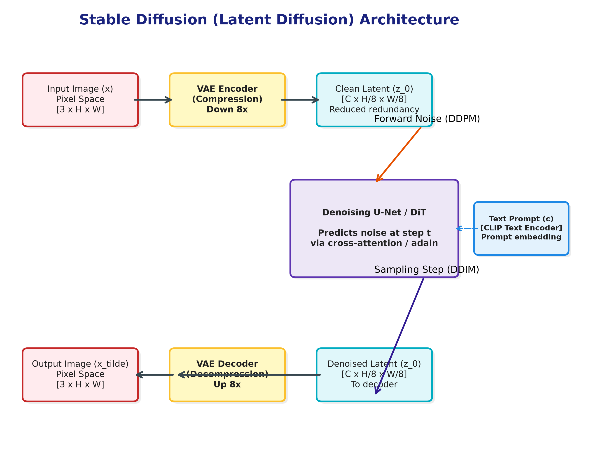
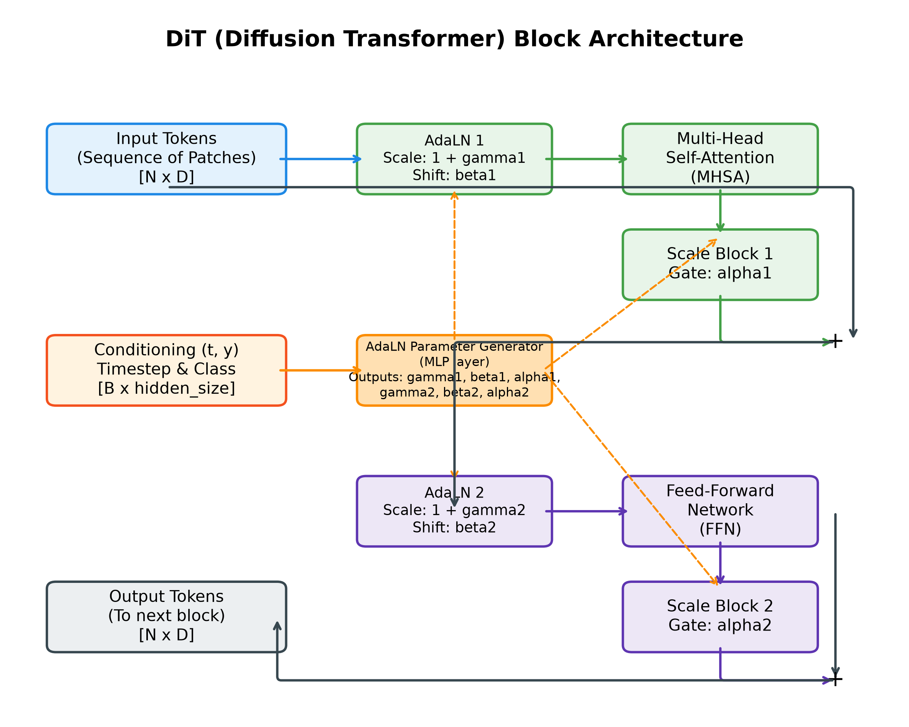
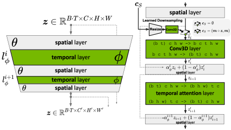
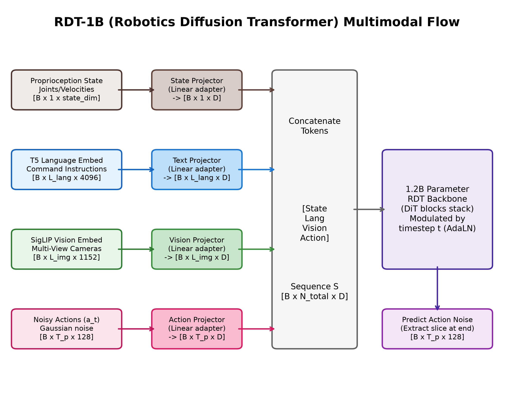

# Stable Diffusion, Diffusion Policy & World Models (生成式基座与时空物理模拟)

本目录包含了基于 PyTorch 从零实现的 <strong>Stable Diffusion (Latent Diffusion Models)</strong>、机器人控制决策中的 <strong>Diffusion Policy</strong>、<strong>Flow Matching Policy</strong>，以及现代生成式基座的核心架构 <strong>DiT (Diffusion Transformer)</strong> 与 <strong>Video DiT (时空视频扩散 Transformer)</strong> 的完整设计与前向/推理逻辑。这些模型共同构成了现代生成式 AI 从“高维多模态媒体合成”走向“机器人动作轨迹决策”与“物理世界模型模拟（World Models）”的理论基石。

---

## 目录
1. [世界模型（World Models）与视频物理模拟](#1-世界模型world-models与视频物理模拟)
2. [LDM 与 VAE：隐空间压缩与架构图解](#2-ldm-与-vae隐空间压缩与架构图解)
3. [DDPM 与 DDIM：从随机演化到确定性加速](#3-ddpm-与-ddim从随机演化到确定性加速)
4. [无分类器引导（Classifier-Free Guidance, CFG）原理](#4-无分类器引导classifier-free-guidance-cfg原理)
5. [DiT (Diffusion Transformer) 架构变革与 AdaLN 调制](#5-dit-diffusion-transformer架构变革与-adaln-调制)
6. [Video DiT：3D VAE、时空 Patch 与文本注入（Sora 核心）](#6-video-dit3d-vae时空-patch与文本注入sora核心)
7. [机器人具身控制：Diffusion Policy 与 Flow Matching Policy](#7-机器人具身控制diffusion-policy与-flow-matching-policy)
8. [机器人大模型先驱：Robotics Diffusion Transformer (RDT-1B)](#8-机器人大模型先驱robotics-diffusion-transformer-rdt-1b)
9. [代码库接口与 Demo 验证](#9-代码库接口与-demo-验证)
10. [公式与图示对照速查](#10-公式与图示对照速查)

---

## 1. 世界模型（World Models）与视频物理模拟

在强化学习与自动驾驶领域，<strong>世界模型（World Models）</strong>是智能体在脑海中模拟真实物理世界运行机制的虚拟仿真器。它需要学习一个状态转移函数：
<p align="center"><strong>s<sub>t+1</sub> = T(s<sub>t</sub>, a<sub>t</sub>)</strong></p>
其中 s<sub>t</sub> 表示当前环境的状态，a<sub>t</sub> 表示智能体采取的控制动作，s<sub>t+1</sub> 表示物理世界受动作影响后的下一刻状态。
*   <strong>视频生成即物理模拟</strong>: 传统的物理引擎（如 Bullet, MuJoCo）需要人工编写复杂的运动方程，而以 OpenAI Sora 和 Google Genie 为代表的<strong>视频生成世界模型</strong>则直接将物理世界的演变建模为条件视频生成。
*   <strong>时空规律学习</strong>: 模型通过观察海量的视频 data，学习并理解重力、碰撞、惯性、流体力学以及刚体形变等物理规律。通过在时空特征上进行去噪，Video DiT 能够预测并合成极具真实感的未来视频序列，从而成为智能体进行无实物安全规控训练的“沙盒”。

---

## 2. LDM 与 VAE：隐空间压缩与架构图解

直接在像素空间（Pixel Space）进行去噪计算开销极其高昂，因为网络需要浪费大量参数去重构高频的细节冗余，而这些冗余并不包含核心语义。
*   <strong>变分自编码器 (VAE)</strong>: <strong>Latent Diffusion Models (LDM)</strong> 提出通过一个预训练好的变分自编码器（VAE）将高维像素空间压缩到低维潜在特征空间（Latent Space）。VAE 的优化损失由重构误差和约束潜在变量分布的 KL 散度共同构成：
    <p align="center"></p>
*   <strong>公式符号极简解释</strong>:
    1.  `x`: 输入的真实高维图像像素数据。
    2.  `z`: 编码后的低维潜在隐变量（Latent vector）。
    3.  `q_phi(z | x)`: <strong>Encoder（编码器）</strong>。输入图像 `x`，输出隐空间中 `z` 的概率分布。
    4.  `p_theta(x | z)`: <strong>Decoder（解码器）</strong>。输入隐空间变量 `z`，重构并还原出高维像素图像 `x`。
    5.  `E_q [log p_theta(x|z)]`: <strong>重构误差损失</strong>。衡量还原出的图像与原始图像之间的差异。
    6.  `D_KL( q_phi(z|x) || p(z) )`: <strong>KL 散度约束</strong>。强迫编码器输出的隐变量分布 `q_phi` 必须无限逼近标准高斯分布 `p(z) = N(0, I)`，从而保证整个隐空间的分布是连续且平滑的，方便后续的去噪和插值。

### 2.1 Stable Diffusion 整体架构图解
为更直观理解 VAE、U-Net 以及 Conditioning 编码器之间的协同工作流，请参考下方架构示意图：
<p align="center"></p>

*   <strong>工作流与图示色块拆解</strong>:
    1.  <strong>Pixel Space (左侧红色背景区域)</strong>: 代表高维像素空间。
        *   <strong>Input Image x (左上`x`紫色方块)</strong>: 原始高维输入图像。
        *   <strong>Reconstructed Image x̃ (左下`x̃`紫色方块)</strong>: 重构或生成的像素图像。
        *   <strong>Encoder ℰ (左上`ℰ`蓝色梯形)</strong>: VAE 编码器，负责将像素空间图像映射并下采样压缩为隐空间特征。
        *   <strong>Decoder 𝒟 (左下`𝒟`蓝色梯形)</strong>: VAE 解码器，负责将去噪后的干净隐空间表征还原重构为像素图像。
    2.  <strong>Latent Space (中间绿色背景区域)</strong>: 代表低维潜在隐空间，扩散与去噪计算在此空间进行以降低开销。
        *   <strong>Latent 表征 z / z_T (深绿色垂直矩形)</strong>: 隐特征表征。
        *   <strong>Diffusion Process (中上浅绿色圆角矩形)</strong>: 正向扩散过程，逐步向潜在特征中注入高斯噪声，使其退化为 $z_T$。
        *   <strong>Denoising U-Net ε_θ (中下浅绿色大框)</strong>: 逆向去噪的核心。其包含一个呈沙漏型的 <strong>U-Net 神经网络 (蓝色沙漏形双梯形组合)</strong>，接受带噪特征并预测每个时间步注入的噪声。
        *   <strong>Cross-Attention (三个橙色圆角方块 Q/K/V)</strong>: 交叉注意力机制，分布在 U-Net 编码与解码路径中，用于将外部条件信息注入到 U-Net 内部特征图中。
        *   <strong>Denoising Step (左下角带两个黄色小梯形的绿色小框)</strong>: 代表在去噪采样循环中（如执行 $T-1$ 次），通过预测的噪声不断迭代更新潜在特征。
    3.  <strong>Conditioning (右侧灰色背景区域)</strong>: 负责生成引导条件的接入。
        *   <strong>控制源 (右侧上部彩色方块)</strong>: 包含语义图 (<strong>Semantic Map, 红色</strong>)、文本 (<strong>Text, 黄色/橙色</strong>)、通用特征 (<strong>Representations, 绿色</strong>) 以及图像 (<strong>Images, 紫色</strong>)。
        *   <strong>Conditioning Encoder τ_θ (右下蓝色梯形)</strong>: 条件嵌入编码器，将上述各种模态的控制信号映射为统一维度的 Embeddings，然后通过交叉注意力层 (Cross-Attention) 注入到 U-Net 中，或者拼接 (Concat) 融入去噪流程。

---

## 3. DDPM 与 DDIM：从随机演化到确定性加速

*   <strong>DDPM (Denoising Diffusion Probabilistic Model)</strong>:
    -   <strong>正向过程（加噪）</strong>: 将高斯噪声逐步注入数据中。在任意时间步 t，加噪隐特征 z<sub>t</sub> 均可通过一步解析计算得出：
        <p align="center"></p>
    -   <strong>公式符号极简解释</strong>:
        1.  `z_0`: 原始的干净隐变量。
        2.  `z_t`: 在第 `t` 个时间步时，加噪后的隐变量状态。
        3.  `epsilon`: 采样自标准高斯分布 `N(0, I)` 的随机噪声。
        4.  `alpha_bar_t`: 累计噪声控制系数。它是每一步保留原始信号比例 `alpha_i = 1 - beta_i` 从 `i = 1` 到 `t` 的累乘结果（`beta_i` 为第 `i` 步注入噪声的比例）。
        5.  `sqrt(alpha_bar_t) * z_0`: 随着时间步 `t` 增加，保留的原始图像信号越来越少（系数 `sqrt(alpha_bar_t)` 趋近于 0）。
        6.  `sqrt(1 - alpha_bar_t) * epsilon`: 随着时间步 `t` 增加，注入的累积噪声越来越多（系数 `sqrt(1 - alpha_bar_t)` 趋近于 1）。
        7.  <strong>为什么这一步能够“一步到位”？</strong> 传统的扩散加噪是一步一步迭加进行的，但在数学上，两个独立高斯分布相加后依然是高斯分布。通过代数展开，可以直接将 `t` 次加噪公式简化为上式，这使得模型训练时无需从第一步模拟到第 `t` 步，直接输入 `z_0` 就能解算出任意时间步 `t` 的噪声图 `z_t`！
    -   <strong>反向过程（去噪）</strong>: 采用马尔可夫链退步辅助逼近，预测每个时间步注入的噪声，目标函数定义为：
        <p align="center"></p>
    -   <strong>公式符号极简解释</strong>:
        1.  `epsilon`: 步骤 1 中实际注入的随机高斯噪声真实值。
        2.  `epsilon_theta(z_t, t)`: 神经网络预测出的噪声值。输入为加噪隐表征 `z_t` 和当前时间步 `t`。
        3.  `|| epsilon - epsilon_theta ||^2`: 预测噪声与真实噪声的均方误差（MSE Loss）。模型训练的目的就是让网络能够精准猜中每一步到底加了什么噪声。
*   <strong>DDIM (Denoising Diffusion Implicit Model)</strong>:
    -   <strong>确定性采样</strong>: DDIM 将正向过程推广至非马尔可夫链形式，构建了一条确定性的 ODE 去噪路径：
        <p align="center"></p>
    -   <strong>公式符号极简解释</strong>:
        该公式由三个核心部分拼装而成，决定了如何从当前的模糊图像 `x_t` 推导更清晰的图像 `x_{t-1}`：
        1.  <strong>第一项（还原的原始信号）</strong>: `(x_t - sqrt(1 - alpha_bar_t) * epsilon_theta) / sqrt(alpha_bar_t)`，这其实是模型利用当前预测噪声对干净图像 `x_0` 的最佳估计值，然后将其乘上 `sqrt(alpha_bar_{t-1})` 进行尺度放大。
        2.  <strong>第二项（指向当前时间步噪声的方向向量）</strong>: 用预测噪声 `epsilon_theta` 乘上 `sqrt(1 - alpha_bar_{t-1} - sigma_t^2)`。它代表在确定性演化路径下，指向噪声分布的分量。
        3.  <strong>第三项（随机高斯噪声）</strong>: `sigma_t * epsilon_t`。其中 `epsilon_t` 是在这一步添加的微小高斯随机抖动。
        4.  <strong>DDIM 加速的精髓是什么？</strong> 当我们令 `sigma_t = 0` 时，第三项（随机项）直接消失。此时去噪过程变成了一个确定性的常微分方程（ODE）求解过程！因为每一步的转移不再具有随机性，我们可以在 1000 步中均匀选取 20 步或 50 步进行跳跃式采样（快速跳步），在几乎不降低图像生成质量的前提下，让推理采样速度暴增 50 倍！

---

## 4. 无分类器引导（Classifier-Free Guidance, CFG）原理

在文本生成图像或机器人基于视觉观测生成动作时，模型必须在样本多样性（Diversity）与条件贴合度（Fidelity）之间取得平衡。
*   <strong>训练方法</strong>: 在模型训练中，输入条件（如文本 Embedding c，或机器人观测 Embedding o）会以一定概率被随机置为空值 ∅（即令其退化为无条件训练）。
*   <strong>推理外推</strong>: 推理阶段，网络会分别计算有条件下的预测噪声和无条件下的预测噪声。CFG 通过线性外推机制对条件噪声进行方向增强：
    <p align="center"></p>
*   <strong>公式符号极简解释</strong>:
    1.  `epsilon_theta(z_t, c)`: 模型在给定控制条件 `c`（如“红色的杯子”）下预测的噪声。
    2.  `epsilon_theta(z_t, empty)`: 模型在无条件（条件置空 ∅）下预测的噪声。
    3.  `w`: <strong>引导因子系数</strong>，通常大于 0。
    4.  <strong>直观几何意义</strong>: 我们将公式变形为 `epsilon_tilde = epsilon_theta(empty) + (1 + w) * [epsilon_theta(c) - epsilon_theta(empty)]`。
        *   这里 `[epsilon_theta(c) - epsilon_theta(empty)]` 是一个指向“符合条件描述”的<strong>方向向量</strong>。
        *   通过乘上大于 1 的放大系数 `(1 + w)`，我们相当于沿着该方向进行了<strong>超外推（Extrapolating）</strong>，强化了条件分量并削弱了无条件分量。
        *   当 `w > 1`（如常设 3--7）时，生成的图像会极端对齐文本口令，或者机器人的控制动作会极度高保真地对齐视觉观测，从而保证在关键动作控制时不发生漂移。

---

## 5. DiT (Diffusion Transformer) 架构变革与 AdaLN 调制
*   <strong>代码实现</strong>: [dit.py](file:///Users/zhongzhiyi/Vision-Foundation-Model/StableDiffusion/dit.py)
*   <strong>核心机制</strong>:
    1.  <strong>Patchification（分块嵌入）</strong>: 将 2D Latent（如 32x32x4）切分为 p × p 的图像块（Patches），平坦化并映射为一维 Token 序列。
    2.  <strong>AdaLN (Adaptive Layer Normalization)</strong>: 传统的 Transformer 使用层归一化（LayerNorm），而 DiT 使用 AdaLN 将时间步和条件信息（如类别标签）注入每一层 Transformer Block 中。AdaLN 计算公式为：
        <p align="center"></p>
    3.  <strong>公式符号极简解释</strong>:
        1.  `LN(h)`: 标准层归一化。输入为当前层 Transformer 的输入 Token 特征向量 `h`。
        2.  `gamma(y)` 和 `beta(y)`: <strong>自适应调制系数</strong>。它们是利用时间步 `t` 和条件嵌入 `y` 的拼接作为输入，通过一个简单的多层感知机（MLP）网络动态回归得到的。
        3.  `(1 + gamma(y)) * LN(h) + beta(y)`: 对层归一化后的特征直接执行通道维度的缩放和偏移。这种通过归一化层注入条件信息的设计，相比传统的 Cross-Attention 机制，计算代价极低，且能够强力指导特征在网络中进行梯度调制。

### 5.1 DiT 模块与三种条件注入机制图解
下方图示完整对比了 DiT 整体管线以及三种不同的条件注入 block 变体（以自适应层归一化 adaLN-Zero 为核心）：
<p align="center"></p>

*   <strong>整体管线与模块拆解（从左至右，自底向上）</strong>:
    1.  <strong>Latent Diffusion Transformer (最左侧列)</strong>: DiT 整体网络流向。
        *   加噪隐变量 (<strong>Noised Latent, 底层灰色方块</strong>) 经分块 (<strong>Patchify, 灰色方块</strong>) 转化为一维 Token 序列；时间步 $t$ 和分类标签 $y$ (<strong>蓝色方块</strong>) 通过嵌入层 (<strong>Embed, 蓝色方块</strong>) 转化为条件嵌入。
        *   Token 序列与条件嵌入共同输入到堆叠的 $N$ 个 <strong>DiT Block</strong> 中。
        *   输出特征经过层归一化 (<strong>Layer Norm, 蓝色方块</strong>) 及线性重塑 (<strong>Linear and Reshape, 绿色方块</strong>) 预测出噪声 (<strong>Noise</strong>) 与方差估计 (<strong>Σ</strong>)。
    2.  <strong>DiT Block with adaLN-Zero (左数第二列，黑色粗框)</strong>: 论文核心的自适应调制模块（自底向上流动）。
        *   <strong>输入端 (底部)</strong>: 接收输入特征 <strong>Input Tokens (灰色方块)</strong> 与条件嵌入 <strong>Conditioning (蓝色方块)</strong>。
        *   <strong>条件调制路径 (右侧支路)</strong>: <strong>Conditioning</strong> 输入到 <strong>MLP (蓝色方块)</strong>，动态预测回归出 6 个自适应调制参数：$\gamma_1, \beta_1$（用于调制自注意力前的归一化）、$\gamma_2, \beta_2$（用于调制前馈层前的归一化）以及 $\alpha_1, \alpha_2$（用于调制残差缩放门控）。
        *   <strong>主特征流 (左侧垂直主轴)</strong>:
            *   特征经 <strong>Layer Norm (蓝色方块)</strong> 归一化，再经 <strong>Scale, Shift (蓝色方块)</strong> 由 $\gamma_1, \beta_1$ 进行通道缩放和偏移。
            *   进入 <strong>Multi-Head Self-Attention (MHSA, 橙色方块)</strong> 计算自注意力，输出经 <strong>Scale (蓝色方块)</strong> 由 $\alpha_1$ 缩放门控，加回 (<strong>+</strong>) 原始输入残差中。
            *   合并后的特征再次进入 <strong>Layer Norm -> Scale, Shift</strong>（由 $\gamma_2, \beta_2$ 调节），通过 <strong>Pointwise Feedforward (FFN, 绿色方块)</strong>，输出经 <strong>Scale</strong>（由 $\alpha_2$ 调节）并累加 (<strong>+</strong>) 回残差，最终从顶部输出。
    3.  <strong>DiT Block with Cross-Attention (左数第三列，灰色细框)</strong>: 另一种条件注入变体。
        *   条件 <strong>Conditioning</strong> 直接作为 Key/Value 注入到 <strong>Multi-Head Cross-Attention (交叉注意力, 红色方块)</strong> 中。在此变体中，模块包含自注意力（橙色）、交叉注意力（红色）与前馈层（绿色）三个串联子块，各自带有 Layer Norm 和残差连接。
    4.  <strong>DiT Block with In-Context Conditioning (最右侧列，灰色细框)</strong>:
        *   条件 <strong>Conditioning</strong> 经过 <strong>Concatenate on Sequence Dimension (蓝色方块)</strong> 直接在序列长度维度上与 <strong>Input Tokens</strong> 拼接，作为联合序列一并送入后续的自注意力（橙色）与前馈层（绿色）中。

---

## 6. Video DiT：3D VAE、时空 Patch 与文本注入（Sora 核心）
*   <strong>代码实现</strong>: [video_dit.py](file:///Users/zhongzhiyi/Vision-Foundation-Model/StableDiffusion/video_dit.py)
*   <strong>核心机制</strong>:
    1.  <strong>时空因子化 (Space-Time Factorization)</strong>: 相比于在巨大的时空联合维度上直接进行全注意力计算，Video LDM 采用空间 with 时间“因子化拆分”的原则。在预训练好的 2D 图像生成器中交织插入一维时间层，只对新插入的时间层进行视频数据微调。
    2.  <strong>维度重塑与混合 (Dimension Reshaping & Merging)</strong>:
        *   对于三维卷积（Conv3D），特征图张量通过维度重置：将空间独立批次 `(B · T) x C x H x W` 转换至时空连续体 `B x C x T x H x W` 进行时序通道卷积，计算后再次还原重塑。
        *   对于时间注意力机制（Temporal Attention），特征图通过重设：`(B · T) x C x H x W` 转换至 `(B · H · W) x T x C`，使 Self-Attention 仅仅在时间维度 `T` 上进行跨帧交互。
        *   空间输出与时间输出通过带学习门控系数 `alpha` 的 Skip Connection 结合：`alpha · z_i + (1 - alpha) · z'_i`。

### 6.1 Video LDM/DiT（时空物理世界模型）架构图解
为引入时间维度建模，Video LDM 在预训练好的 2D 空间层中交织插入了时间卷积与时间注意力层。图示展示了其交织架构与细节：
<p align="center"></p>

*   <strong>工作流与时空块拆解</strong>:
    1.  <strong>整体交织结构 (左侧梯形堆叠)</strong>:
        *   输入隐变量 $z$ 的维度为 $B \cdot T \times C \times H \times W$，即将 batch 维度 $B$ 与时间帧数 $T$ 展开。
        *   网络由基础的预训练 2D <strong>spatial layer (灰白色梯形)</strong> 与新增 of 1D <strong>temporal layer (绿色梯形)</strong> 交替穿插组成。
    2.  <strong>时空数据流细节 (右侧垂直流向图)</strong>:
        *   <strong>Spatial Layer (顶部灰色方块)</strong>: 基础空间处理层，输入特征在帧轴独立计算。
        *   <strong>Learned Downsampling (左上支路)</strong>: 接收上下文图像/帧条件 $c_S$，经过 <strong>Resize (白色梯形)</strong> 调整尺度，并通过 <strong>Conv2D (绿色方块)</strong> 投影后，与空间特征合并形成 $z_i$。
        *   <strong>Conv3D Layer (中间绿色方块)</strong>: 局部时间卷积块。在此分支中，张量形状从空间形式 $(B \cdot T) \times C \times H \times W$ 重塑为时空形式 $B \times C \times T \times H \times W$，经过 3D 卷积以在帧轴上捕捉局部物理运动连续性，随后还原重塑为 $(B \cdot T) \times C \times H \times W$，输出为 $z'_i$。
        *   <strong>Gated Skip Connection 1 (中间灰色框)</strong>: 空间特征 $z_i$ 与时间卷积特征 $z'_i$ 通过公式 $\alpha_{\phi}^i z_i + (1 - \alpha_{\phi}^i) z'_i$ 进行门控残差融合。初始化时设置 $\alpha_{\phi}^i = 1$，使时间分支输出为 0，以保护预训练的 2D 空间层免受破坏，实现平滑收敛。融合结果为 $z_{i+1}$。
        *   <strong>Temporal Attention Layer (下部绿色方块)</strong>: 全局时间注意力块。在此分支中，张量形状重塑为 $(B \cdot H \cdot W) \times T \times C$，使 Self-Attention 仅在时间轴 $T$ 上进行全局帧交互，完成后还原回 $(B \cdot T) \times C \times H \times W$，输出为 $z'_{i+1}$。
        *   <strong>Gated Skip Connection 2 (底部灰色框)</strong>: 特征 $z_{i+1}$ 与全局时间注意力特征 $z'_{i+1}$ 通过公式 $\alpha_{\phi}^{i+1} z_{i+1} + (1 - \alpha_{\phi}^{i+1}) z'_{i+1}$ 门控残差融合，最后向下传导。

---

## 7. 机器人具身控制：Diffusion Policy 与 Flow Matching Policy

将扩散生成式模型应用在机器人控制决策中，主要为了解决模仿学习中行为克隆（BC）模型的致命短板。

### 7.1 行为克隆的硬伤与动作扩散的解法
*   <strong>行为克隆的致命硬伤（Explicit Policy 的局限）</strong>:
    机器人执行人类示教数据时，往往会面临<strong>多模态动作</strong>的问题。例如，当机械臂前方有一个杯子，人类既可以选择从“左边绕过去拿”，也可以选择从“右边绕过去拿”。
    *   如果使用基于 MSE（均方误差）优化的确定性网络（Explicit Policy，即一般的行为克隆模型 $a = f(o)$），模型会强行去拟合这两个峰值的“平均数”，结果就是控制输出这两种合理路径的叠加中间值——直接撞向杯子（撞毁物体）。
    *   如果使用隐式策略（Implicit Policy），模型需要通过构建复杂的能量函数 $E(o, a)$ 来寻找能量极小值点，但推理时需要对数千个动作候选样本反复运行采样和打分，计算延迟极大，完全无法满足高频交互控制。
*   <strong>动作扩散策略（Diffusion Policy）</strong>:
    动作扩散策略将机器人的未来动作轨迹序列建模为一个条件去噪扩散模型。它通过 1D 时间轴卷积 UNet 或 Transformer，输入当前的相机帧和关节感受状态作为 Condition，将原本杂乱无章的高斯轨迹噪声逐步塑形，解算出圆滑合理的机器人抓取控制路径，能够完美拟合多峰概率边界，确保动作平滑而精准。

<p align="center"></p>

*   <strong>Diffusion Policy 机制图示拆解 (Teaser 图)</strong>:
    *   <strong>(a) Explicit Policy (最左侧)</strong>: 显式策略通过网络 $F_\theta(o)$ 直接回归动作 $\hat{a}$ (蓝色带帽字母)。其常用动作表征（右侧蓝色虚线框内）包括：单峰回归 (Scalar Regression, 单峰曲线图)、高斯混合模型 (Mixture of Gaussians, 多峰曲线图) 以及离散分类 (Categorical, 柱状图)。由于本质是点估计，当遇到多峰多模态决策时，容易输出错误动作。
    *   <strong>(b) Implicit Policy (中间)</strong>: 隐式策略训练一个能量函数 $E_\theta(o, a)$，输入观测 $o$ 与动作 $a$，通过寻找能量极小值决策。右侧能量热力图（横轴观测 $o$, 纵轴动作 $a$）中，<strong>白色/浅蓝色代表低能量（Energy = 0，代表合理动作分布）</strong>，<strong>深蓝色代表高能量（Energy = 1，代表不合理动作分布）</strong>。动作分布在此呈现为一个包含水平横杠的环状结构（多峰边界）。
    *   <strong>(c) Diffusion Policy (最右侧)</strong>: 动作扩散策略。相比隐式策略，它不直接算能量，而是通过网络 $\epsilon_\theta(o, a)$ 学习并输出<strong>动作空间上的梯度矢量场 (Gradient Field, 右侧蓝色箭头表征的矢量场)</strong>，在 $K$ 步迭代去噪中沿着箭头指向将随机噪声拉向低能量的白色/浅蓝色圆弧路径，既重现了完整的多模态分布，又具有很高的采样效率。

<p align="center"></p>

*   <strong>多模态避障实证分析（Multimodal Trajectory Learning 图示拆解）</strong>:
    在上图的 T 形状障碍物绕避测试中，我们在中央放置了 <strong>T 形三维障碍物（绿/灰色 T 字几何体）</strong>，目标点为 <strong>右上角蓝色圆形</strong>，对比了四种不同策略：
    1.  <strong>Diffusion Policy (动作扩散, 左一)</strong>: 动作轨迹从左下出发，非常干净、平滑地分裂为<strong>左绕（深紫色/红色弧线）</strong>和<strong>右绕（黑色/深蓝色弧线）</strong>两条完全规避障碍的路径，且无一发生碰撞（100% 避障）。轨迹的渐变色（从黄到红再到深紫）代表随时间前行的控制步骤。
    2.  <strong>LSTM-GMM (高斯混合网络, 左二)</strong>: 轨迹极度散乱，许多轨迹（黄色与红色杂乱折线）直接穿过或撞击在 T 形障碍物的下半部及两侧，且伴随大量偏离路线的折线。
    3.  <strong>BET (行为能量 Transformer, 左三)</strong>: 产生了大量断裂、交叉的无序直线轨迹，横跨障碍物并扩散至大片无效区域，易导致机械臂卡顿和机械故障。
    4.  <strong>IBC (隐式行为克隆, 最右侧)</strong>: 轨迹几乎全部受限于左侧通道，且产生了明显的锯齿状剧烈跳动与抖动，无法平顺运行。
*   <strong>退避视界控制（Receding Horizon Control）</strong>: 机器人单次预测未来长达 T<sub>p</sub> 步（如 16 步）的动作轨迹，但只执行前 T<sub>e</sub> 步（如 8 步），接着立刻开始下一次去噪预测。这种“走一步看一步”的方式大幅强化了机器人的容错与纠偏性能。

### 7.2 流匹配动作决策 (Flow Matching Policy)
*   <strong>原理</strong>: 虽然动作扩散表现极佳，但由于其去噪轨迹是弯曲且包含随机项的，推理速度慢限制了高频交互。<strong>流匹配（Flow Matching）</strong>在噪声与动作轨迹之间构建了确定性的直线概率路径（Straight CFM）：
    <p align="center"></p>
*   <strong>公式符号极简解释</strong>:
    1.  `x_0`: 初始的高斯随机动作噪声。
    2.  `x_1`: 最终的目标干净动作数据点（示教轨迹）。
    3.  `psi_t(x)`: 时变向量流映射。由于它是关于时间步 `t` 的线性插值 `t * x_1 + (1 - t) * x_0`，因此粒子在其引导下是完全沿着<strong>直线</strong>从噪声向干净数据演化的。
*   <strong>极速控制</strong>: 训练速度场网络 `v_theta` 去直接回归这股直线的速度矢量场，其优化目标损失函数（Conditional Flow Matching Loss）如下：
    <p align="center"></p>
*   <strong>公式符号极简解释</strong>:
    1.  `v_theta(x_t, t, o)`: 速度场网络。输入插值状态 `x_t`、时间 `t` 以及机器人本体+视觉观测条件 `o`。
    2.  `x_1 - x_0`: 粒子移动的<strong>瞬时目标速度</strong>（由于是直线路径，终点减起点即代表理想速度方向）。
    3.  网络被训练直接去逼近这一直线速度差，推理时仅需要 5 步 Euler 一阶常微分积分迭代累加就能输出高精度的动作序列：
        <p align="center"><strong>a<sub>t+Δt</sub> = a<sub>t</sub> + Δt · v<sub>θ</sub>(a<sub>t</sub>, t, o)</strong></p>
        由于积分路径是直的，迭代步数可以极其少，大幅降低了计算延迟，使机器人可以实现 100Hz 以上的极速闭环控规。

---

## 8. 机器人大模型先驱：Robotics Diffusion Transformer (RDT-1B)

在真实世界的多模态具身控制中，机器人操作面临着双臂协同、非线性接触以及多视角摄像头融合等复杂的物理交互痛点。由清华大学开发的 <strong>RDT-1B（Robotics Diffusion Transformer, 1.2B 参数）</strong> 代表了目前最前沿的机器人具身大模型范式。

### 8.1 物理可解释的统一动作空间（Physically Interpretable Unified Action Space）
*   <strong>异构机器人的障碍</strong>: 不同的机器人具有截然不同的机械结构（单臂、双臂、六轴、七轴、轮式底盘等）。传统做法需要为每种机器人单独定制动作表示，导致数据无法跨机器人共享训练。
*   <strong>RDT 的解法</strong>: 提出了一个统一的 <strong>128 维物理可解释动作空间</strong>。该空间中每个维度都被赋予了明确的物理意义（如：前 6 维表示左臂末端空间位姿变化量，中 6 维表示右臂，随后的维度表示关节角速度、夹爪张合度、移动底盘线速度/角速度等）。
*   任何异构机器人均可将其特定的控制量对齐填入这 128 维的对应维度中，未用到的维度置为 0，并利用 action mask 进行辅助屏蔽。这实现了异构机器人数据的无缝混合预训练。

### 8.2 多模态输入适配器（Multimodal Conditioning）
RDT-1B 作为一个超大规模的条件扩散模型，利用了先进的视觉和语言模型进行场景理解：
1.  <strong>多视角视觉编码（SigLIP）</strong>: 机器人通常配备多个摄像头（如：胸部相机、左手腕相机、右手腕相机）。RDT 采用 `siglip-so400m-patch14-384` 提取各视角的空间特征，映射为 1152 维的视觉 Tokens。
2.  <strong>指令文本编码（T5-XXL）</strong>: 采用大语言模型 `t5-v1_1-xxl` 对人类控制口令（如“帮我把红色的杯子递过来”）进行编码，输出 4096 维的语义 Tokens。
3.  <strong>本体感受状态（Proprioception）</strong>: 机械臂当前的关节状态被直接投影为 128 维的 State Tokens。

### 8.3 RDT-1B 异构模态数据流与大模型推理
为更直观理解各种控制信号与异构硬件动作是如何统一汇聚、编码并输入的，请参考下方多模态数据流动架构图：
<p align="center"></p>

*   <strong>三栏式架构与多模态数据流拆解</strong>:
    1.  <strong>Unified Action Space (左侧独立栏)</strong>: 统一物理动作空间。
        *   展示不同构机器人（单臂末端、双臂关节、夹爪加轮式底盘等）的特定物理控制指令，通过 <strong>Unified Action Space (带洋红色框的圆角框)</strong> 对齐投射到 128 维的统一动作向量中（灰白色胶囊图示，未使用的通道置为 0，并由 action mask 屏蔽）。
    2.  <strong>Low-Dimensional Inputs & Main Sequence (中间主轴上部)</strong>:
        *   <strong>Proprioception z_t (本体感受, 底座/传感器图标)</strong>、<strong>Noisy Action ã_t (加噪动作, 机械手爪图标)</strong> 经统一动作空间表征映射与嵌入后，通过 <strong>MLP (蓝色方块)</strong> 提取特征。
        *   <strong>Frequency c (控制频率, 蓝色波形图标)</strong> 和时间步 $k$ 也经由另一个 <strong>MLP (蓝色方块)</strong> 提取特征。
        *   两路低维表征在 <strong>Concat. (圆形连通器图标)</strong> 拼接，作为 Backbone 的主输入序列。
    3.  <strong>Conditioning Inputs (右侧条件输入栏)</strong>:
        *   <strong>Image Inputs (右上)</strong>: 外部相机 (Exterior)、右腕相机 (Right-Wrist) 与左腕相机 (Left-Wrist) 提取的 3 视角画面，通过 <strong>SigLIP (蓝色方块)</strong> 编码，拼接上 <strong>Multi-Dim. Pos. Emb. (红蓝渐变胶囊图示)</strong> 后转化为视觉 Tokens。
        *   <strong>Language Inputs (右下)</strong>: 自然语言任务口令通过 <strong>T5-XXL (蓝色方块)</strong> 编码器转化为带有 <strong>Attention Mask (绿灰胶囊图示)</strong> 的语言 Tokens。
    4.  <strong>Backbone & Outputs (中间主轴中下部)</strong>:
        *   主输入序列（低维动作+本体+时间等）进入 <strong>L × DiT Block with Cross-Attention (中间蓝色大框)</strong>。
        *   图像 Tokens 与语言 Tokens 会通过 <strong>Alternatively Inject Image/Lang. (交替注入分支)</strong> 传入 Cross-Attention 层中对动作流进行条件调制。
        *   最后，经过 <strong>Norm & MLP (蓝色方块)</strong>，输出 128 维的去噪控制动作 <strong>Outputs: Denoised Act. a_{t:t+\tau_a} (底部包含机械手爪图标的方块)</strong>。

#### RDT 代码调用示例
```python
import torch
from rdt import RDTRunner

# 初始化 RDT-1B 控制器 (统一动作空间 128 维, 轨迹预测 horizon=64 步)
rdt_runner = RDTRunner(
    action_dim=128, pred_horizon=64,
    lang_token_dim=4096, img_token_dim=1152, state_token_dim=128
)

# 模拟输入: T5-XXL 文本编码 (32个 tokens), SigLIP 视觉特征 (196个 tokens), 机器人本体状态 (1步)
lang_cond = torch.randn(1, 32, 4096)
img_cond = torch.randn(1, 196, 1152)
state_traj = torch.randn(1, 1, 128)

# 1. 训练阶段: 输入目标轨迹计算 diffusion loss
actions_gt = torch.randn(1, 64, 128)
t = torch.tensor([[45]])
loss = rdt_runner(actions_gt, t, lang_cond, img_cond, state_traj)
print("RDT training loss:", loss.item())

# 2. 推理阶段: 依靠条件输入，反向去噪解算最优的双臂协同动作序列
pred_actions = rdt_runner.predict_action(lang_cond, img_cond, state_traj, num_inference_steps=10)
print("RDT Predicted bimanual trajectory:", pred_actions.shape)  # torch.Size([1, 64, 128])
```

---

## 9. 代码库接口与 Demo 验证

本项目在 `StableDiffusion/` 目录下提供了完整的纯 PyTorch 模型复现。以下是核心代码模块及其作用：

*   [stable_diffusion.py](file:///Users/zhongzhiyi/Vision-Foundation-Model/StableDiffusion/stable_diffusion.py):
    -   `VAE`: 包含下采样 8x 隐空间压缩的 Encoder，和对应的 Decoder。
    -   `DenoisingUNet`: 具有 ResNet block 与 2D 空间 Cross-Attention 的交叉去噪 UNet。
    -   `DDPMScheduler` & `DDIMScheduler`: 分别实现了马尔可夫 stochastic 去噪和确定性快速跳步去噪。
*   [dit.py](file:///Users/zhongzhiyi/Vision-Foundation-Model/StableDiffusion/dit.py):
    -   `DiffusionTransformer`: DiT 主骨干网，实现了 Patchification, 空间位置编码，以及基于 AdaLN 调制块的堆叠。
*   [video_dit.py](file:///Users/zhongzhiyi/Vision-Foundation-Model/StableDiffusion/video_dit.py):
    -   `VAE3D`: 时空视频自编码器。
    -   `VideoDiT`: 全局 3D 时空自注意力去噪器，包含文本 Cross-Attention 交叉注入模块。
*   [rdt.py](file:///Users/zhongzhiyi/Vision-Foundation-Model/StableDiffusion/rdt.py):
    -   `RDT` & `RDTRunner`: 机器人具身基础大模型 RDT-1B 复现，包含 128 维物理统一空间变换以及多通道 Token 拼接去噪机制。
*   [diffusion_policy.py](file:///Users/zhongzhiyi/Vision-Foundation-Model/StableDiffusion/diffusion_policy.py) & [flow_matching_policy.py](file:///Users/zhongzhiyi/Vision-Foundation-Model/StableDiffusion/flow_matching_policy.py):
    -   分别实现了以视觉-本体输入为 Conditioning 变量的 1D 时间卷积 UNet 扩散决策器与 Euler 流匹配轨迹生成器。

你可以通过运行测试脚本验证所有模型的前向维度和计算流程：
```bash
python StableDiffusion/run_demo.py
```

---

## 10. 公式与图示对照速查

*   <strong>公式 1</strong>: [DDPM 隐空间单步正向解析加噪](images/eq1_ddpm_add_noise.png)
*   <strong>公式 2</strong>: [CFG 无分类器引导去噪外推](images/eq2_cfg.png)
*   <strong>公式 3</strong>: [流匹配直线概率路径插值](images/eq3_cfm_path.png)
*   <strong>公式 4</strong>: [流匹配速度场损失函数](images/eq4_cfm_loss.png)
*   <strong>公式 5</strong>: [DDIM 确定性迭代采样路径](images/eq5_ddim_step.png)
*   <strong>公式 6</strong>: [AdaLN 自适应归一化调节算子](images/eq6_adaln.png)
*   <strong>公式 7</strong>: [VAE 重构与 KL 约束损失](images/eq7_vae_loss.png)
*   <strong>公式 8</strong>: [DDPM 正向噪声预测损失](images/eq8_ddpm_loss.png)
*   <strong>公式 9</strong>: [Video DiT 3D 视频张量到 1D 时空 Tokens 投影](images/eq9_spatiotemporal_patch.png)
*   <strong>公式 10</strong>: [RDT-1B 异构模态 Token 统一拼接序列表示](images/eq10_rdt_concat.png)
*   <strong>图示 1</strong>: [Stable Diffusion (LDM) 整体编解码去噪流](images/ldm_architecture.png)
*   <strong>图示 2</strong>: [DiT 变体自适应归一化 Transformer Block](images/dit_architecture.png)
*   <strong>图示 3</strong>: [Video DiT 视频 3D patch 及联合跨注意力时空流程](images/video_dit_architecture.png)
*   <strong>图示 4</strong>: [RDT-1B 异构模态投影与长序列拼接计算流](images/rdt_architecture.png)
*   <strong>图示 5</strong>: [Diffusion Policy 机器人多模态轨迹 teaser 示意](images/diffusion_policy_teaser.png)
*   <strong>图示 6</strong>: [动作去噪与其它常见策略多分支决策路径实证对比](images/diffusion_policy_multimodal.png)
