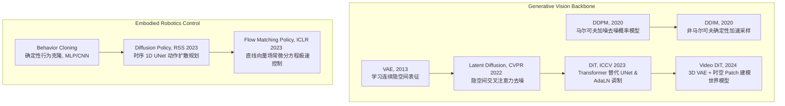

# Stable Diffusion & Diffusion Policy: 从图像生成到时空物理模拟与机器人控制

本教程旨在为初学者及深入研究世界模型（World Models）与具身智能（Embodied AI）的开发者提供详尽的技术讲解。我们将从生成式自监督扩散模型的基本数学原理出发，逐步解析其如何从“高维图像合成”演进到“时空视频物理模拟（如 Sora）”，以及如何作为“动作轨迹预测器”在机械臂控制决策中实现落地。

---

## 目录
1. [概念定义与技术演进路径](#1-概念定义与技术演进路径)
2. [隐空间扩散模型基石：VAE 与 LDM](#2-隐空间扩散模型基石vae-与-ldm)
3. [扩散算法核心对立：DDPM 与 DDIM](#3-扩散算法核心对立ddpm-与-ddim)
4. [引导性生成核心：无分类器引导（CFG）](#4-引导性生成核心无分类器引导cfg)
5. [Backbone 的变革：Diffusion Transformer (DiT) 与 AdaLN](#5-backbone-的变革diffusion-transformer-dit-与-adaln)
6. [Sora 模拟器底层：Video DiT 与时空物理世界模型](#6-sora-模拟器底层video-dit-与时空物理世界模型)
7. [机器人具身控制：Diffusion Policy 与 Flow Matching Policy](#7-机器人具身控制diffusion-policy-与-flow-matching-policy)
8. [代码库接口与 Demo 验证](#8-代码库接口与-demo-验证)
9. [公式与图示对照速查](#9-公式与图示对照速查)

---

## 1. 概念定义与技术演进路径

在计算机视觉与具身智能的研究中，生成式模型已经从单纯的“样本复原”演变为“物理规律的模拟与执行”。为了让不懂该领域的初学者清晰理清脉络，我们将整个技术体系的演进梳理如下：



---

## 2. 隐空间扩散模型基石：VAE 与 LDM

### 2.1 变分自编码器 (VAE)：感知压缩与高频冗余剥离
为什么我们不直接在原始像素图像（Pixel Space，例如 512 × 512 × 3 的 RGB 图像）上进行扩散训练？
*   <strong>核心痛点</strong>: 原始图像中包含了大量的<strong>高频噪点与背景冗余</strong>（例如：粗糙的墙面纹理、散乱的光影等）。直接去噪会耗费大量的模型参数去拟合这些对图像语义无关紧要的像素点，导致计算效率极低。
*   <strong>解决方案</strong>: <strong>变分自编码器（Variational Autoencoder, VAE）</strong> 将高维像素图像压缩到低维潜在特征空间（Latent Space）。
    -   <strong>Encoder（编码器）</strong>: 将大小为 (B, 3, H, W) 的图像投影到潜在均值 μ 与方差对数 logvar，利用重采样技术（Reparameterization Trick）生成连续的隐变量 z<sub>0</sub> = μ + ε × σ，其中 ε 服从标准高斯分布。
    -   <strong>Decoder（解码器）</strong>: 负责在去噪完成后，将低维潜在特征重新投影回高维像素空间。
    -   <strong>VAE 损失函数</strong>: 由<strong>图像重构误差</strong>（MSE / L1 损失）与约束隐空间特征分布接近标准高斯分布的 <strong>KL 散度（Kullback-Leibler Divergence）</strong> 共同组成，使隐空间具有连续且易于采样的优良数学性质：
        <p align="center"></p>

### 2.2 隐空间扩散模型 (LDM)
在 VAE 建立的隐空间中，隐特征 z<sub>0</sub> 的维度通常比原图降低 8 倍（如 512 × 512 被压缩为 64 × 64 隐变量），去除了无用噪点并保留了核心几何语义。扩散去噪网络（UNet 或 DiT）仅需在 64 × 64 的低维隐变量上预测噪声，极大地释放了计算资源。

---

## 3. 扩散算法核心对立：DDPM 与 DDIM

对于初学者来说，最容易混淆的是 <strong>DDPM</strong> 与 <strong>DDIM</strong> 的数学机制与推理效率差异。这两者构成了当前所有生成式模型采样的基石。

### 3.1 DDPM：随机马尔可夫链退步 (2020)
*   <strong>正向加噪（Forward Process）</strong>: 这是一个向图像逐渐注入高斯噪声的马尔可夫链。在任意时间步 t，我们不需要从步步递推，可以直接通过解析公式一步计算出加噪后的隐特征 z<sub>t</sub>：
    <p align="center"></p>
    其中 α<sub>bar_t</sub> 是由预设噪声方差 β<sub>t</sub> 计算得出的累计衰减因子。
*   <strong>反向去噪（Reverse Process）</strong>: 模型在时间步 t 输入 z<sub>t</sub>，使用神经网络预测注入的噪声，目标函数（Noise Prediction Loss）定义为：
    <p align="center"></p>
    由于去噪方向也服从马尔可夫概率演化，采样时必须完整迭代完 1000 步的反向转移概率，生成一张图耗时巨大。

### 3.2 DDIM：非马尔可夫确定性加速采样 (2020)
*   <strong>创新点</strong>: DDIM 重新设计了前向和反向概率路径，推导出了<strong>非马尔可夫（Non-Markovian）</strong>前向路径。这使得去噪推理过程不再包含随机随机项，演变为一条完全确定性的隐式反向采样轨迹：
    <p align="center"></p>
*   <strong>跳步加速</strong>: 因为推理轨迹是确定性的，我们在采样时可以随意跳过大部分时间步。例如：每隔 50 步采样一次，仅需要 20 步迭代即可获得与 DDPM 1000 步基本一致甚至更好的生成效果。这极大降低了生成延迟，对于需要<strong>秒级/毫秒级闭环响应</strong>的机器人动作生成提供了应用基础。

---

## 4. 引导性生成核心：无分类器引导（Classifier-Free Guidance, CFG）原理

条件扩散模型（例如：输入“一只红色的苹果”生成图像，或者输入“前方的摄像头画面”生成机器人轨迹）在训练时，网络极易忽略输入的条件变量，发生<strong>条件退化（Conditioning Ignores）</strong>。

*   <strong>训练阶段</strong>: CFG 引入了无条件联合训练。即在每次迭代时，以一定概率（通常为 10%--20%）将文本或观测条件置为空值 ∅（令其退化为无条件扩散预测）。
*   <strong>推理阶段</strong>: 模型同时预测有条件下的噪声与无条件下的噪声。CFG 通过线性外推，强制拉大两者的差距，从而极大地强化条件对特征生成的指导作用：
    <p align="center"></p>
    其中 w 为引导因子系数。
    -   当 w = 0 时，退化为普通有条件预测；
    -   当 w > 1（通常设为 3--7）时，条件控制力被成倍放大，生成的图像极其符合文本指令，或者机器人生成的动作极高保真地对齐视觉观测；但过高的 w 会降低生成的多样性，甚至导致图像过饱和或动作僵硬。

---

## 5. Backbone 的变革：Diffusion Transformer (DiT) 与 AdaLN

在 2023 年前，几乎所有扩散模型都采用 2D 卷积 UNet 作为预测噪声的骨干网。但 2D 卷积由于局域感受野受限，难以应对超大规模参数的扩展（Scaling Laws）。

### 5.1 Patchification (分块投影) 与时空映射
DiT（Diffusion Transformer）抛弃了传统的卷积 UNet，将 Vision Transformer (ViT) 引入去噪任务。
*   <strong>分块机制</strong>: 将 2D Latent（形状为 B × C × H × W）切分为不重叠的 p × p 图像块（Patches），平坦化后投影为一维 Tokens 序列，其 Token 长度为 N = (H/p) × (W/p)。然后加入可学习的空间位置编码（Positional Embeddings）。

### 5.2 自适应层归一化 (AdaLN) 调制机制
传统的 Transformer 使用 LayerNorm 对 token 进行标准化，而 DiT 提出了 <strong>AdaLN（Adaptive Layer Normalization）</strong>，将扩散时间步 t 和类别条件嵌入 y 动态注入到每一个 Transformer Block 中：
<p align="center"></p>
*   <strong>运行步骤</strong>:
    1.  将 t 和 y 拼接，输入一个 MLP 中，为每个 block 回归生成 6 个标量参数：γ<sub>1</sub>, β<sub>1</sub> (Self-Attention 的缩放与偏移)；γ<sub>2</sub>, β<sub>2</sub> (FFN 的缩放与偏移)；α<sub>1</sub>, α<sub>2</sub> (残差路径的门控权重)。
    2.  对于输入 Token 特征 h，进行 LayerNorm 后直接乘上尺度放大系数 (1 + γ) 并叠加偏移量 β。
    3.  通过这种设计，时间与条件可以直接作用到自注意力与前馈网络的归一化层上，使网络极具 Scaling 潜力。

---

## 6. Sora 模拟器底层：Video DiT 与时空物理世界模型

世界模型（World Models）在机器人技术和自动驾驶中的核心目的，是能够在虚拟脑海中完全模拟真实物理世界的时空运行。<strong>Video DiT</strong> 是目前最先进的实现方案。

### 6.1 3D 时空自编码器 (3D VAE)
不同于 2D 图像 VAE，Video DiT 配备了 3D 卷积的 <strong>VAE3D</strong>。
*   它接收连续的视频帧序列 (B, F, C, H, W)，不仅在空间维度下采样 8x，在<strong>时间（帧）维度也实施下采样（例如 2x 压缩）</strong>，这有助于将长视频压缩为极低密度的时空隐特征（B, F_lat, C_lat, H_lat, W_lat），去除时间的帧间高度冗余。

### 6.2 时空分块与 3D 坐标投影 (Spatiotemporal Patchification)
视频被压缩为时空 Latent 后，通过 3D 卷积层（Kernel 尺寸为 p<sub>t</sub> × p<sub>s</sub> × p<sub>s</sub>）将隐视频块投影为一维时空 Tokens。
*   时空分块将 3D 时空块映射为 1D sequence 的计算流程公式如下：
    <p align="center"></p>
*   <strong>3D 位置编码</strong>: 每个 Token 此时不仅代表图像空间位置，还代表了视频在时间轴上的相对位置。加入 3D 时空位置编码可以让模型明确分辨出“先来后到”与“左右方位”。

### 6.3 时空联合注意力与文本注入 (Text Injection)
*   <strong>联合注意力机制</strong>: 一维时空 Tokens 在 Transformer 中进行全局双向自注意力交互。模型不仅能看到同一个画面内不同物体的物理空间联系，还能看到这个物体在连续帧中的位移趋势。这使得模型可以自主学会“物体因重力下落”、“杯子破碎无法复原”等时间演化的物理规律。
*   <strong>Cross-Attention 文本注入</strong>: 在时空 Transformer 的 Self-Attention 之后，插入一层 Cross-Attention 层。视频 patch tokens 充当 Query，文本提示 Embedding（如 CLIP/T5 提取的特征）充当 Key 和 Value，从而将复杂的文本指令（如“一只恐龙在雪地散步”）精细化投影到时空视频合成的演进轨迹中。

---

## 7. 机器人具身控制：Diffusion Policy 与 Flow Matching Policy

将扩散生成式模型应用在机器人控制决策中，主要为了解决模仿学习（Imitation Learning）中经典的行为克隆（Behavioral Cloning, BC）模型的致命短板。

### 7.1 行为克隆的硬伤与动作扩散的解法
*   <strong>行为克隆的致命硬伤</strong>: 人类示教数据往往是<strong>多模态（Multimodal）</strong>的（例如避开障碍物去抓一个杯子，人类既可以选择从左侧绕过，也可以从右侧绕过，这在数学上是一个典型的双峰概率分布）。如果使用确定性网络（MLP, 或者是 L2 Loss 优化的 CNN），网络为了最小化平均误差，会输出两个峰值的“平均动作”（即径直撞上中间的障碍物）。
*   <strong>动作扩散策略（Diffusion Policy）</strong>: 将机器人未来的动作轨迹序列建模为一个条件去噪扩散模型。输入当前的相机帧和关节角状态作为条件，通过 1D 时间轴卷积 UNet，将原本随机无序的动作噪声一步步“推敲”为一条圆滑且合理的机械臂抓取路径，完美重现多模态动作的多峰边界。
*   <strong>退避视界控制（Receding Horizon Control）</strong>: 机器人单次预测未来长达 T<sub>p</sub> 步（如 16 步）的动作轨迹，但只执行前 T<sub>e</sub> 步（如 8 步），接着立刻开始下一次去噪预测。这种“走一步看一步”的方式大幅强化了机器人的容错与纠偏性能。

<p align="center">
  
</p>
<p align="center">
  
</p>

### 7.2 流匹配动作决策 (Flow Matching Policy)
*   <strong>原理</strong>: 虽然动作扩散表现极佳，但由于其去噪轨迹是弯曲且包含随机项的，推理速度慢限制了高频交互。<strong>流匹配（Flow Matching）</strong>在噪声与动作轨迹之间构建了确定性的直线概率路径（Straight CFM）：
    <p align="center"></p>
*   <strong>极速控制</strong>: 训练网络去直接回归这股直线的速度矢量场，推理时直接使用 Euler 一阶常微分积分迭代：
    <p align="center"><strong>a<sub>t+Δt</sub> = a<sub>t</sub> + Δt · v<sub>θ</sub>(a<sub>t</sub>, t, o)</strong></p>
    仅需要 5 步积分更新即可生成质量顶级的流畅物理运动序列，大幅减少了计算耗时，极高贴合机器人的实时闭环控规。
    流匹配回归优化的目标损失函数如下：
    <p align="center"></p>

---

## 8. 代码库接口与 Demo 验证

本项目在 `StableDiffusion/` 目录下提供了完整的纯 PyTorch 模型复现。以下是核心代码模块及其作用：

*   [stable_diffusion.py](file:///Users/zhongzhiyi/Vision-Foundation-Model/StableDiffusion/stable_diffusion.py):
    -   `VAE`: 包含下采样 8x 隐空间压缩的 Encoder，和对应的 Decoder。
    -   `DenoisingUNet`: 具有 ResNet block 与 2D 空间 Cross-Attention 的交叉去噪 UNet。
    -   `DDPMScheduler` & `DDIMScheduler`: 分别实现了马尔可夫 stochastic 去噪和确定性快速跳步去噪。
*   [dit.py](file:///Users/zhongzhiyi/Vision-Foundation-Model/StableDiffusion/dit.py):
    -   `DiffusionTransformer`: DiT 主骨干网，实现了 Patchification, 空间位置编码，以及基于 AdaLN 调制块的堆叠。
*   [video_dit.py](file:///Users/zhongzhiyi/Vision-Foundation-Model/StableDiffusion/video_dit.py):
    -   `VAE3D`: 时空视频自编码器。
    -   `VideoDiT`: 全局 3D 时空自注意力去噪器，包含文本 Cross-Attention 交叉注入模块。
*   [diffusion_policy.py](file:///Users/zhongzhiyi/Vision-Foundation-Model/StableDiffusion/diffusion_policy.py) & [flow_matching_policy.py](file:///Users/zhongzhiyi/Vision-Foundation-Model/StableDiffusion/flow_matching_policy.py):
    -   分别实现了以视觉-本体输入为 Conditioning 变量的 1D 时间卷积 UNet 扩散决策器与 Euler 流匹配轨迹生成器。

你可以通过运行测试脚本验证所有模型的前向维度和计算流程：
```bash
python StableDiffusion/run_demo.py
```

---

## 9. 公式与图示对照速查

*   <strong>公式 1</strong>: [DDPM 隐空间单步正向解析加噪](images/eq1_ddpm_add_noise.png)
*   <strong>公式 2</strong>: [CFG 无分类器引导去噪外推](images/eq2_cfg.png)
*   <strong>公式 3</strong>: [流匹配直线概率路径插值](images/eq3_cfm_path.png)
*   <strong>公式 4</strong>: [流匹配速度场损失函数](images/eq4_cfm_loss.png)
*   <strong>公式 5</strong>: [DDIM 确定性迭代采样路径](images/eq5_ddim_step.png)
*   <strong>公式 6</strong>: [AdaLN 自适应归一化调节算子](images/eq6_adaln.png)
*   <strong>公式 7</strong>: [VAE 重构与 KL 约束损失](images/eq7_vae_loss.png)
*   <strong>公式 8</strong>: [DDPM 正向噪声预测损失](images/eq8_ddpm_loss.png)
*   <strong>公式 9</strong>: [Video DiT 3D 视频张量到 1D 时空 Tokens 投影](images/eq9_spatiotemporal_patch.png)
*   <strong>图示 1</strong>: [Diffusion Policy 机器人工作环境实拍](images/diffusion_policy_teaser.png)
*   <strong>图示 2</strong>: [模仿学习多模态轨迹与多峰概率重构对比](images/diffusion_policy_multimodal.png)
